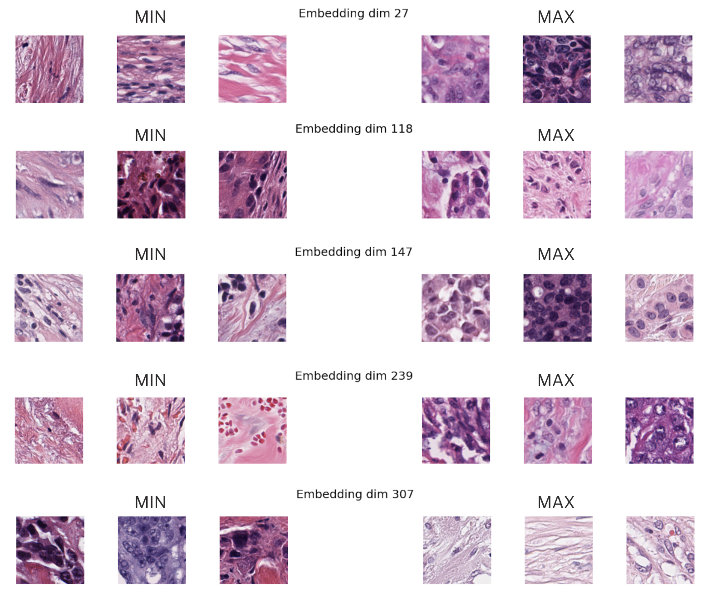
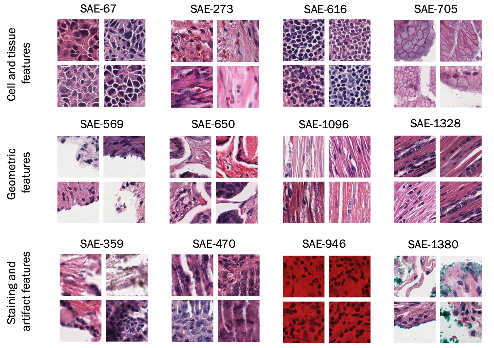
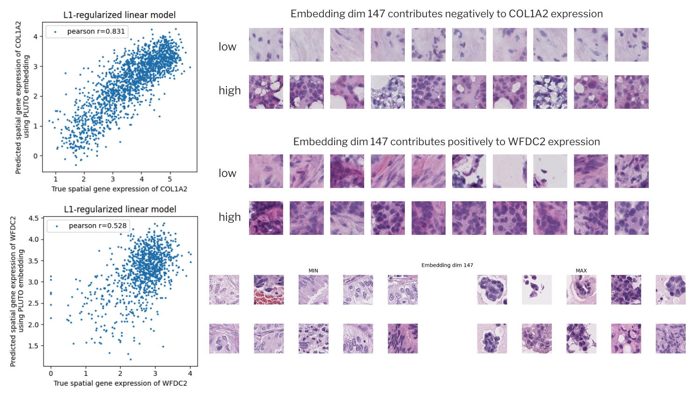
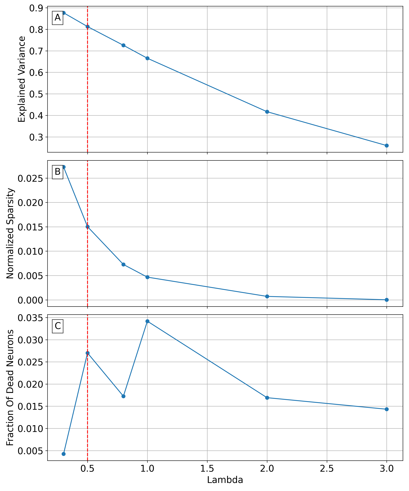

# 病理学基础模型的可解释性分析，揭示了多模态间的生物学相关嵌入。

发布时间：2024年07月15日

`LLM应用` `医学影像`

> Interpretability analysis on a pathology foundation model reveals biologically relevant embeddings across modalities

# 摘要

> 大型语言模型（LLM）的机制性可解释性已深入研究。我们首次尝试将这些方法应用于医学影像，分析了从病理学基础模型中提取的ViT-Small编码器特征。通过两个数据集——病理图像集和配对的空间转录组学图像集，我们揭示了细胞和组织形态的可解释表示及模型嵌入空间中的基因表达。这一探索为未来在医学和临床领域中可解释特征维度的研究和应用奠定了基础。

> Mechanistic interpretability has been explored in detail for large language models (LLMs). For the first time, we provide a preliminary investigation with similar interpretability methods for medical imaging. Specifically, we analyze the features from a ViT-Small encoder obtained from a pathology Foundation Model via application to two datasets: one dataset of pathology images, and one dataset of pathology images paired with spatial transcriptomics. We discover an interpretable representation of cell and tissue morphology, along with gene expression within the model embedding space. Our work paves the way for further exploration around interpretable feature dimensions and their utility for medical and clinical applications.

[Arxiv](https://arxiv.org/abs/2407.10785)