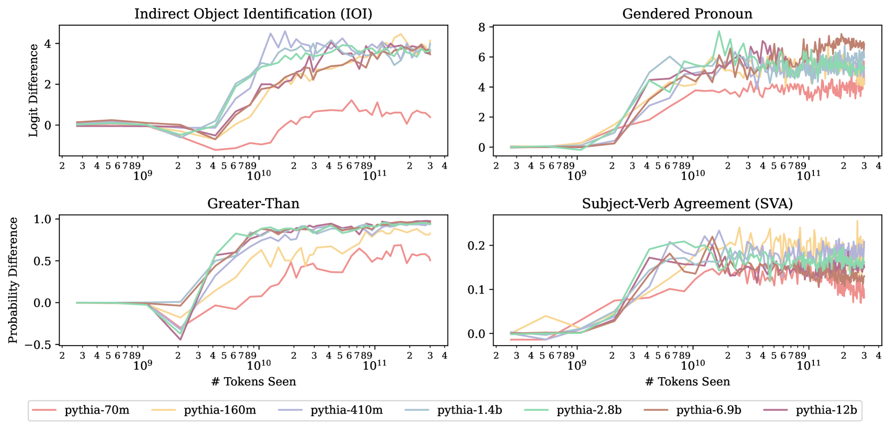

# LLM 电路分析在不同训练阶段和规模上均保持一致性。

发布时间：2024年07月15日

`LLM理论` `人工智能` `机器学习`

> LLM Circuit Analyses Are Consistent Across Training and Scale

# 摘要

> 当前部署的大多数大型语言模型都经历了持续训练或额外微调。然而，关于 LLM 内部机制的研究多聚焦于预训练结束时的单一模型状态，这引发了一个疑问：其研究结果能否适用于实际应用场景？现有研究多关注仅编码器模型或简单模型，与实际部署的模型差异较大。本研究深入探讨了仅解码器 LLM 中，模型机制（以电路形式展现）在跨越 3000 亿个训练令牌的过程中如何涌现与演化，涉及模型参数从 7000 万至 28 亿不等。我们发现，任务能力及其支撑功能组件在不同规模模型中于相似令牌数时稳定出现。尽管这些组件可能随时间由不同注意力头实现，但其核心算法保持一致。更令人惊讶的是，这些算法及所涉组件类型能在不同模型规模间复制。这些发现表明，预训练结束时对小模型进行的电路分析，其洞察力在后续预训练及不同模型规模中依然有效。

> Most currently deployed large language models (LLMs) undergo continuous training or additional finetuning. By contrast, most research into LLMs' internal mechanisms focuses on models at one snapshot in time (the end of pre-training), raising the question of whether their results generalize to real-world settings. Existing studies of mechanisms over time focus on encoder-only or toy models, which differ significantly from most deployed models. In this study, we track how model mechanisms, operationalized as circuits, emerge and evolve across 300 billion tokens of training in decoder-only LLMs, in models ranging from 70 million to 2.8 billion parameters. We find that task abilities and the functional components that support them emerge consistently at similar token counts across scale. Moreover, although such components may be implemented by different attention heads over time, the overarching algorithm that they implement remains. Surprisingly, both these algorithms and the types of components involved therein can replicate across model scale. These results suggest that circuit analyses conducted on small models at the end of pre-training can provide insights that still apply after additional pre-training and over model scale.

[Arxiv](https://arxiv.org/abs/2407.10827)