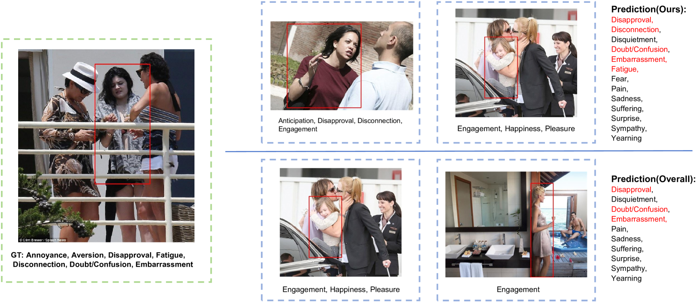

# 大型视觉-语言模型在情境感知中扮演情感识别器的角色

发布时间：2024年07月15日

`LLM应用` `情感分析` `人工智能`

> Large Vision-Language Models as Emotion Recognizers in Context Awareness

# 摘要

> 情境感知情绪识别（CAER）任务复杂且关键，需从多情境线索中感知情绪。传统方法侧重于设计复杂架构从图像中提取情绪线索，但受限于特定数据集，可能带有标注者的主观情绪偏见。在实际应用中，获取大量标记数据颇具挑战。本文系统探索了利用大型视觉-语言模型（LVLMs）增强CAER任务的三个途径：1）在两个CAER数据集上微调LVLMs，这是将大型模型应用于下游任务的常规做法。2）设计零样本和少样本模式，评估在数据稀缺或完全未见情况下LVLMs的性能。为此，我们提出一个无需训练的框架，充分利用LVLMs的上下文学习（ICL）能力，通过基于图像相似性的排序算法检索示例，结合指令和测试示例输入LVLMs进行情感判断。3）融入思维链（CoT）以利用LVLMs的丰富知识库，增强模型推理能力并提供可解释结果。实验和分析显示，LVLMs在不同范式下均表现出色，尤其在少样本设置中的优异性能表明，LVLMs在无需大量训练的情况下完成特定任务的可行性。

> Context-aware emotion recognition (CAER) is a complex and significant task that requires perceiving emotions from various contextual cues. Previous approaches primarily focus on designing sophisticated architectures to extract emotional cues from images. However, their knowledge is confined to specific training datasets and may reflect the subjective emotional biases of the annotators. Furthermore, acquiring large amounts of labeled data is often challenging in real-world applications. In this paper, we systematically explore the potential of leveraging Large Vision-Language Models (LVLMs) to empower the CAER task from three paradigms: 1) We fine-tune LVLMs on two CAER datasets, which is the most common way to transfer large models to downstream tasks. 2) We design zero-shot and few-shot patterns to evaluate the performance of LVLMs in scenarios with limited data or even completely unseen. In this case, a training-free framework is proposed to fully exploit the In-Context Learning (ICL) capabilities of LVLMs. Specifically, we develop an image similarity-based ranking algorithm to retrieve examples; subsequently, the instructions, retrieved examples, and the test example are combined to feed LVLMs to obtain the corresponding sentiment judgment. 3) To leverage the rich knowledge base of LVLMs, we incorporate Chain-of-Thought (CoT) into our framework to enhance the model's reasoning ability and provide interpretable results. Extensive experiments and analyses demonstrate that LVLMs achieve competitive performance in the CAER task across different paradigms. Notably, the superior performance in few-shot settings indicates the feasibility of LVLMs for accomplishing specific tasks without extensive training.

[Arxiv](https://arxiv.org/abs/2407.11300)