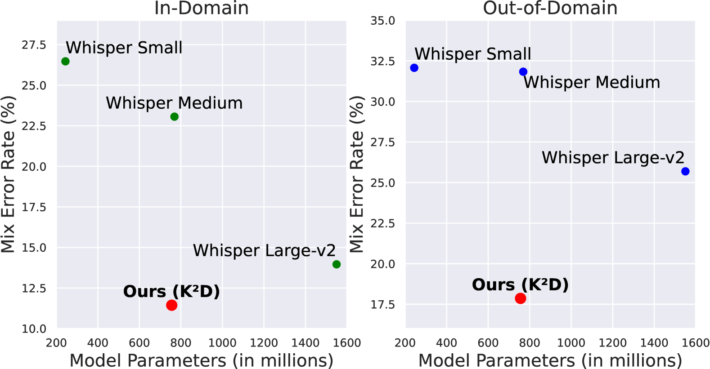
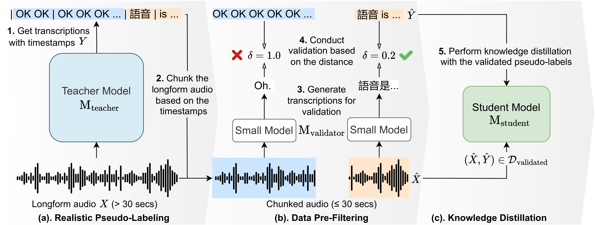

# 知识蒸馏不留遗珠：利用真实数据提升代码转换ASR的实用与效能

发布时间：2024年07月15日

`LLM应用` `语音识别` `软件开发`

> Leave No Knowledge Behind During Knowledge Distillation: Towards Practical and Effective Knowledge Distillation for Code-Switching ASR Using Realistic Data

# 摘要

> 在自动语音识别领域，尽管大型模型能生成高质量转录，但计算资源的限制使其在实际应用中受阻，尤其是在复杂的代码转换 ASR 场景中。为此，我们创新性地提出了一个通过真实语音数据进行知识蒸馏的框架，旨在打造更高效的 CS-ASR 模型。我们的 K$^2$D 方法不仅汲取教师模型的智慧，还融合了小型辅助模型的独特见解。实验证明，K$^2$D 在多个数据集上表现卓越，通过处理未标记的真实数据，我们成功开发出一个体积减半、速度提升五倍的模型，其性能在所有测试中均超越了传统方法和教师模型。这一成果已在 Hugging Face 平台公开分享，供业界共享 (https://huggingface.co/andybi7676/k2d-whisper.zh-en)。

> Recent advances in automatic speech recognition (ASR) often rely on large speech foundation models for generating high-quality transcriptions. However, these models can be impractical due to limited computing resources. The situation is even more severe in terms of more realistic or difficult scenarios, such as code-switching ASR (CS-ASR). To address this, we present a framework for developing more efficient models for CS-ASR through knowledge distillation using realistic speech-only data. Our proposed method, Leave No Knowledge Behind During Knowledge Distillation (K$^2$D), leverages both the teacher model's knowledge and additional insights from a small auxiliary model. We evaluate our approach on two in-domain and two out-domain datasets, demonstrating that K$^2$D is effective. By conducting K$^2$D on the unlabeled realistic data, we have successfully obtained a 2-time smaller model with 5-time faster generation speed while outperforming the baseline methods and the teacher model on all the testing sets. We have made our model publicly available on Hugging Face (https://huggingface.co/andybi7676/k2d-whisper.zh-en).

[Arxiv](https://arxiv.org/abs/2407.10603)