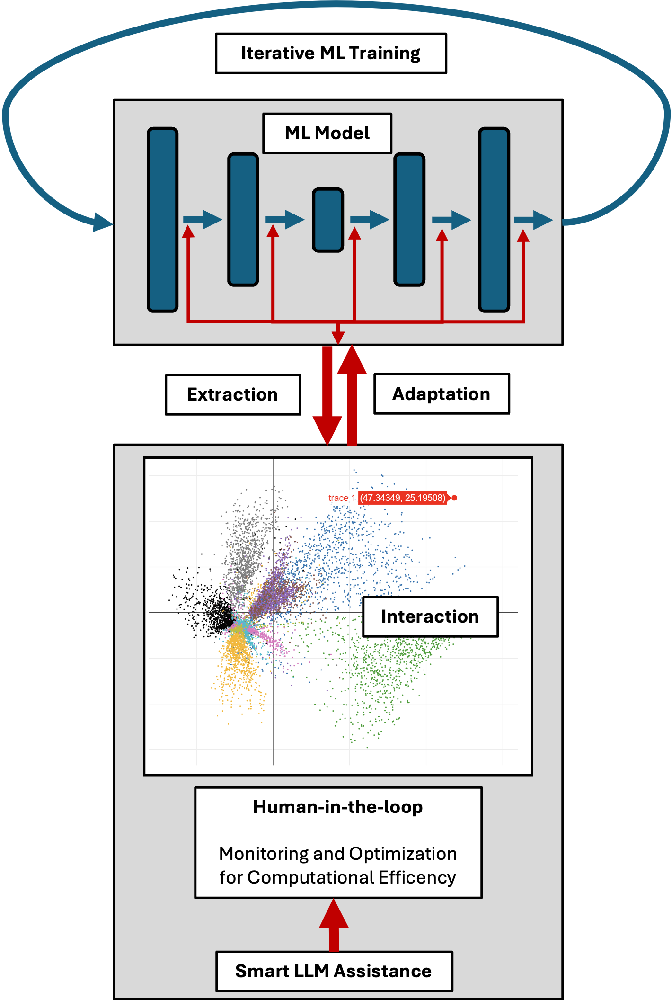
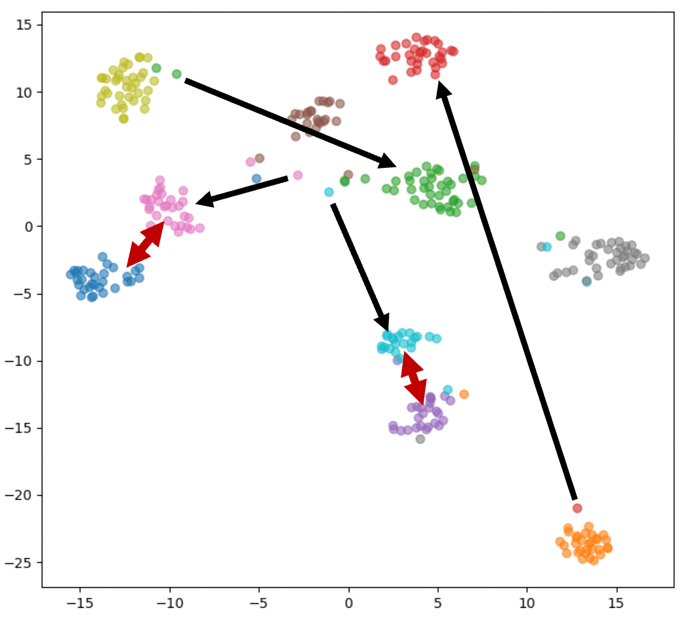
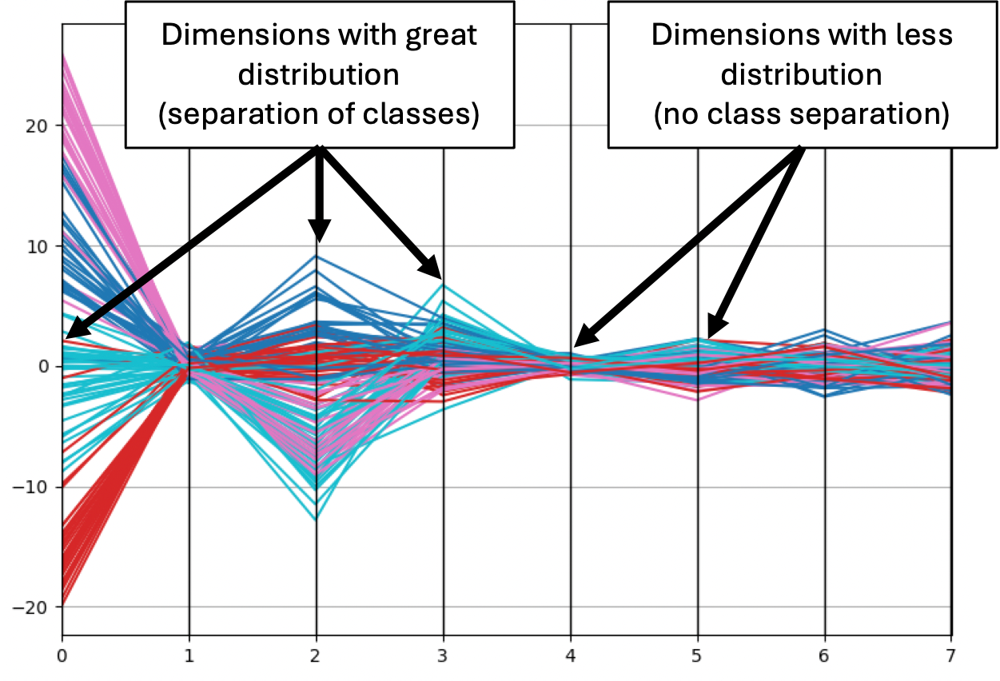

# 借助混合智能，我们正迈向一个既可持续又节能的机器学习新时代。

发布时间：2024年07月15日

`Agent` `能源效率` `机器学习`

> Leveraging Hybrid Intelligence Towards Sustainable and Energy-Efficient Machine Learning

# 摘要

> 混合智能通过融合人类与AI的优势，旨在提升决策、问题解决及系统整体性能。随着大型语言模型（LLM）的兴起，它们作为智能代理加速机器学习发展，混合智能在人机交互中的重要性日益凸显。本文探讨了如何运用混合智能实现可持续且节能的机器学习。在模型开发中，我们往往聚焦于最终性能，却忽视了开发过程的效率。同时，鉴于大规模计算对环境的深远影响，能源效率变得至关重要。本研究通过人机回环（HITL）与LLM代理的互动，引入辅助知识源，旨在揭示并优化机器学习开发中的低效环节。

> Hybrid intelligence aims to enhance decision-making, problem-solving, and overall system performance by combining the strengths of both, human cognitive abilities and artificial intelligence. With the rise of Large Language Models (LLM), progressively participating as smart agents to accelerate machine learning development, Hybrid Intelligence is becoming an increasingly important topic for effective interaction between humans and machines. This paper presents an approach to leverage Hybrid Intelligence towards sustainable and energy-aware machine learning. When developing machine learning models, final model performance commonly rules the optimization process while the efficiency of the process itself is often neglected. Moreover, in recent times, energy efficiency has become equally crucial due to the significant environmental impact of complex and large-scale computational processes. The contribution of this work covers the interactive inclusion of secondary knowledge sources through Human-in-the-loop (HITL) and LLM agents to stress out and further resolve inefficiencies in the machine learning development process.

[Arxiv](https://arxiv.org/abs/2407.10580)