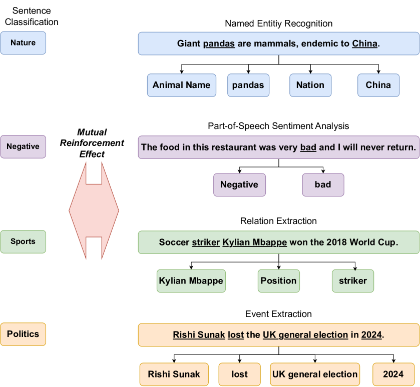
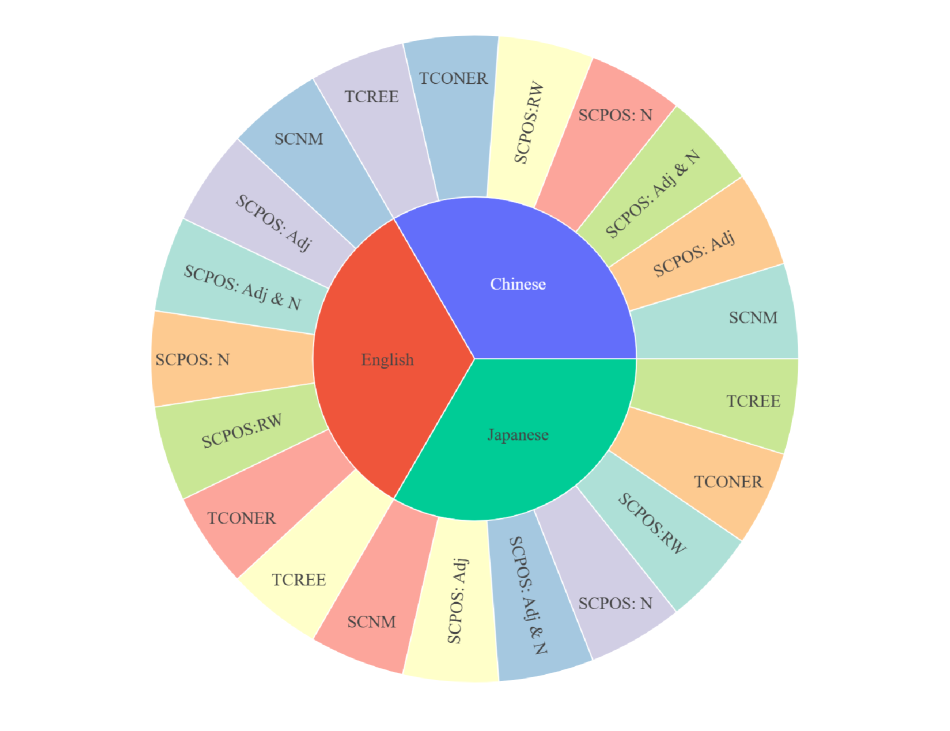
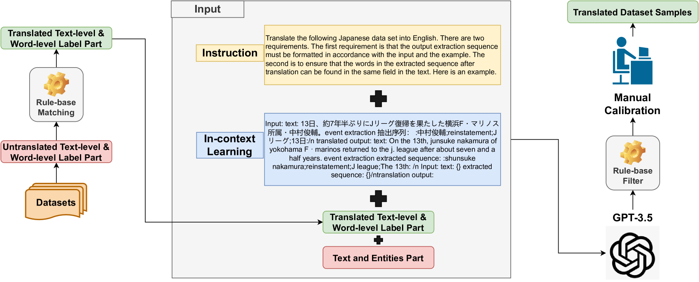
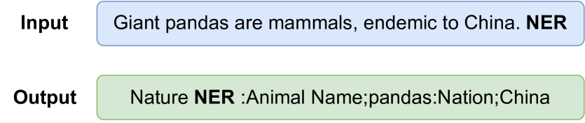
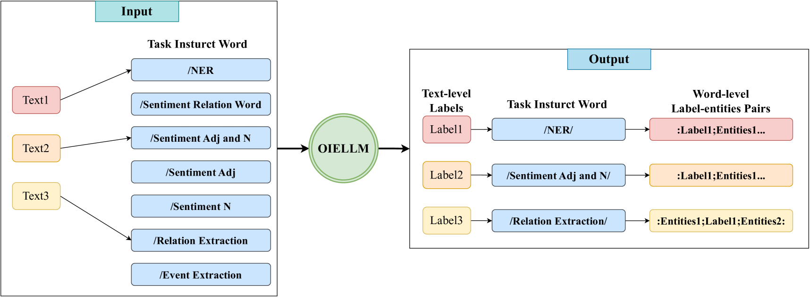

# MMM：探索多语言数据集的相互强化效应，并测试其在开放领域信息抽取大型语言模型中的应用。

发布时间：2024年07月15日

`LLM应用` `数据集` `信息提取`

> MMM: Multilingual Mutual Reinforcement Effect Mix Datasets & Test with Open-domain Information Extraction Large Language Models

# 摘要

> 互增强效应（MRE）在信息提取和多任务研究领域颇具潜力，但因日语专属数据集的限制，全球研究者难以深入探索。为此，我们推出了包含21个子数据集的多语言MRE混合数据集（MMM），涵盖英、日、中三种语言。本文还提出了一种利用大型语言模型（LLM）辅助的数据集翻译方法，大幅缩短了数据集构建的手动标注时间。同时，我们通过引入开放领域的命名实体识别（NER）和句子分类任务，丰富了数据集内容。基于此，我们构建了一个统一的输入-输出框架，用于训练开放领域信息提取大型语言模型（OIELLM），该模型在处理新MMM数据集时表现出色，性能大幅提升。

> The Mutual Reinforcement Effect (MRE) represents a promising avenue in information extraction and multitasking research. Nevertheless, its applicability has been constrained due to the exclusive availability of MRE mix datasets in Japanese, thereby limiting comprehensive exploration by the global research community. To address this limitation, we introduce a Multilingual MRE mix dataset (MMM) that encompasses 21 sub-datasets in English, Japanese, and Chinese. In this paper, we also propose a method for dataset translation assisted by Large Language Models (LLMs), which significantly reduces the manual annotation time required for dataset construction by leveraging LLMs to translate the original Japanese datasets. Additionally, we have enriched the dataset by incorporating open-domain Named Entity Recognition (NER) and sentence classification tasks. Utilizing this expanded dataset, we developed a unified input-output framework to train an Open-domain Information Extraction Large Language Model (OIELLM). The OIELLM model demonstrates the capability to effectively process novel MMM datasets, exhibiting significant improvements in performance.

[Arxiv](https://arxiv.org/abs/2407.10953)