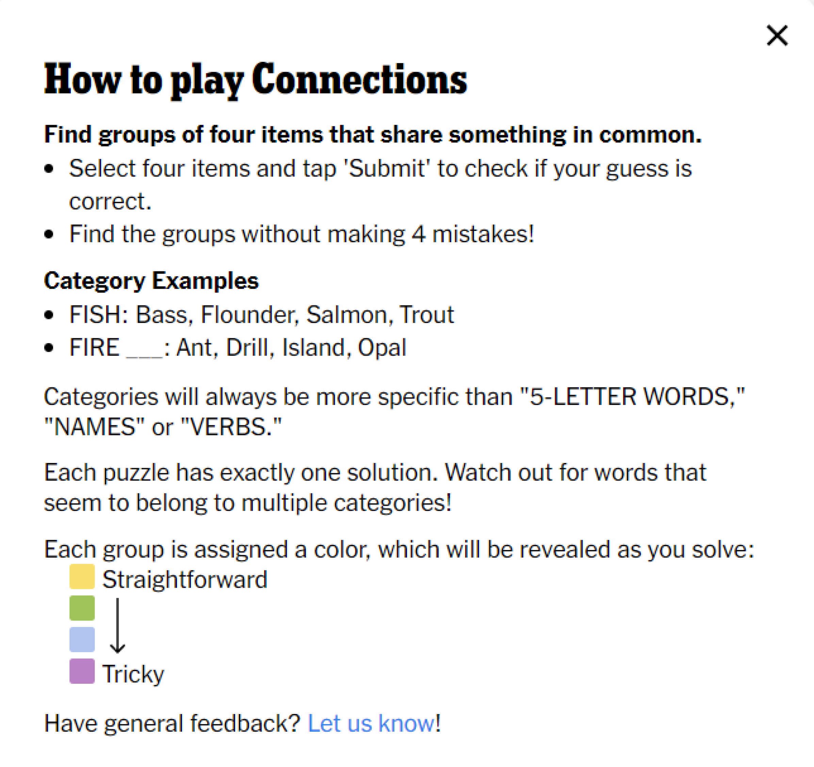
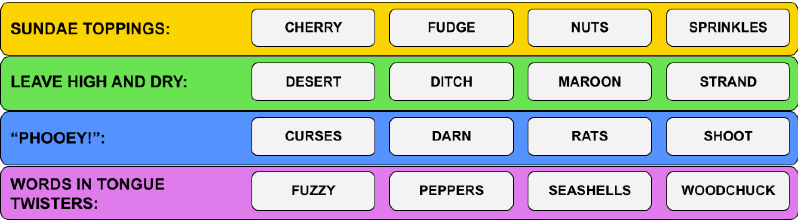
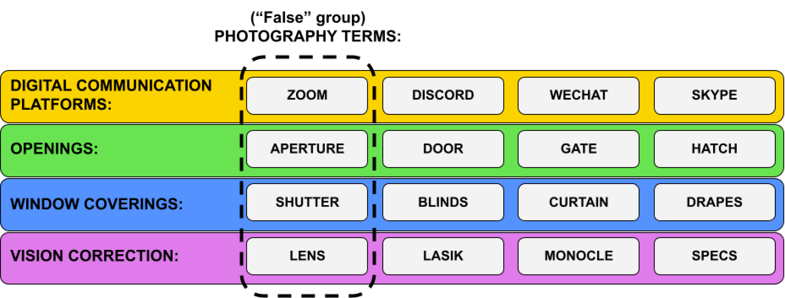
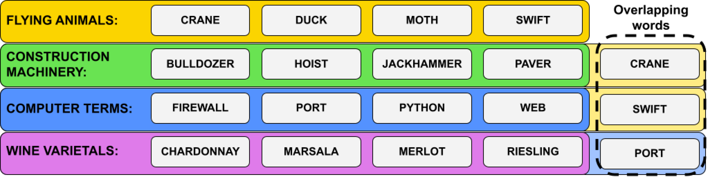
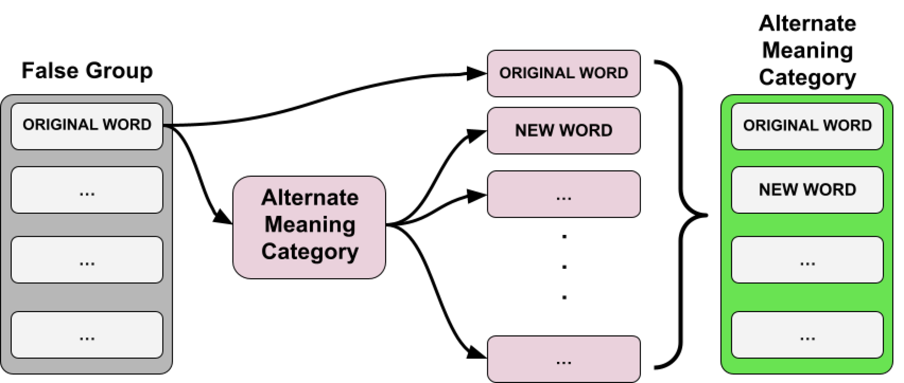
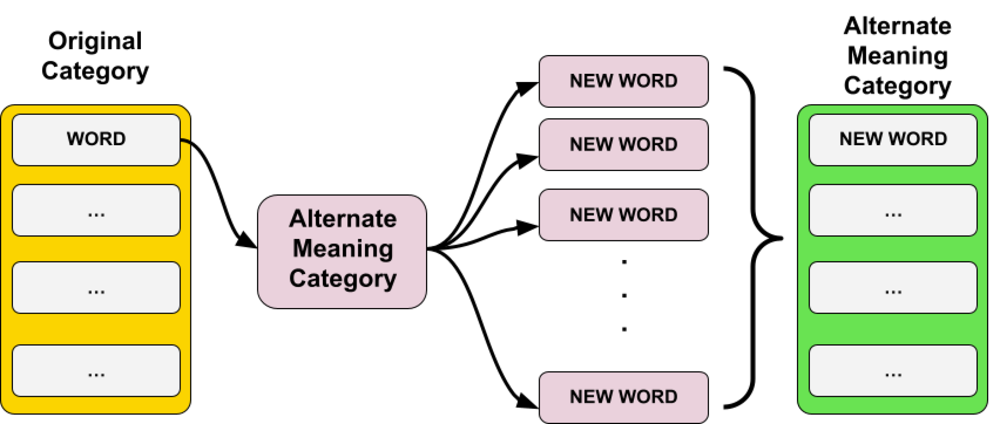
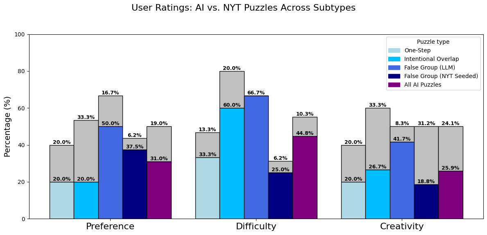
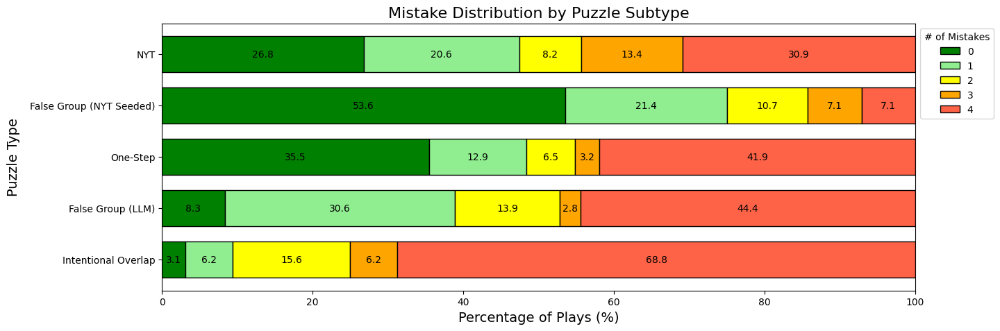

# LLM 助力《纽约时报》Connections 文字游戏，创新谜题连连看。

发布时间：2024年07月15日

`LLM应用`

> Making New Connections: LLMs as Puzzle Generators for The New York Times' Connections Word Game

# 摘要

> 《纽约时报》的 Connections 谜题是一款每日更新的单词联想游戏，玩家需找出由共同主题连接的四词组合。解谜不仅考验语义知识和抽象推理，创作新谜题更需元认知能力，即准确预判解题者的思维路径。本文探讨了 GPT 系列大型语言模型 (LLM) 在创造挑战性与创意性兼具的单词游戏方面的能力。首先，我们分析了 Connections 游戏在程序内容生成 (PCG) 领域的独特挑战。接着，我们提出了一种基于树状思维 (ToT) 提示法的 LLM 生成谜题方法，并通过用户研究对比 AI 与传统谜题，结果显示 LLM 能创造出多样、有趣且富有挑战性的 Connections 谜题，深受玩家喜爱。

> The Connections puzzle is a word association game published daily by The New York Times (NYT). In this game, players are asked to find groups of four words that are connected by a common theme. While solving a given Connections puzzle requires both semantic knowledge and abstract reasoning, generating novel puzzles additionally requires a form of metacognition: generators must be able to accurately model the downstream reasoning of potential solvers. In this paper, we investigate the ability of the GPT family of Large Language Models (LLMs) to generate challenging and creative word games for human players. We start with an analysis of the word game Connections and the unique challenges it poses as a Procedural Content Generation (PCG) domain. We then propose a method for generating Connections puzzles using LLMs by adapting a Tree of Thoughts (ToT) prompting approach. We evaluate this method by conducting a user study, asking human players to compare AI-generated puzzles against published Connections puzzles. Our findings show that LLMs are capable puzzle creators, and can generate diverse sets of enjoyable, challenging, and creative Connections puzzles as judged by human users.

[Arxiv](https://arxiv.org/abs/2407.11240)