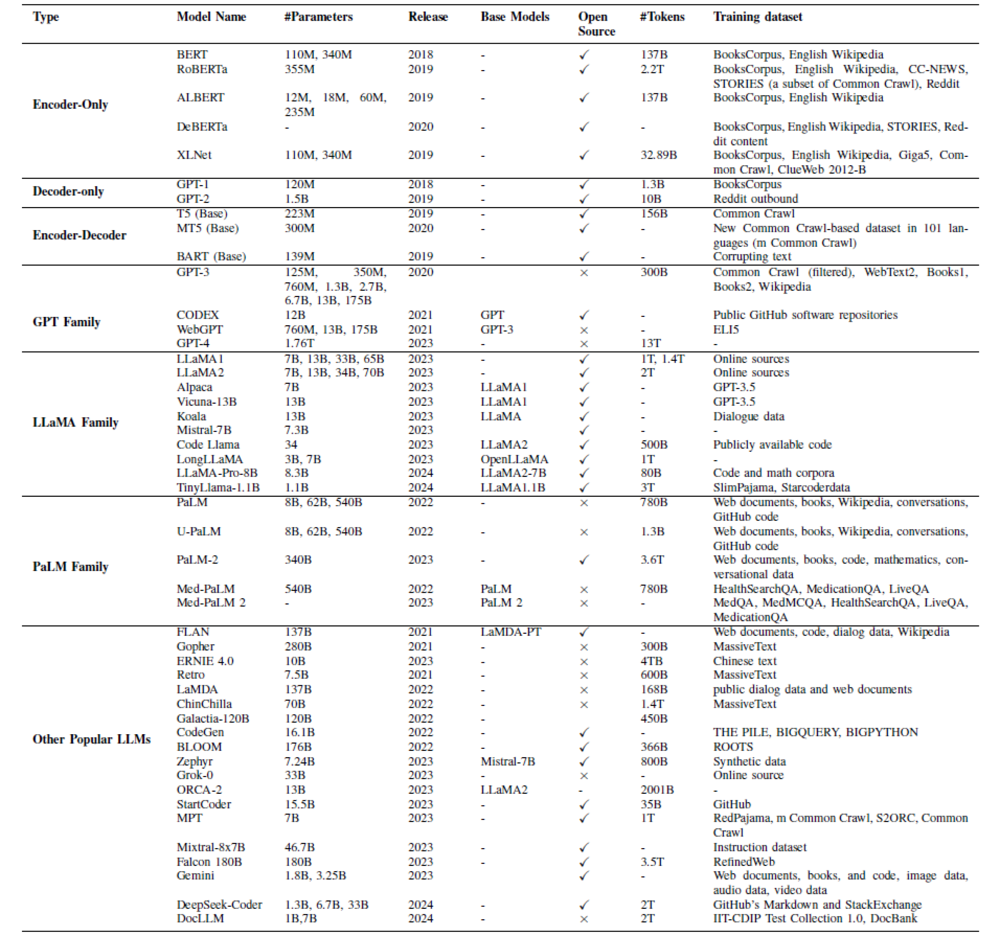
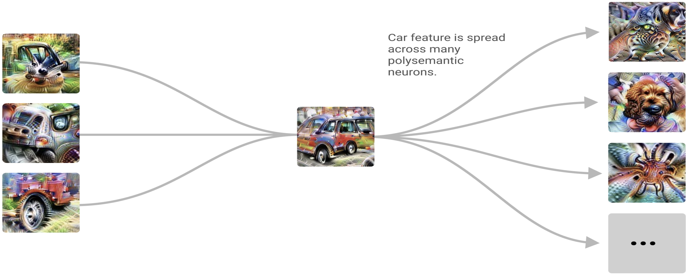

# 探究大型语言模型的内在机制，并探讨其在金融服务领域的应用潜力。

发布时间：2024年07月15日

`LLM应用` `人工智能`

> Mechanistic interpretability of large language models with applications to the financial services industry

# 摘要

> GPTs等大型语言模型在多领域表现出色，但其复杂性使得内部决策过程难以解读。在金融领域，这种不透明性尤为关键，因为偏见、公平性和可靠性的问责至关重要。本文中，我们首次运用机制性可解释性，深入剖析大型语言模型在金融服务中的运作机制。我们展示了如何设计算法任务以支持合规监控，特别是分析GPT-2 Small在识别潜在公平贷款违规时的注意力模式。通过逻辑归因分析，我们揭示了各层及注意力头对决策的影响。此外，我们通过设计不同提示并采用激活修补技术，精准定位了任务完成的关键组件，发现特定注意力头在任务中扮演重要角色。

> Large Language Models such as GPTs (Generative Pre-trained Transformers) exhibit remarkable capabilities across a broad spectrum of applications. Nevertheless, due to their intrinsic complexity, these models present substantial challenges in interpreting their internal decision-making processes. This lack of transparency poses critical challenges when it comes to their adaptation by financial institutions, where concerns and accountability regarding bias, fairness, and reliability are of paramount importance. Mechanistic interpretability aims at reverse engineering complex AI models such as transformers. In this paper, we are pioneering the use of mechanistic interpretability to shed some light on the inner workings of large language models for use in financial services applications. We offer several examples of how algorithmic tasks can be designed for compliance monitoring purposes. In particular, we investigate GPT-2 Small's attention pattern when prompted to identify potential violation of Fair Lending laws. Using direct logit attribution, we study the contributions of each layer and its corresponding attention heads to the logit difference in the residual stream. Finally, we design clean and corrupted prompts and use activation patching as a causal intervention method to localize our task completion components further. We observe that the (positive) heads $10.2$ (head $2$, layer $10$), $10.7$, and $11.3$, as well as the (negative) heads $9.6$ and $10.6$ play a significant role in the task completion.

[Arxiv](https://arxiv.org/abs/2407.11215)