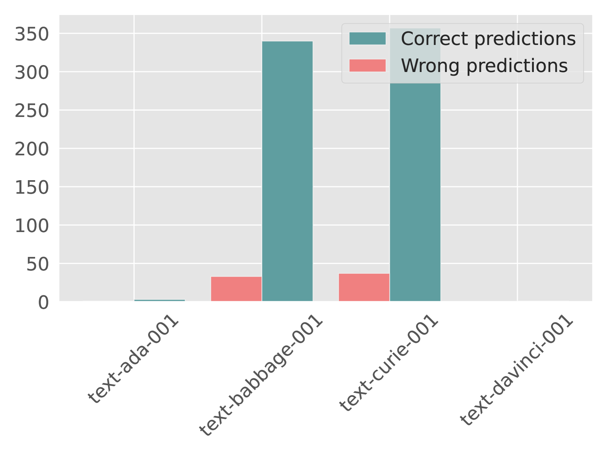

# MetaLLM：一款高效且经济的动态框架，专为大型语言模型打造

发布时间：2024年07月15日

`LLM应用` `人工智能` `云计算`

> MetaLLM: A High-performant and Cost-efficient Dynamic Framework for Wrapping LLMs

# 摘要

> 随着机器学习的迅猛发展，众多大型语言模型（LLM）在多领域任务中大放异彩。然而，这些模型在计算成本和定价上各异，且查询需求因领域和复杂度而异，单一模型的选择往往并非最优。为此，我们推出了MetaLLM框架，它智能地为每个查询选择最佳LLM，显著提升分类任务的准确性与成本效益。通过将选择问题视为多臂老虎机问题，MetaLLM在不确定性中巧妙平衡了准确性与成本。在OpenAI、Amazon、Anthropic和Meta等平台的实验中，MetaLLM展现了其在实际应用中的高效性，为未来扩展至更多任务奠定了基础。

> The rapid progress in machine learning (ML) has brought forth many large language models (LLMs) that excel in various tasks and areas. These LLMs come with different abilities and costs in terms of computation or pricing. Since the demand for each query can vary, e.g., because of the queried domain or its complexity, defaulting to one LLM in an application is not usually the best choice, whether it is the biggest, priciest, or even the one with the best average test performance. Consequently, picking the right LLM that is both accurate and cost-effective for an application remains a challenge. In this paper, we introduce MetaLLM, a framework that dynamically and intelligently routes each query to the optimal LLM (among several available LLMs) for classification tasks, achieving significantly improved accuracy and cost-effectiveness. By framing the selection problem as a multi-armed bandit, MetaLLM balances prediction accuracy and cost efficiency under uncertainty. Our experiments, conducted on popular LLM platforms such as OpenAI's GPT models, Amazon's Titan, Anthropic's Claude, and Meta's LLaMa, showcase MetaLLM's efficacy in real-world scenarios, laying the groundwork for future extensions beyond classification tasks.

[Arxiv](https://arxiv.org/abs/2407.10834)