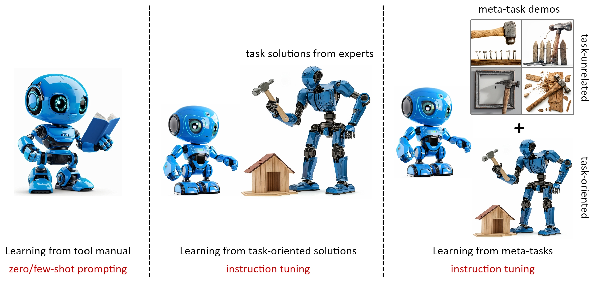
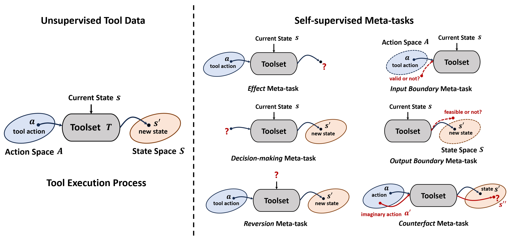
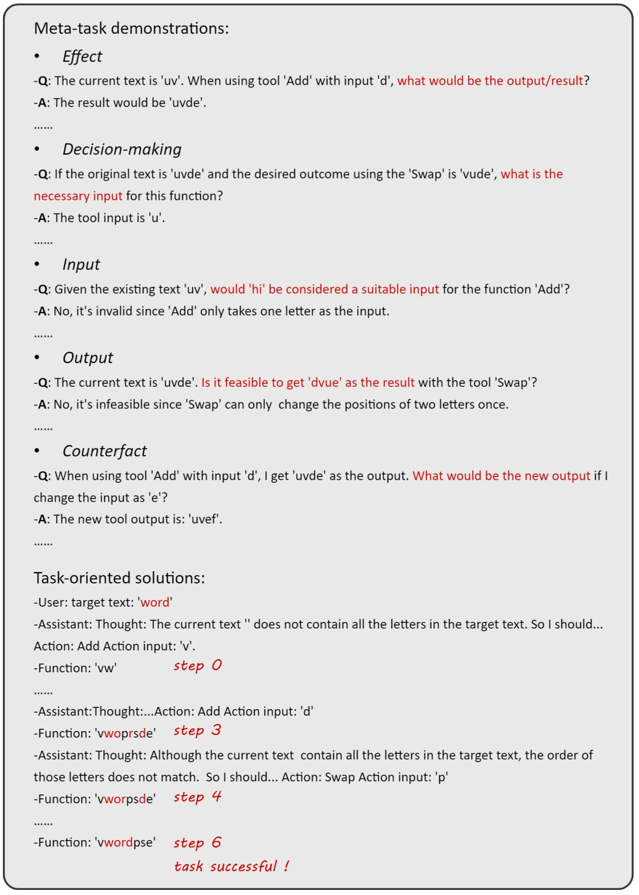
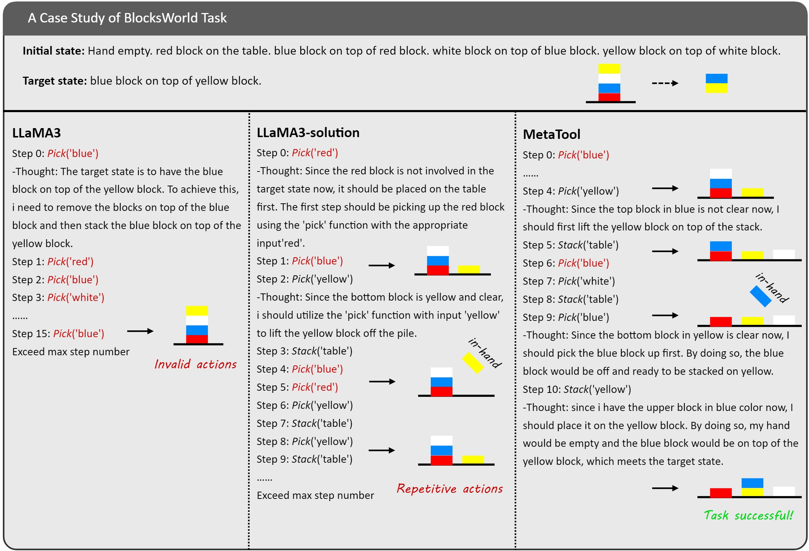

# MetaTool：借助元任务增强，助力大型语言模型精通工具使用

发布时间：2024年07月15日

`Agent` `人工智能` `自动化`

> MetaTool: Facilitating Large Language Models to Master Tools with Meta-task Augmentation

# 摘要

> 在现实场景中，利用LLM掌握复杂工具是AI代理的关键能力。本文提出的MetaTool方法，通过自监督数据增强和元任务设计，使LLM深入理解工具，提升任务完成效率。该方法不仅超越了传统模型，还在多个工具任务上与顶尖模型相媲美。

> Utilizing complex tools with Large Language Models (LLMs) is a critical component for grounding AI agents in various real-world scenarios. The core challenge of manipulating tools lies in understanding their usage and functionality. The prevailing approach involves few-shot prompting with demonstrations or fine-tuning on expert trajectories. However, for complex tools and tasks, mere in-context demonstrations may fail to cover sufficient knowledge. Training-based methods are also constrained by the high cost of dataset construction and limited generalizability. In this paper, we introduce a new tool learning methodology (MetaTool) that is generalizable for mastering any reusable toolset. Our approach includes a self-supervised data augmentation technique that enables LLMs to gain a comprehensive understanding of various tools, thereby improving their ability to complete tasks effectively. We develop a series of meta-tasks that involve predicting masked factors of tool execution. These self-supervised tasks enable the automatic generation of high-quality QA data concerning tool comprehension. By incorporating meta-task data into the instruction tuning process, the proposed MetaTool model achieves significant superiority to open-source models and is comparable to GPT-4/GPT-3.5 on multiple tool-oriented tasks.

[Arxiv](https://arxiv.org/abs/2407.12871)