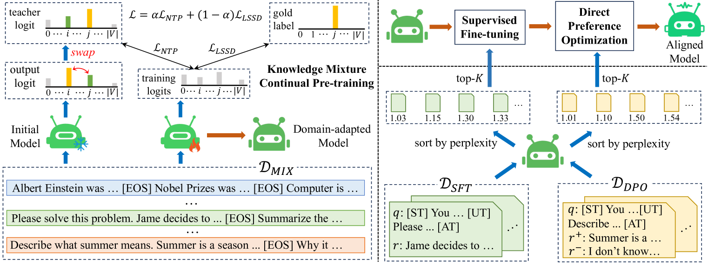

# Mix-CPT：一种领域适应框架，通过分离知识学习与格式对齐来实现。

发布时间：2024年07月15日

`LLM应用` `人工智能`

> Mix-CPT: A Domain Adaptation Framework via Decoupling Knowledge Learning and Format Alignment

# 摘要

> 将通用大型语言模型 (LLM) 适应到专业领域，因数据分布多样性而颇具挑战。传统方法需在大规模领域特定语料库上持续预训练，以记忆知识，再按人类指令和偏好应用。但此法效率低下，因忽视知识利用，且在有限样本下，LLM 需同时学习知识利用与格式对齐。为此，我们提出 Mix-CPT 框架，融合领域知识学习与通用格式对齐。首先，进行知识混合持续预训练，兼顾记忆与利用，相互强化。为防遗忘，引入 logit swap 自蒸馏约束。随后，利用预训练所得，高效指令调整与对齐，少量样本即可。实验证明，Mix-CPT 能提升 LLM 在目标与通用领域的任务解决能力，超越传统方法。

> Adapting general large language models (LLMs) to specialized domains presents great challenges due to varied data distributions. This adaptation typically requires continual pre-training on massive domain-specific corpora to facilitate knowledge memorization, followed by training to apply this knowledge following human instructions and preferences. However, this method may result in inefficient knowledge memorization due to a lack of awareness of knowledge utilization and imposes substantial demands on LLMs to simultaneously learn knowledge utilization and format alignment with limited training samples. To facilitate the domain adaptation of LLM, we revise this process and propose a new domain adaptation framework including domain knowledge learning and general format alignment, called Mix-CPT. Specifically, we first conduct a knowledge mixture continual pre-training that concurrently focuses on knowledge memorization and utilization, allowing for mutual reinforcement. To avoid catastrophic forgetting during the continual pre-training process, we further incorporate a logit swap self-distillation constraint. Subsequently, leveraging the knowledge and capabilities acquired during continual pre-training, we efficiently perform instruction tuning and alignment with a few general training samples to achieve format alignment. Extensive experiments demonstrate that our proposed Mix-CPT framework can simultaneously improve the task-solving capabilities of LLMs on the target and general domains compared to the traditional adaptation methods.

[Arxiv](https://arxiv.org/abs/2407.10804)