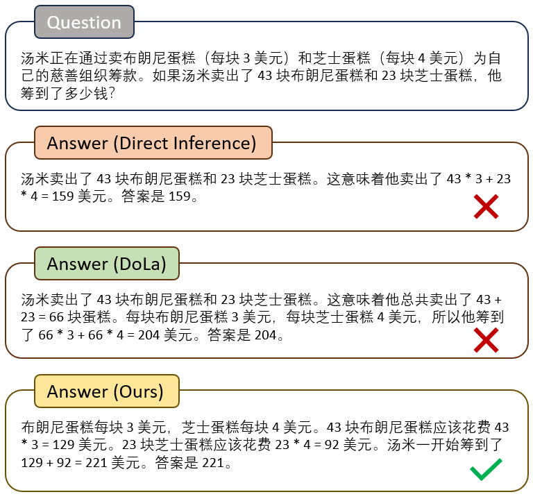
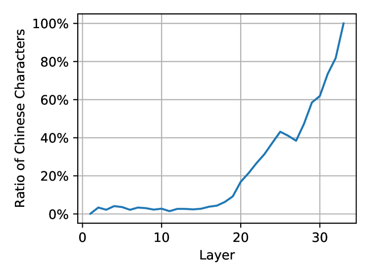
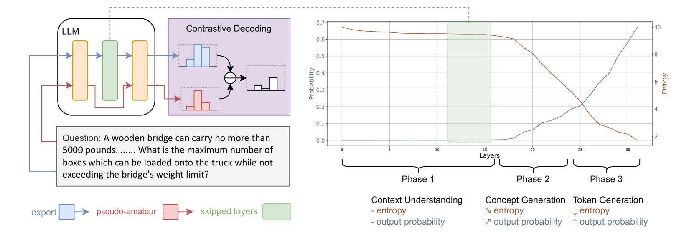

# 多语言对比解码：跨越语言界限的层级跳跃

发布时间：2024年07月15日

`LLM应用` `人工智能`

> Multilingual Contrastive Decoding via Language-Agnostic Layers Skipping

# 摘要

> 通过对比层解码（DoLa），旨在通过比较早期与最终输出的预测概率，提升大型语言模型（LLM）的生成质量。然而，该方法在非英语任务上表现欠佳。受先前关于模型前向传递中语言转换的研究启发，我们发现问题在于早期与最终输出间的语言不匹配。为此，我们提出了一种适用于多语言的改进对比解码算法。为获取更有价值的早期输出，我们设计了两种策略，跳过底层、与语言无关的层。实验结果显示，我们的方法不仅超越了以往的对比解码基准，还显著提升了LLM在11种语言中的思维链推理准确性。项目详情请访问：https://github.com/NJUNLP/SkipLayerCD。

> Decoding by contrasting layers (DoLa), is designed to improve the generation quality of large language models (LLMs) by contrasting the prediction probabilities between an early exit output (amateur logits) and the final output (expert logits). However, we find that this approach does not work well on non-English tasks. Inspired by previous interpretability work on language transition during the model's forward pass, we discover that this issue arises from a language mismatch between early exit output and final output. In this work, we propose an improved contrastive decoding algorithm that is effective for diverse languages beyond English. To obtain more helpful amateur logits, we devise two strategies to skip a set of bottom, language-agnostic layers based on our preliminary analysis. Experimental results on multilingual reasoning benchmarks demonstrate that our proposed method outperforms previous contrastive decoding baselines and substantially improves LLM's chain-of-thought reasoning accuracy across 11 languages. The project will be available at: https://github.com/NJUNLP/SkipLayerCD.

[Arxiv](https://arxiv.org/abs/2407.10795)