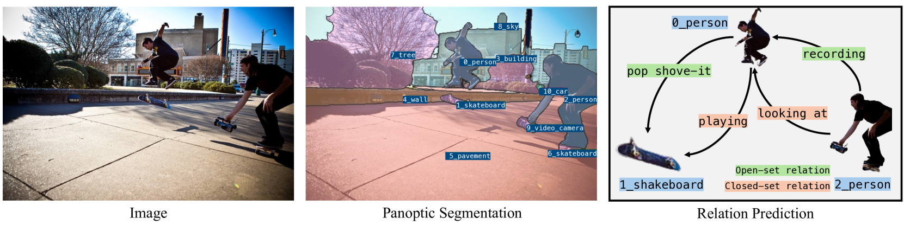
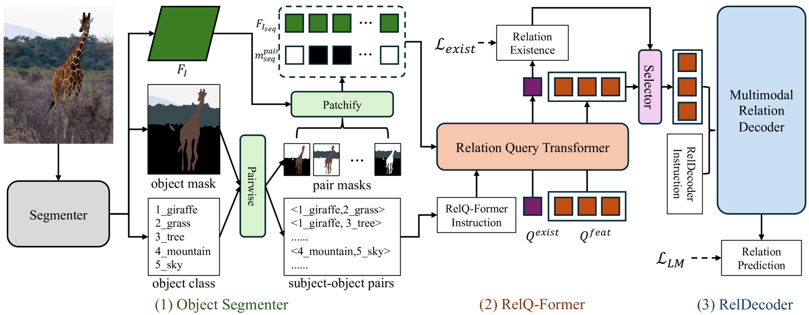
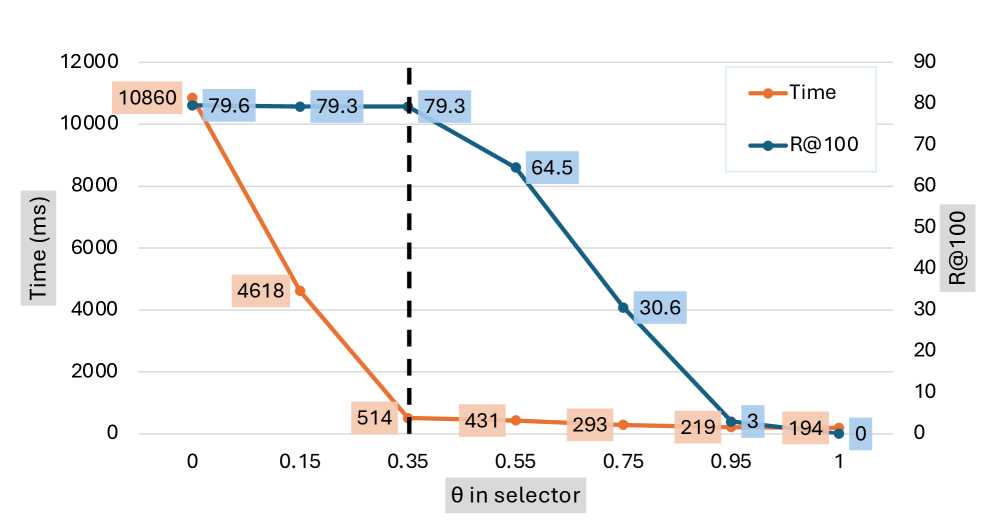

# OpenPSG：借助大型多模态模型，实现开集全景场景图的生成

发布时间：2024年07月15日

`LLM应用` `计算机视觉` `人工智能`

> OpenPSG: Open-set Panoptic Scene Graph Generation via Large Multimodal Models

# 摘要

> 全景场景图生成 (PSG) 旨在分割并识别图像中对象及其关系，实现图像的结构化理解。传统方法局限于预定义类别，限制了其在开放世界中的应用。随着大型多模态模型 (LMMs) 的迅猛发展，开放集对象检测与分割取得显著进展，但 PSG 中的开放集关系预测仍待探索。本文聚焦于结合预训练开放集全景分割模型的开放集关系预测，实现真正的开放集全景场景图生成 (OpenPSG)。我们利用 LMMs 自回归地实现开放集关系预测，并引入关系查询变换器，高效提取对象对视觉特征并评估关系存在，通过过滤无关对提升预测效率。我们还设计了生成与判断指令，自回归地执行 PSG 中的开放集关系预测。据我们所知，首次提出开放集 PSG 任务。实验证明，我们的方法在开放集关系预测与全景场景图生成方面表现卓越。代码已公开于 \url{https://github.com/franciszzj/OpenPSG}。

> Panoptic Scene Graph Generation (PSG) aims to segment objects and recognize their relations, enabling the structured understanding of an image. Previous methods focus on predicting predefined object and relation categories, hence limiting their applications in the open world scenarios. With the rapid development of large multimodal models (LMMs), significant progress has been made in open-set object detection and segmentation, yet open-set relation prediction in PSG remains unexplored. In this paper, we focus on the task of open-set relation prediction integrated with a pretrained open-set panoptic segmentation model to achieve true open-set panoptic scene graph generation (OpenPSG). Our OpenPSG leverages LMMs to achieve open-set relation prediction in an autoregressive manner. We introduce a relation query transformer to efficiently extract visual features of object pairs and estimate the existence of relations between them. The latter can enhance the prediction efficiency by filtering irrelevant pairs. Finally, we design the generation and judgement instructions to perform open-set relation prediction in PSG autoregressively. To our knowledge, we are the first to propose the open-set PSG task. Extensive experiments demonstrate that our method achieves state-of-the-art performance in open-set relation prediction and panoptic scene graph generation. Code is available at \url{https://github.com/franciszzj/OpenPSG}.

[Arxiv](https://arxiv.org/abs/2407.11213)