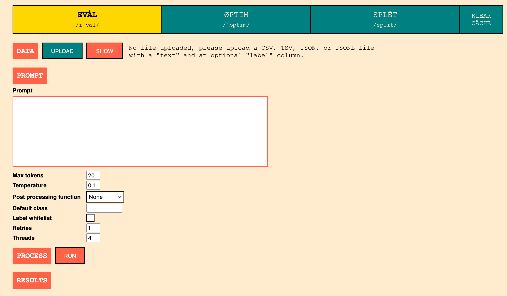
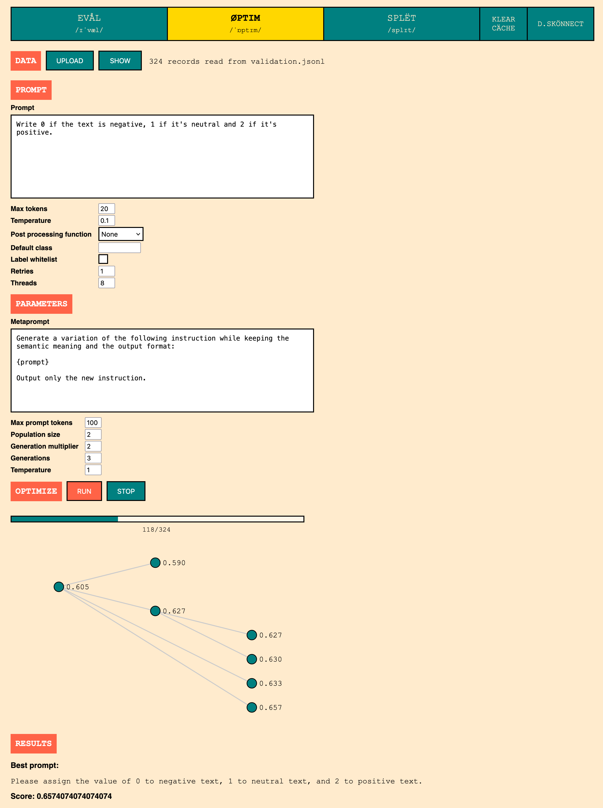
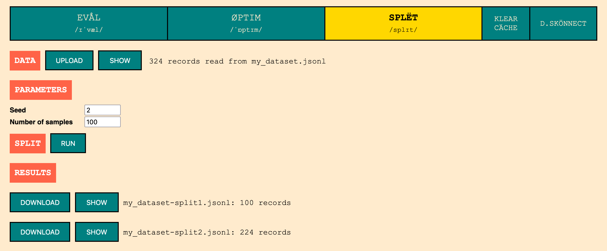

# 提示选择不容忽视：借助大型语言模型，为社会科学领域的文本标注注入新活力。

发布时间：2024年07月15日

`LLM应用` `社会科学` `人工智能`

> Prompt Selection Matters: Enhancing Text Annotations for Social Sciences with Large Language Models

# 摘要

> 大型语言模型在社会科学文本标注任务中的表现已能媲美甚至超越人类，且成本大幅降低。但提示选择对标注准确性的影响仍未被探究。本研究揭示了提示间性能的显著差异，并运用自动优化技术系统生成高质量提示。此外，我们通过 https://prompt-ultra.github.io/ 为社区提供了一个便捷的浏览器实现方案。

> Large Language Models have recently been applied to text annotation tasks from social sciences, equalling or surpassing the performance of human workers at a fraction of the cost. However, no inquiry has yet been made on the impact of prompt selection on labelling accuracy. In this study, we show that performance greatly varies between prompts, and we apply the method of automatic prompt optimization to systematically craft high quality prompts. We also provide the community with a simple, browser-based implementation of the method at https://prompt-ultra.github.io/ .

[Arxiv](https://arxiv.org/abs/2407.10645)