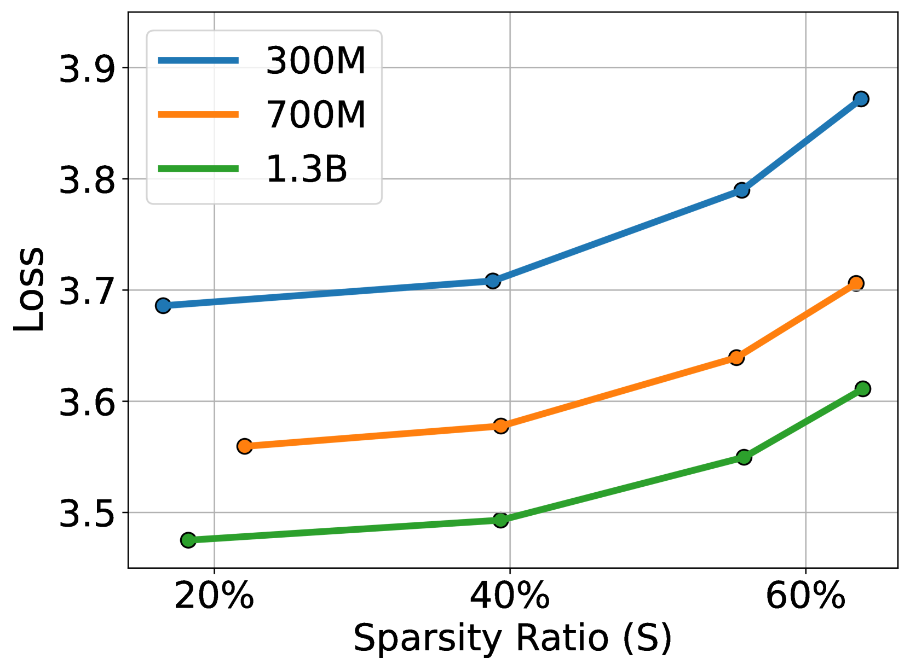

# Q-Sparse 技术揭示，所有大型语言模型均能实现完全的稀疏激活。

发布时间：2024年07月15日

`LLM理论` `信息技术` `能源效率`

> Q-Sparse: All Large Language Models can be Fully Sparsely-Activated

# 摘要

> 我们引入了 Q-Sparse，这是一种既简单又高效的训练稀疏激活大型语言模型的方法。Q-Sparse 通过 top-K 稀疏化和直通估计器的应用，实现了 LLM 中激活的完全稀疏，大幅提升了推理效率。主要成果包括：Q-Sparse 在保持与基准 LLM 相当性能的同时，推理效率更高；为稀疏激活 LLM 设计了推理优化的缩放定律；适用于多种训练场景，如从头开始、继续训练和微调；兼容全精度和 1 位 LLM，如 BitNet b1.58。BitNet b1.58 与 Q-Sparse 的结合，为未来 LLM 的效率革命奠定了基础，显著降低了成本和能源消耗。

> We introduce, Q-Sparse, a simple yet effective approach to training sparsely-activated large language models (LLMs). Q-Sparse enables full sparsity of activations in LLMs which can bring significant efficiency gains in inference. This is achieved by applying top-K sparsification to the activations and the straight-through-estimator to the training. The key results from this work are, (1) Q-Sparse can achieve results comparable to those of baseline LLMs while being much more efficient at inference time; (2) We present an inference-optimal scaling law for sparsely-activated LLMs; (3) Q-Sparse is effective in different settings, including training-from-scratch, continue-training of off-the-shelf LLMs, and finetuning; (4) Q-Sparse works for both full-precision and 1-bit LLMs (e.g., BitNet b1.58). Particularly, the synergy of BitNet b1.58 and Q-Sparse (can be equipped with MoE) provides the cornerstone and a clear path to revolutionize the efficiency, including cost and energy consumption, of future LLMs.

[Arxiv](https://arxiv.org/abs/2407.10969)