# 量化提示助力视觉-语言模型高效泛化

发布时间：2024年07月15日

`LLM应用` `计算机视觉` `机器学习`

> Quantized Prompt for Efficient Generalization of Vision-Language Models

# 摘要

> 近年来，CLIP等大规模预训练视觉-语言模型在多领域大放异彩。如何将这些庞大数据模型中的丰富知识有效迁移至下游任务，成为研究焦点。然而，下游适应过程中常遭遇过拟合与灾难性遗忘两大难题，导致模型过度适应当前数据，丧失关键的通用知识。传统方法依赖经典正则化技术，但随着解决方案日益复杂，存储与推理成本激增，亟待新策略。本文从随机噪声抑制过拟合现象中获得灵感，将量化误差视为噪声，探索高效且有效的量化正则化方法。同时，为在低成本下提升模型泛化与专业化能力，我们深入剖析提示权重分布，提炼量化模块设计原则，并据此打造多个竞争性基准。该方法轻量高效，适用于资源受限设备。此外，它能无缝融入MaPLe等现有技术，提升准确率并降低存储负担，兼具强大功能与广泛适用性。在11个数据集上的实验验证了其卓越性能。相关代码已公开于https://github.com/beyondhtx/QPrompt。

> In the past few years, large-scale pre-trained vision-language models like CLIP have achieved tremendous success in various fields. Naturally, how to transfer the rich knowledge in such huge pre-trained models to downstream tasks and datasets becomes a hot topic. During downstream adaptation, the most challenging problems are overfitting and catastrophic forgetting, which can cause the model to overly focus on the current data and lose more crucial domain-general knowledge. Existing works use classic regularization techniques to solve the problems. As solutions become increasingly complex, the ever-growing storage and inference costs are also a significant problem that urgently needs to be addressed. While in this paper, we start from an observation that proper random noise can suppress overfitting and catastrophic forgetting. Then we regard quantization error as a kind of noise, and explore quantization for regularizing vision-language model, which is quite efficiency and effective. Furthermore, to improve the model's generalization capability while maintaining its specialization capacity at minimal cost, we deeply analyze the characteristics of the weight distribution in prompts, conclude several principles for quantization module design and follow such principles to create several competitive baselines. The proposed method is significantly efficient due to its inherent lightweight nature, making it possible to adapt on extremely resource-limited devices. Our method can be fruitfully integrated into many existing approaches like MaPLe, enhancing accuracy while reducing storage overhead, making it more powerful yet versatile. Extensive experiments on 11 datasets shows great superiority of our method sufficiently. Code is available at https://github.com/beyondhtx/QPrompt.

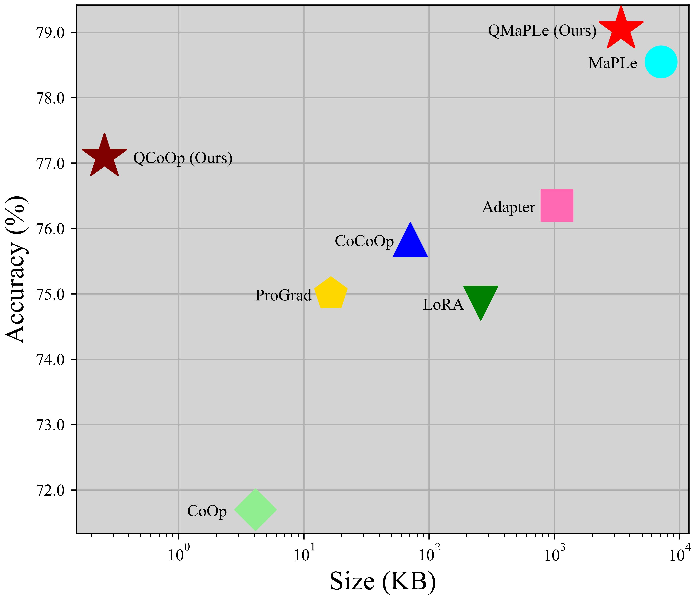

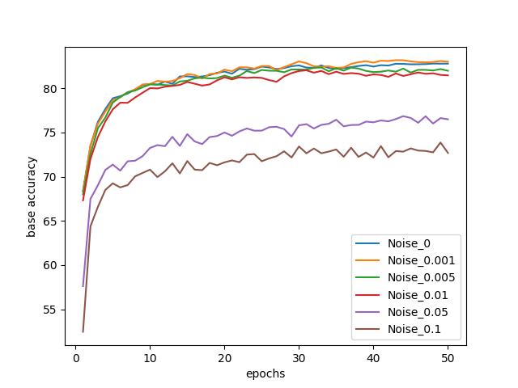

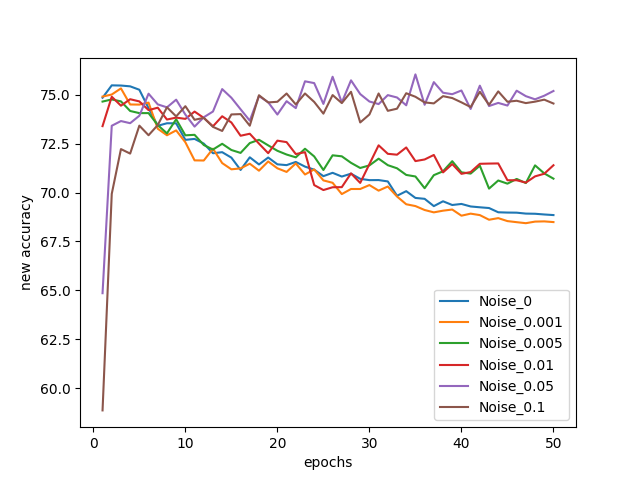

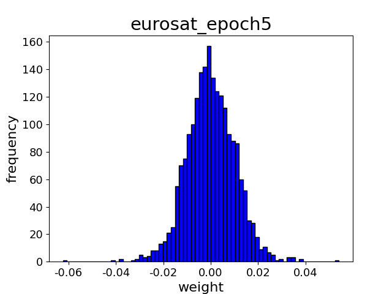

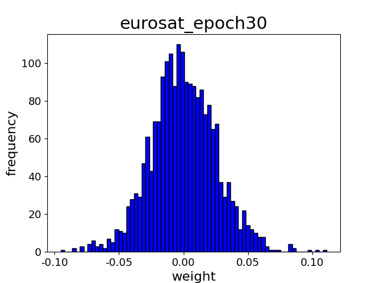

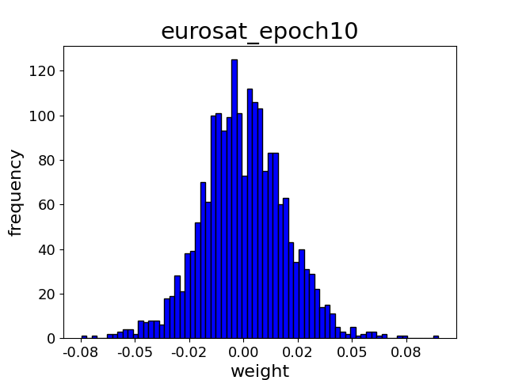

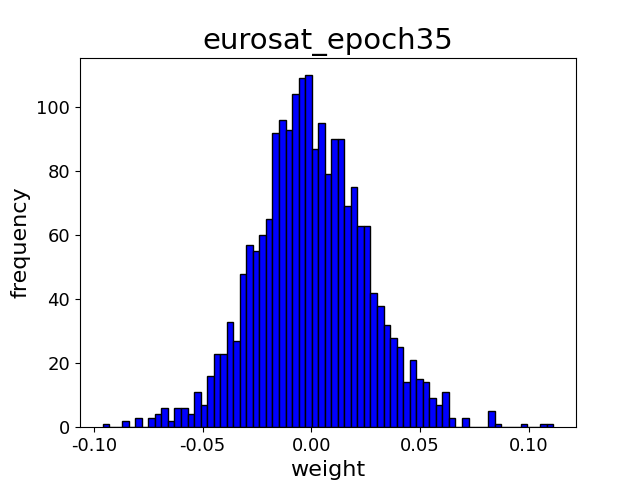

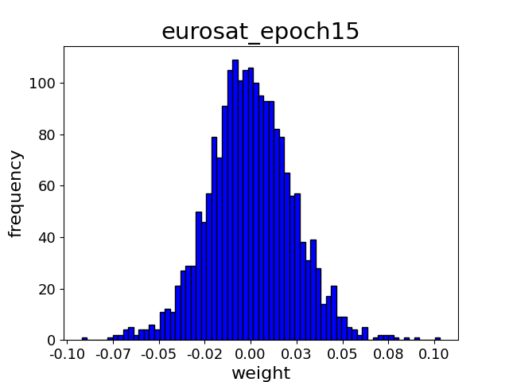

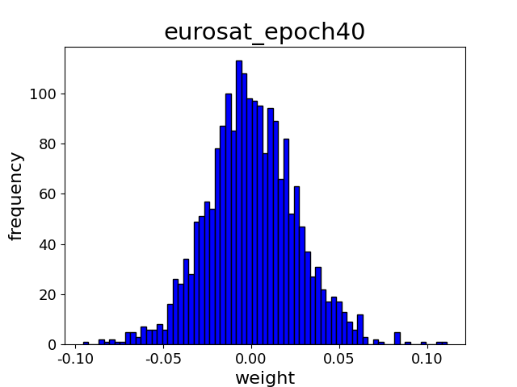

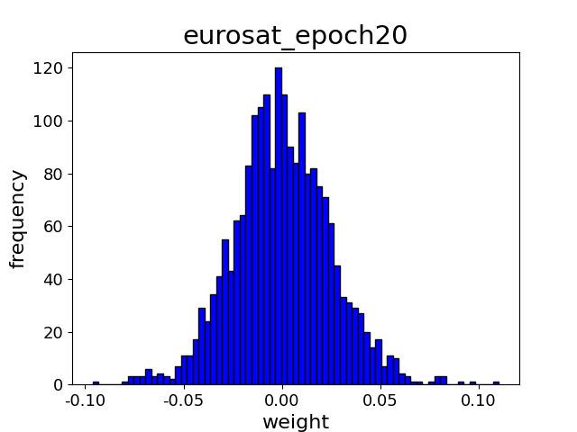

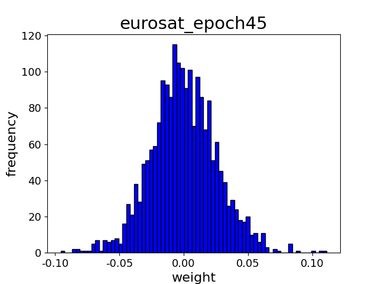

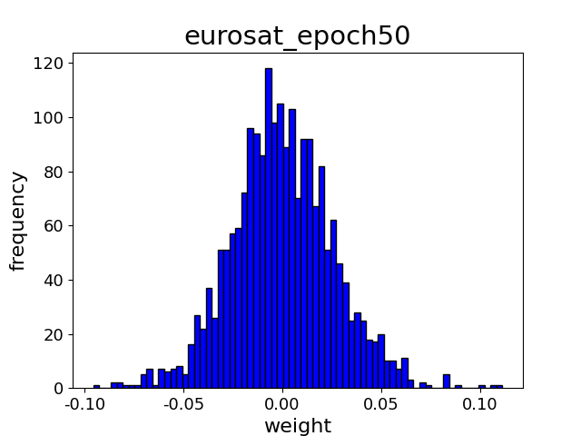

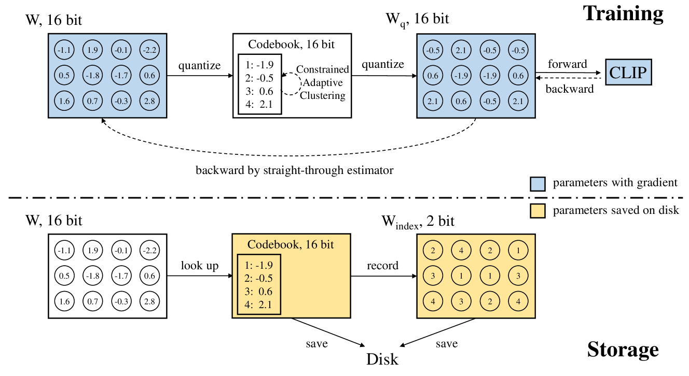

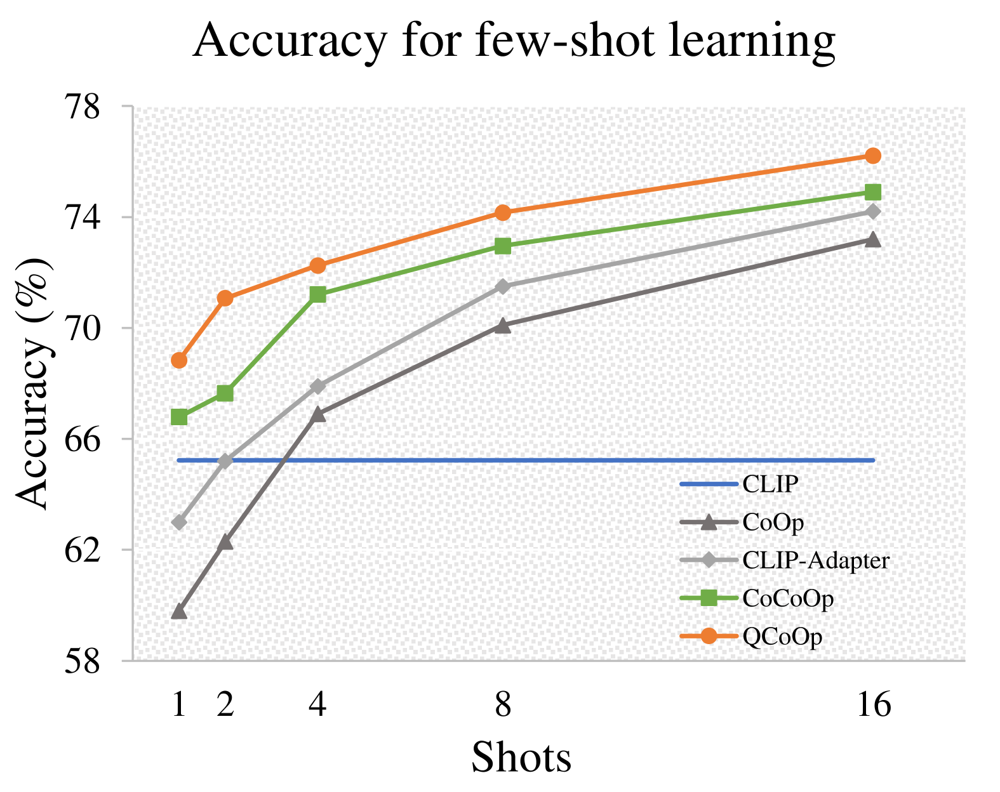

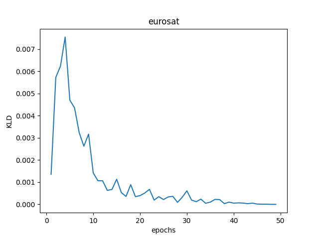

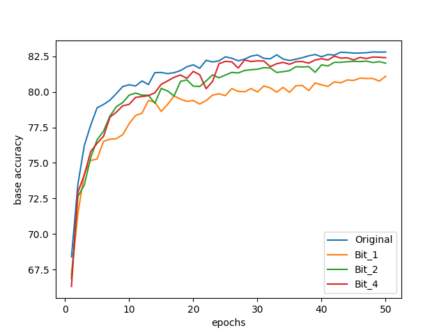

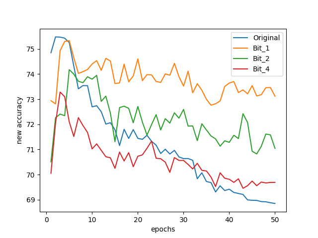

[Arxiv](https://arxiv.org/abs/2407.10704)