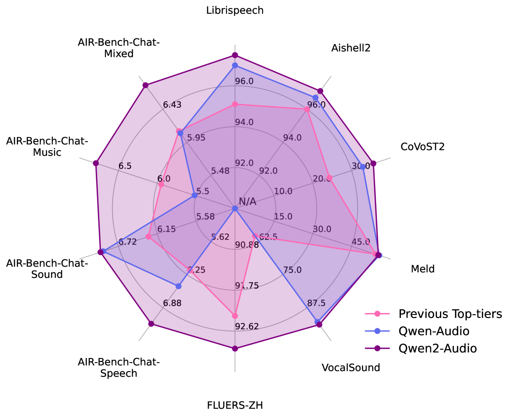
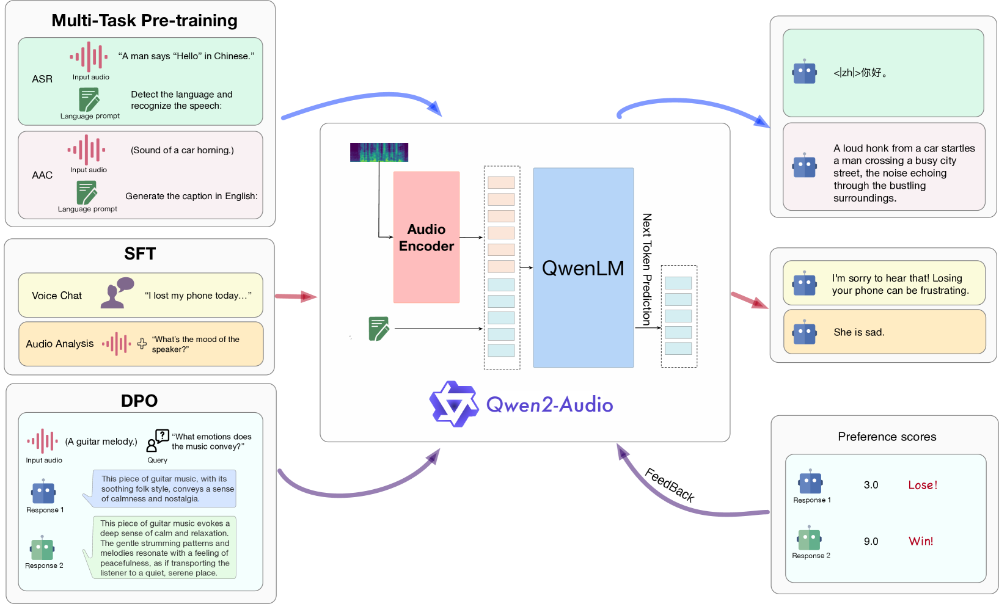
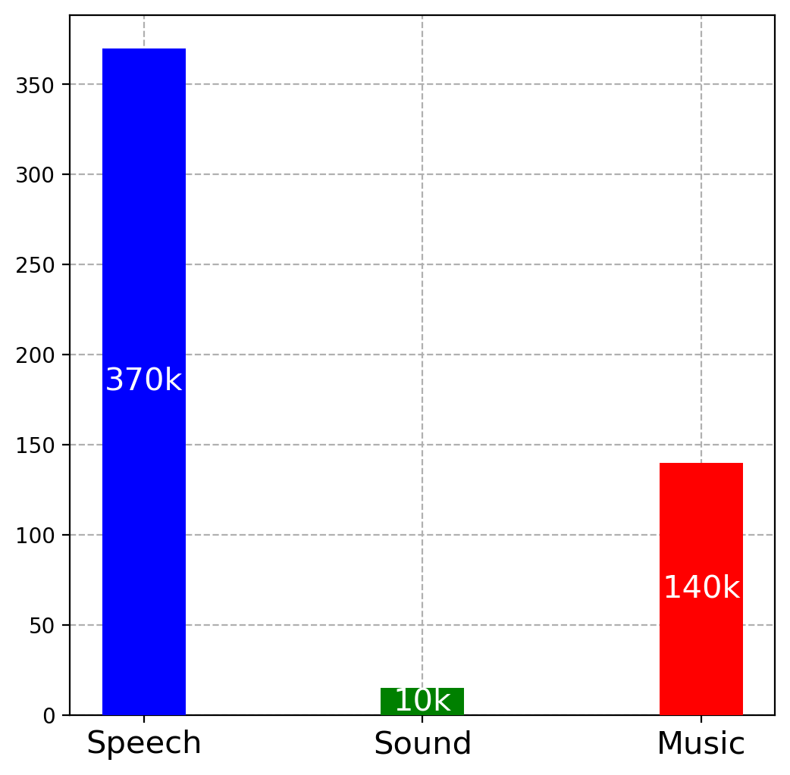
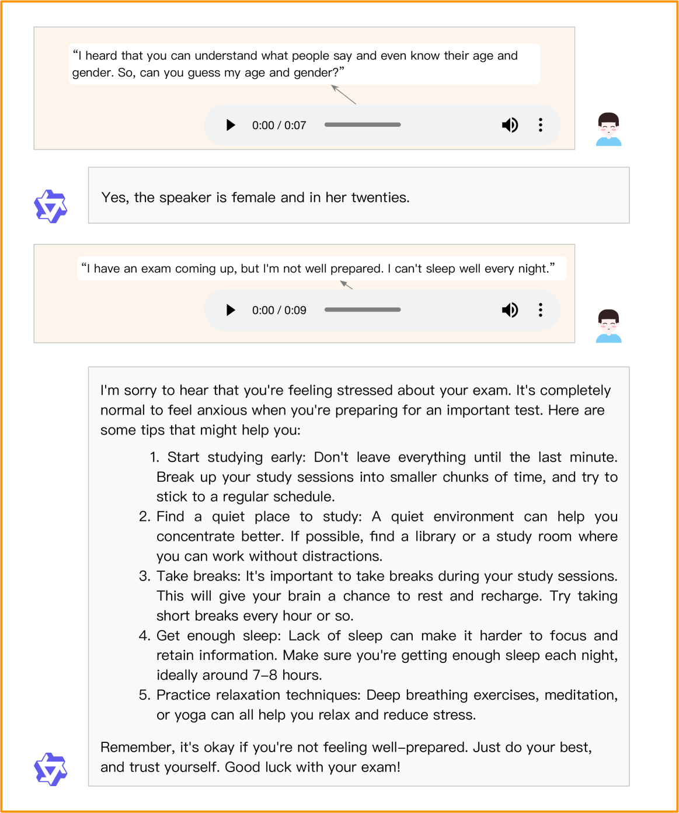
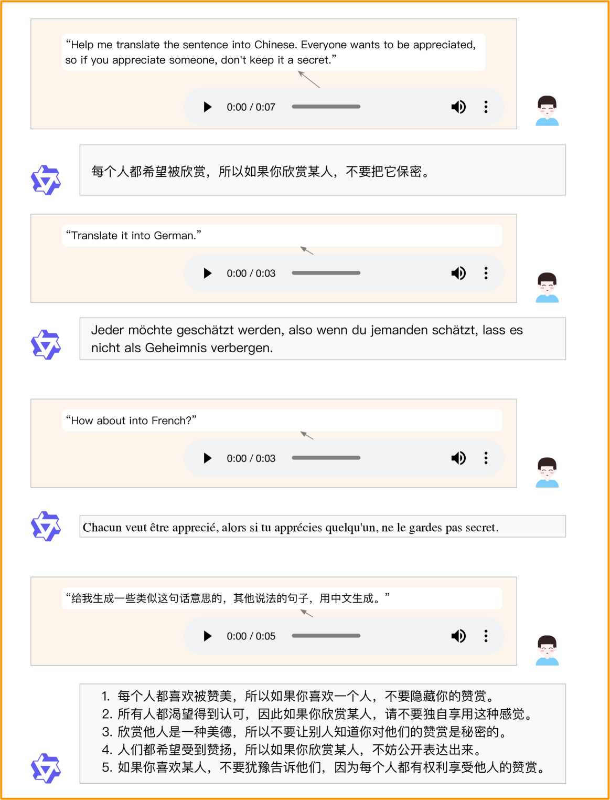
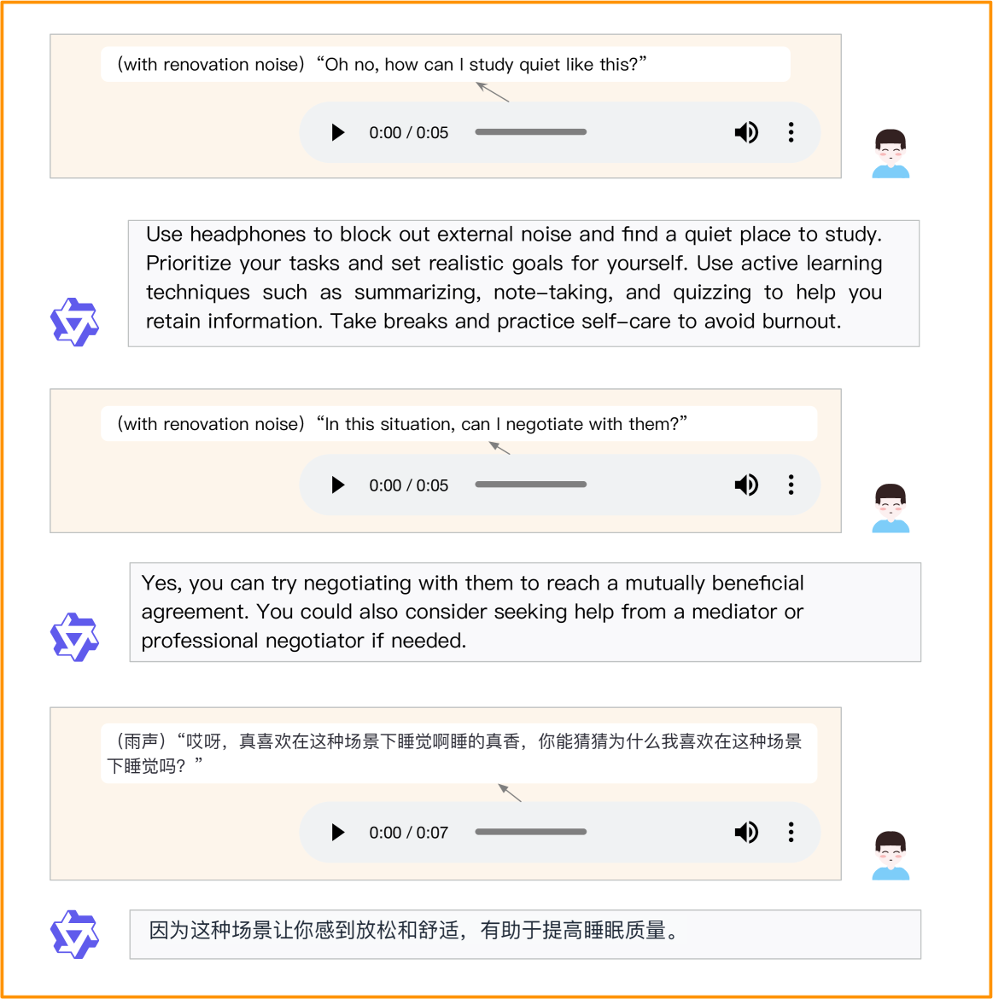
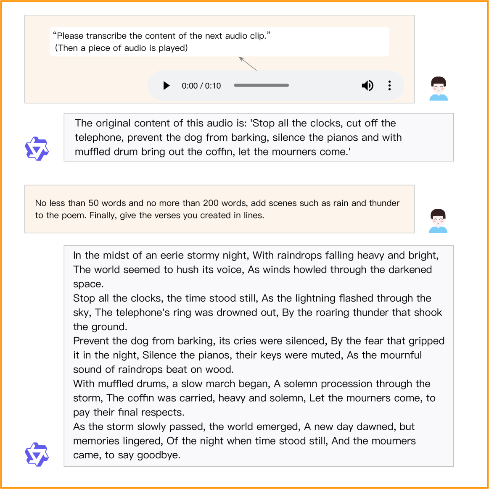
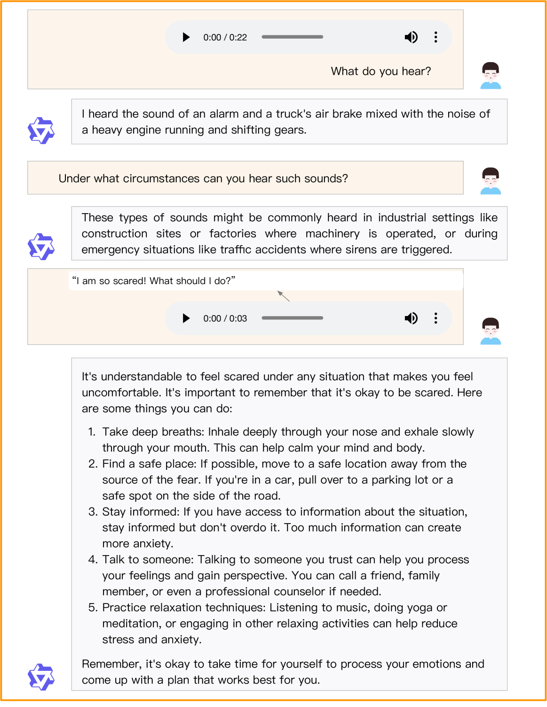
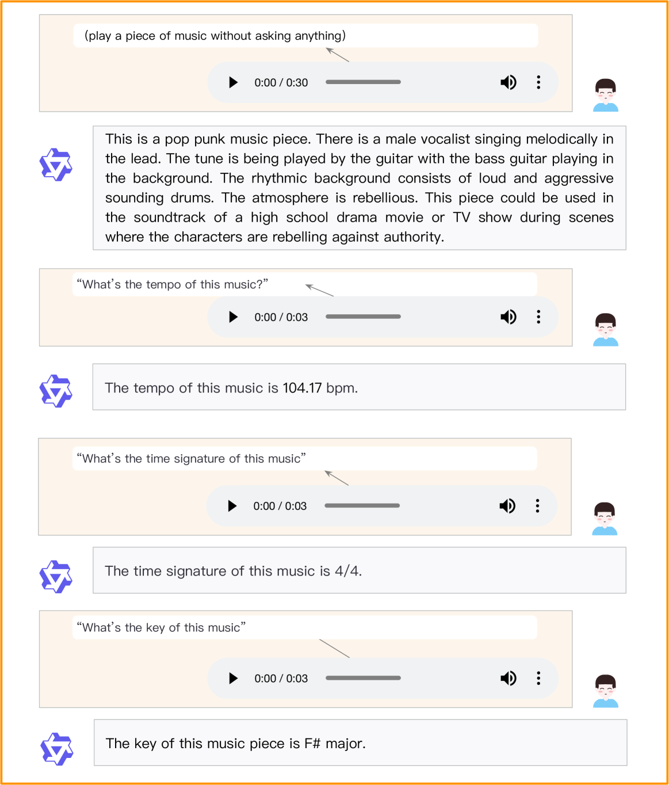
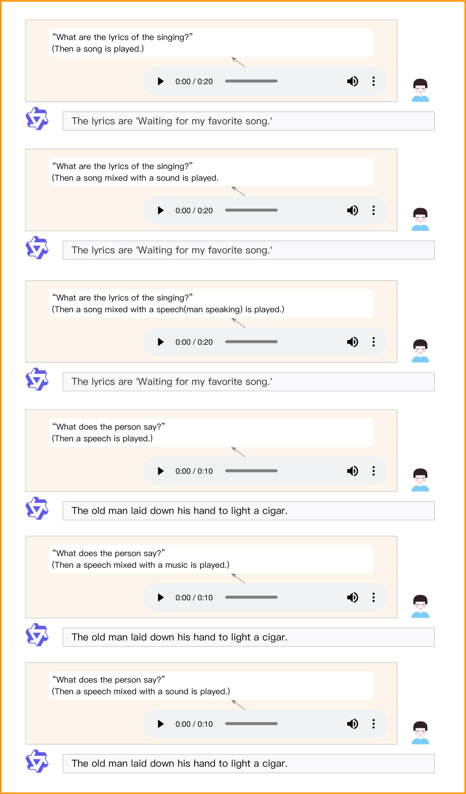

# Qwen2-Audio 技术报告

发布时间：2024年07月15日

`LLM应用` `音频处理` `语音识别`

> Qwen2-Audio Technical Report

# 摘要

> 我们推出了Qwen-Audio的最新成果——Qwen2-Audio，这是一个能够处理多种音频输入并进行分析或直接响应语音指令的大型音频-语言模型。通过使用自然语言提示简化预训练流程并扩充数据量，我们增强了Qwen2-Audio的指令执行能力，并设计了两种音频交互模式：语音聊天和音频分析。在语音聊天模式下，用户可与Qwen2-Audio自由语音交流，无需文本介入；而在音频分析模式中，用户可结合音频与文本指令进行深入分析。值得一提的是，这两种模式间的切换无需系统提示，Qwen2-Audio能智能识别并响应音频内容。例如，面对同时包含多种声音、多人对话及语音指令的复杂音频，Qwen2-Audio能精准理解指令并给出相应解读。此外，通过DPO的优化，模型在保持事实准确性和行为一致性方面表现更佳。根据AIR-Bench的评测，Qwen2-Audio在音频指令遵循能力测试中超越了Gemini-1.5-pro等先前最佳模型。我们开源Qwen2-Audio，旨在推动多模态语言技术的发展。

> We introduce the latest progress of Qwen-Audio, a large-scale audio-language model called Qwen2-Audio, which is capable of accepting various audio signal inputs and performing audio analysis or direct textual responses with regard to speech instructions. In contrast to complex hierarchical tags, we have simplified the pre-training process by utilizing natural language prompts for different data and tasks, and have further expanded the data volume. We have boosted the instruction-following capability of Qwen2-Audio and implemented two distinct audio interaction modes for voice chat and audio analysis. In the voice chat mode, users can freely engage in voice interactions with Qwen2-Audio without text input. In the audio analysis mode, users could provide audio and text instructions for analysis during the interaction. Note that we do not use any system prompts to switch between voice chat and audio analysis modes. Qwen2-Audio is capable of intelligently comprehending the content within audio and following voice commands to respond appropriately. For instance, in an audio segment that simultaneously contains sounds, multi-speaker conversations, and a voice command, Qwen2-Audio can directly understand the command and provide an interpretation and response to the audio. Additionally, DPO has optimized the model's performance in terms of factuality and adherence to desired behavior. According to the evaluation results from AIR-Bench, Qwen2-Audio outperformed previous SOTAs, such as Gemini-1.5-pro, in tests focused on audio-centric instruction-following capabilities. Qwen2-Audio is open-sourced with the aim of fostering the advancement of the multi-modal language community.

[Arxiv](https://arxiv.org/abs/2407.10759)