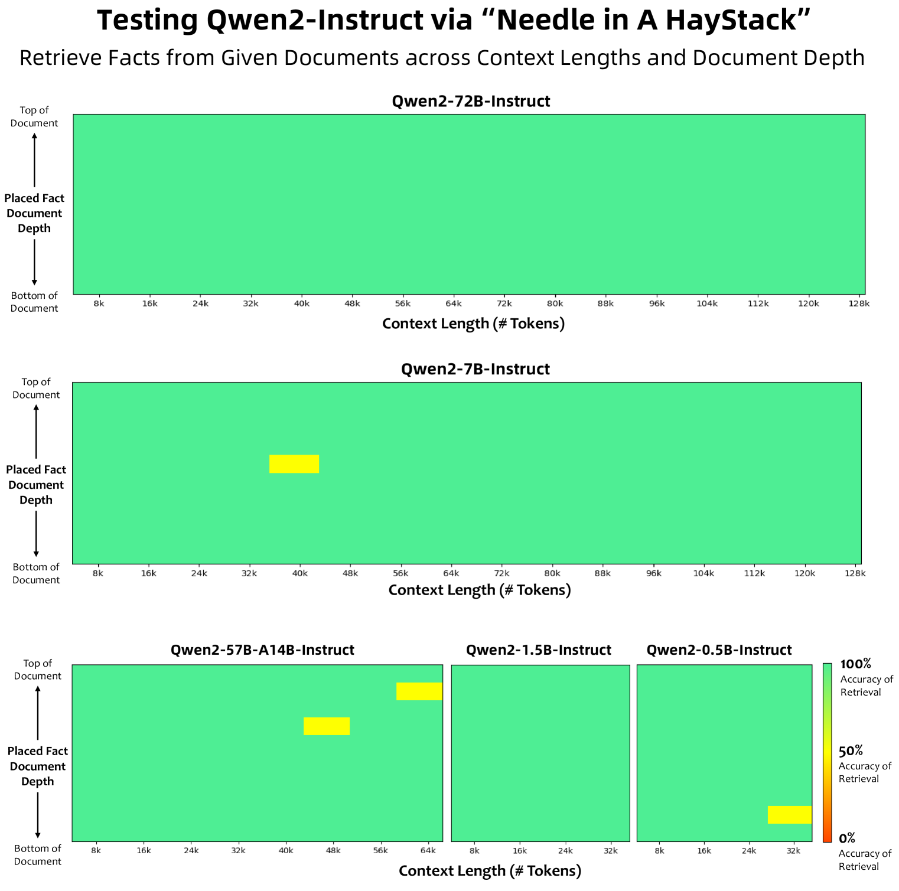

# Qwen2 技术报告

发布时间：2024年07月15日

`LLM应用` `人工智能` `多语言处理`

> Qwen2 Technical Report

# 摘要

> 本报告隆重推出Qwen2系列，这是我们大型语言模型和多模态模型的最新力作。我们发布了一系列全面的基础和指令调优语言模型，参数范围从0.5亿至72亿，涵盖密集模型和专家混合模型。Qwen2不仅超越了众多先前的开放权重模型，包括其前身Qwen1.5，更在语言理解、生成、多语言能力、编码、数学和推理等多个领域与专有模型一较高下。旗舰模型Qwen2-72B表现卓越：MMLU得分84.2，GPQA得分37.9，HumanEval得分64.6，GSM8K得分89.5，BBH得分82.4。指令调优版Qwen2-72B-Instruct同样亮眼：MT-Bench得分9.1，Arena-Hard得分48.1，LiveCodeBench得分35.7。此外，Qwen2精通约30种语言，从英语到中文，从西班牙语到阿拉伯语，展现了其强大的多语言能力和全球适用性。为推动社区创新和模型普及，我们在Hugging Face和ModelScope上公开了Qwen2模型权重，并提供了GitHub上的示例代码等补充材料。这些平台还提供了量化、微调和部署的资源，助力广泛的应用和研究探索。

> This report introduces the Qwen2 series, the latest addition to our large language models and large multimodal models. We release a comprehensive suite of foundational and instruction-tuned language models, encompassing a parameter range from 0.5 to 72 billion, featuring dense models and a Mixture-of-Experts model. Qwen2 surpasses most prior open-weight models, including its predecessor Qwen1.5, and exhibits competitive performance relative to proprietary models across diverse benchmarks on language understanding, generation, multilingual proficiency, coding, mathematics, and reasoning.
  The flagship model, Qwen2-72B, showcases remarkable performance: 84.2 on MMLU, 37.9 on GPQA, 64.6 on HumanEval, 89.5 on GSM8K, and 82.4 on BBH as a base language model. The instruction-tuned variant, Qwen2-72B-Instruct, attains 9.1 on MT-Bench, 48.1 on Arena-Hard, and 35.7 on LiveCodeBench. Moreover, Qwen2 demonstrates robust multilingual capabilities, proficient in approximately 30 languages, spanning English, Chinese, Spanish, French, German, Arabic, Russian, Korean, Japanese, Thai, Vietnamese, and more, underscoring its versatility and global reach.
  To foster community innovation and accessibility, we have made the Qwen2 model weights openly available on Hugging Face1 and ModelScope2, and the supplementary materials including example code on GitHub3. These platforms also include resources for quantization, fine-tuning, and deployment, facilitating a wide range of applications and research endeavors.

[Arxiv](https://arxiv.org/abs/2407.10671)