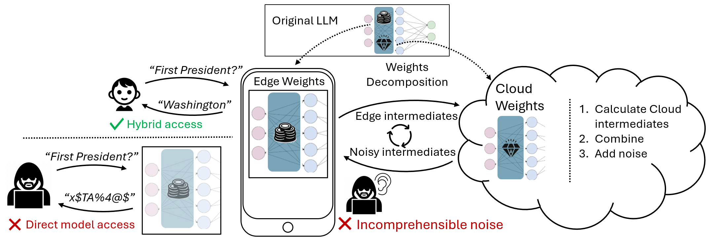
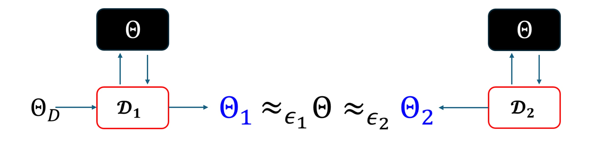
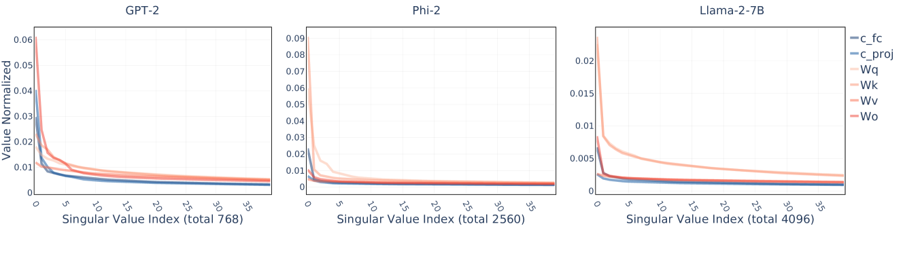
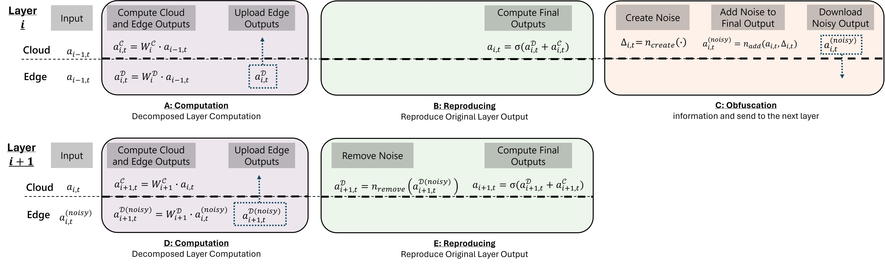
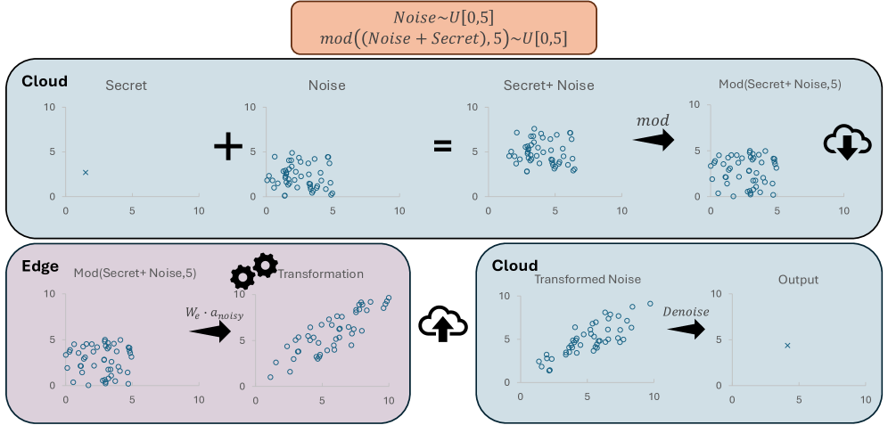
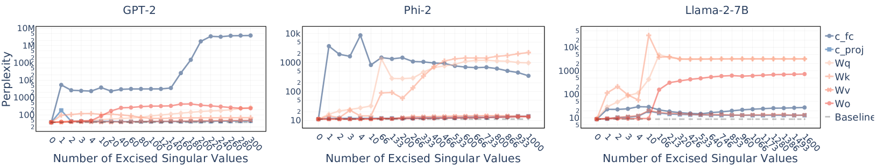
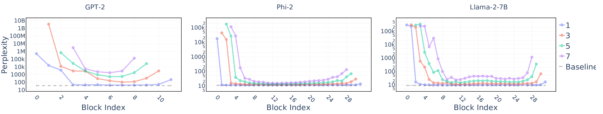
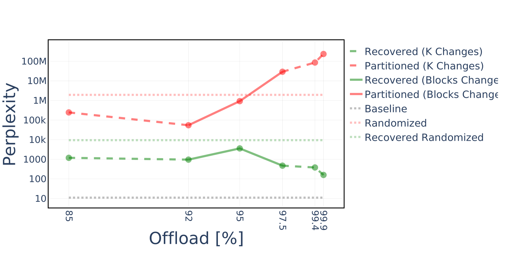

# SLIP：通过权重分解技术，保障大型语言模型（LLM）的知识产权安全。

发布时间：2024年07月15日

`LLM应用` `边缘计算` `网络安全`

> SLIP: Securing LLMs IP Using Weights Decomposition

# 摘要

> 随着大型语言模型（LLM）在学术和工业领域的广泛应用，它们已成为宝贵的知识产权（IP），体现了巨大的投资。然而，高昂的云部署成本促使人们转向边缘设备部署，这却增加了参数被盗和滥用的风险。现有的边缘模型保护方法存在实用性、准确性或适用性方面的局限。本文提出了一种创新的混合推理算法SLIP，旨在保护边缘部署的模型免受盗窃。SLIP是首个既实用又安全，且不影响准确性和延迟的混合协议。它通过矩阵分解，在安全和昂贵的资源与成本效益高但易受攻击的资源之间划分模型，确保敏感的IP部分得到最大保留，同时最小化计算量。该协议还提供了安全保障，防止攻击者利用分区获取信息。实验结果表明，我们的方法既强大又有效，是保护LLM的理想选择。

> Large language models (LLMs) have recently seen widespread adoption, in both academia and industry. As these models grow, they become valuable intellectual property (IP), reflecting enormous investments by their owners. Moreover, the high cost of cloud-based deployment has driven interest towards deployment to edge devices, yet this risks exposing valuable parameters to theft and unauthorized use. Current methods to protect models' IP on the edge have limitations in terms of practicality, loss in accuracy, or suitability to requirements. In this paper, we introduce a novel hybrid inference algorithm, named SLIP, designed to protect edge-deployed models from theft. SLIP is the first hybrid protocol that is both practical for real-world applications and provably secure, while having zero accuracy degradation and minimal impact on latency. It involves partitioning the model between two computing resources, one secure but expensive, and another cost-effective but vulnerable. This is achieved through matrix decomposition, ensuring that the secure resource retains a maximally sensitive portion of the model's IP while performing a minimal amount of computations, and vice versa for the vulnerable resource. Importantly, the protocol includes security guarantees that prevent attackers from exploiting the partition to infer the secured information. Finally, we present experimental results that show the robustness and effectiveness of our method, positioning it as a compelling solution for protecting LLMs.

[Arxiv](https://arxiv.org/abs/2407.10886)