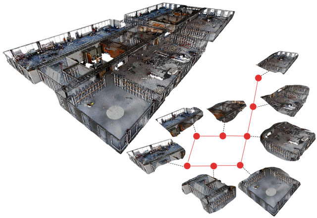
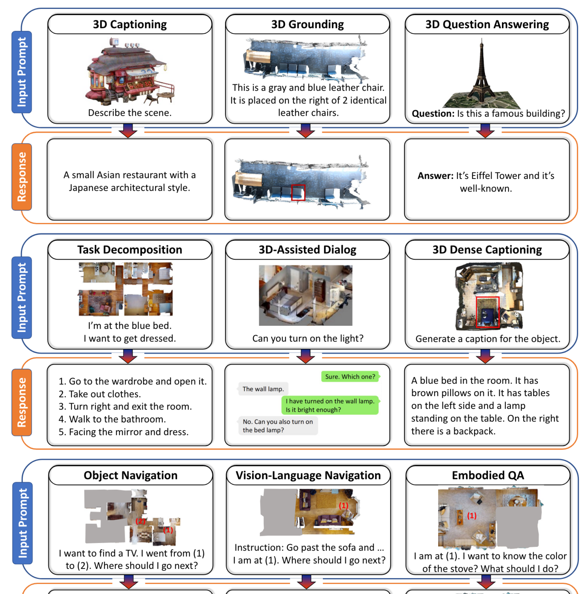
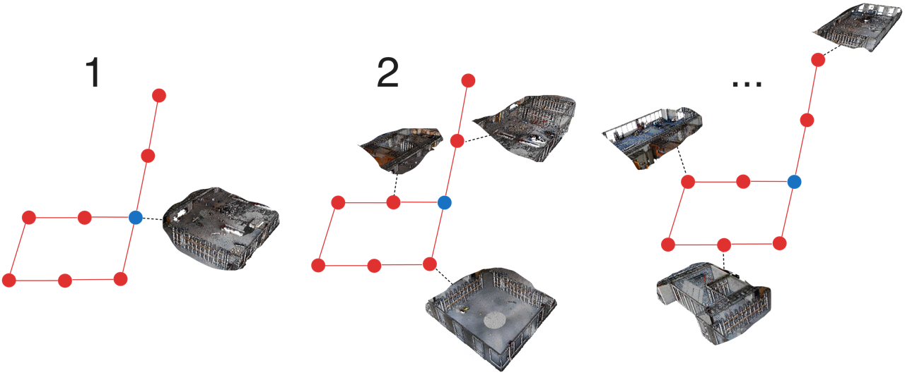
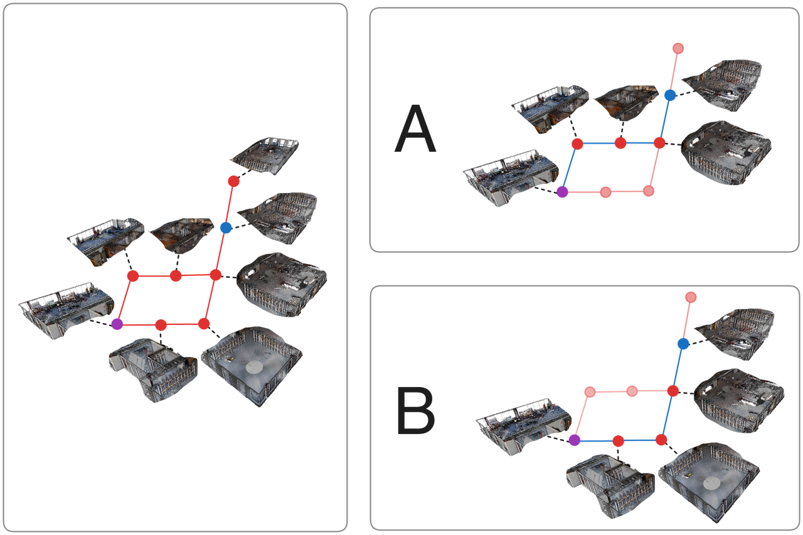

# 利用 Datagraphs 技术，我们将 LMMs 的三维推理能力提升至大型机器人任务环境，实现更高效的场景理解与决策。

发布时间：2024年07月15日

`LLM应用` `搜索与救援` `机器人`

> Scaling 3D Reasoning with LMMs to Large Robot Mission Environments Using Datagraphs

# 摘要

> 本文针对将大型多模态模型 (LMM) 扩展至广阔 3D 环境的难题，提出解决方案。尤其在搜索与救援等需要覆盖广大区域的紧急任务中，机器人的部署对此需求迫切。然而，LMM 的应用受限于其输入大小的严格上下文窗口。为此，我们创新性地采用数据图结构，使 LMM 能逐步查询大型环境的局部信息。结合图遍历算法，我们能优先处理关键地点，显著提升 3D 场景语言任务的可扩展性。虽然我们以 3D 场景为例，但该方法同样适用于点云或高斯喷射等其他密集模态。通过搜索与救援任务的实例，我们展示了数据图在 3D 场景语言任务中的应用潜力。

> This paper addresses the challenge of scaling Large Multimodal Models (LMMs) to expansive 3D environments. Solving this open problem is especially relevant for robot deployment in many first-responder scenarios, such as search-and-rescue missions that cover vast spaces. The use of LMMs in these settings is currently hampered by the strict context windows that limit the LMM's input size. We therefore introduce a novel approach that utilizes a datagraph structure, which allows the LMM to iteratively query smaller sections of a large environment. Using the datagraph in conjunction with graph traversal algorithms, we can prioritize the most relevant locations to the query, thereby improving the scalability of 3D scene language tasks. We illustrate the datagraph using 3D scenes, but these can be easily substituted by other dense modalities that represent the environment, such as pointclouds or Gaussian splats. We demonstrate the potential to use the datagraph for two 3D scene language task use cases, in a search-and-rescue mission example.

[Arxiv](https://arxiv.org/abs/2407.10743)