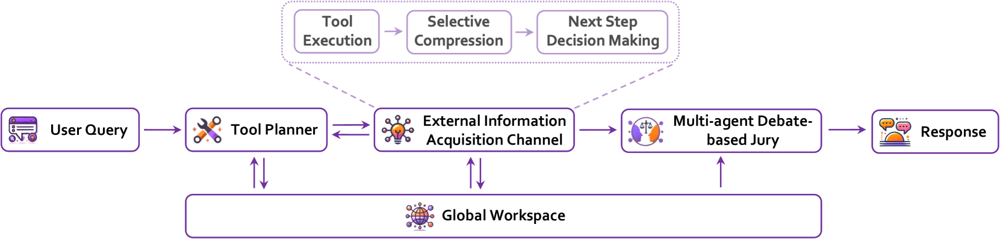
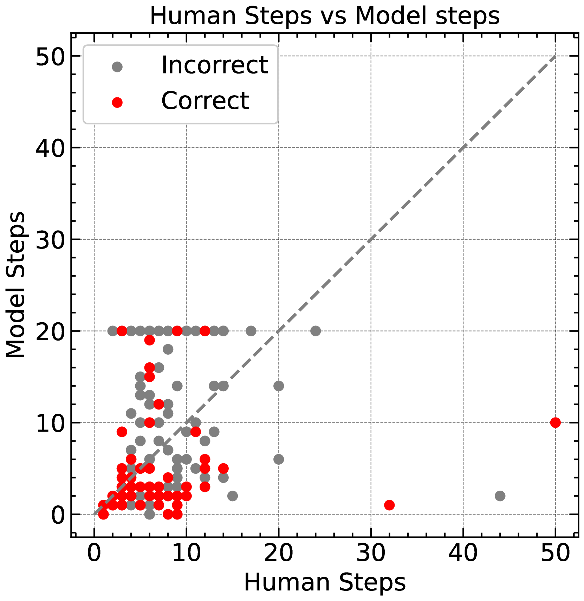

# Sibyl 框架，简洁高效，专为复杂现实推理设计。

发布时间：2024年07月15日

`Agent` `人工智能` `软件开发`

> Sibyl: Simple yet Effective Agent Framework for Complex Real-world Reasoning

# 摘要

> 现有的基于大型语言模型（LLM）的代理通过结合LLM的内在知识、强大的上下文学习能力、零-shot能力以及人类设计的精细工具使用流程，展现出卓越的问题解决能力。然而，这些代理在长期推理和工具潜力利用方面仍有不足，导致在复杂现实推理场景中表现不佳。为此，我们推出了Sibyl，一个简洁而强大的LLM代理框架，旨在通过精简工具集高效解决复杂推理任务。借鉴全球工作空间理论，Sibyl设立全局工作空间以优化知识和对话历史的系统内管理与共享。遵循心灵社会理论，Sibyl采用多代理辩论机制自我优化答案，确保决策的全面性与平衡性。这一设计不仅简化了系统架构，还拓宽了问题解决的广度，从几分钟内可解的人类任务扩展至需数小时乃至数天的复杂挑战，推动思维模式从直觉（系统1）向深思熟虑（系统2）转变。Sibyl自设计之初便注重可扩展性与调试便捷性，融入函数式编程的可重入理念，力求在其他LLM应用中实现低成本高效集成。实验表明，搭载GPT-4的Sibyl代理在GAIA基准测试中以34.55%的平均分领先同类产品，我们期待Sibyl能引领更多高效、可靠的LLM代理解决方案，助力应对现实世界的复杂推理难题。

> Existing agents based on large language models (LLMs) demonstrate robust problem-solving capabilities by integrating LLMs' inherent knowledge, strong in-context learning and zero-shot capabilities, and the use of tools combined with intricately designed LLM invocation workflows by humans. However, these agents still exhibit shortcomings in long-term reasoning and under-use the potential of existing tools, leading to noticeable deficiencies in complex real-world reasoning scenarios. To address these limitations, we introduce Sibyl, a simple yet powerful LLM-based agent framework designed to tackle complex reasoning tasks by efficiently leveraging a minimal set of tools. Drawing inspiration from Global Workspace Theory, Sibyl incorporates a global workspace to enhance the management and sharing of knowledge and conversation history throughout the system. Furthermore, guided by Society of Mind Theory, Sibyl implements a multi-agent debate-based jury to self-refine the final answers, ensuring a comprehensive and balanced approach. This approach aims to reduce system complexity while expanding the scope of problems solvable-from matters typically resolved by humans in minutes to those requiring hours or even days, thus facilitating a shift from System-1 to System-2 thinking. Sibyl has been designed with a focus on scalability and ease of debugging by incorporating the concept of reentrancy from functional programming from its inception, with the aim of seamless and low effort integration in other LLM applications to improve capabilities. Our experimental results on the GAIA benchmark test set reveal that the Sibyl agent instantiated with GPT-4 achieves state-of-the-art performance with an average score of 34.55%, compared to other agents based on GPT-4. We hope that Sibyl can inspire more reliable and reusable LLM-based agent solutions to address complex real-world reasoning tasks.

[Arxiv](https://arxiv.org/abs/2407.10718)