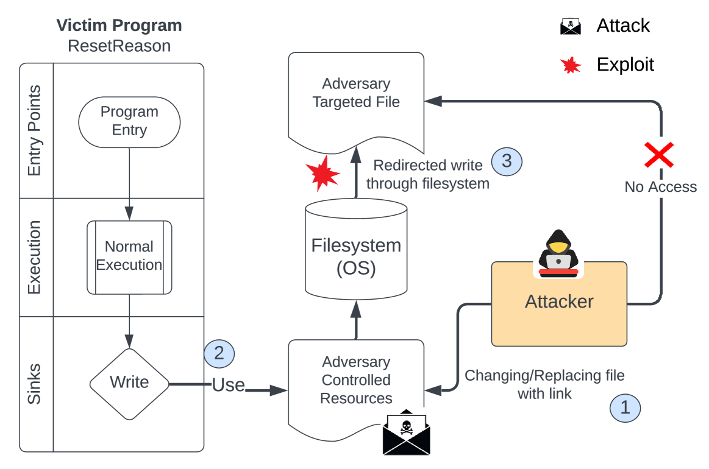

# Android系统文件系统漏洞的静态检测

发布时间：2024年07月15日

`LLM应用` `移动设备` `网络安全`

> Static Detection of Filesystem Vulnerabilities in Android Systems

# 摘要

> 尽管已有多种防御和测试技术，文件系统漏洞仍是Android系统的一大威胁。Android系统中复杂的程序行为和访问控制机制使得有效识别这些漏洞颇具挑战。本文介绍的PathSentinel，通过融合静态程序分析与访问控制策略分析，成功检测路径遍历、劫持及诱饵等三种文件系统漏洞，突破了以往技术的局限。PathSentinel通过整合程序与访问控制策略分析，精准定位攻击面，并剔除众多不切实际的攻击，为漏洞测试生成有效输入。此外，PathSentinel借助大型语言模型（LLMs），根据识别的漏洞和生成的输入，自动生成针对性的利用代码，大幅减轻了编写测试应用的工程负担，展现了静态分析与LLMs结合提升利用生成与漏洞验证效率的潜力。对三星和OnePlus的Android 12及14系统的评估表明，PathSentinel在217个应用中发现了51个未知漏洞，误报率极低。这些成果凸显了结合程序与访问控制策略分析进行精准漏洞检测的重要性，并指出了集成LLMs实现自动化利用生成的光明前景，为提升Android系统对抗文件系统漏洞的安全性提供了全面解决方案。

> Filesystem vulnerabilities persist as a significant threat to Android systems, despite various proposed defenses and testing techniques. The complexity of program behaviors and access control mechanisms in Android systems makes it challenging to effectively identify these vulnerabilities. In this paper, we present PathSentinel, which overcomes the limitations of previous techniques by combining static program analysis and access control policy analysis to detect three types of filesystem vulnerabilities: path traversals, hijacking vulnerabilities, and luring vulnerabilities. By unifying program and access control policy analysis, PathSentinel identifies attack surfaces accurately and prunes many impractical attacks to generate input payloads for vulnerability testing. To streamline vulnerability validation, PathSentinel leverages large language models (LLMs) to generate targeted exploit code based on the identified vulnerabilities and generated input payloads. The LLMs serve as a tool to reduce the engineering effort required for writing test applications, demonstrating the potential of combining static analysis with LLMs to enhance the efficiency of exploit generation and vulnerability validation. Evaluation on Android 12 and 14 systems from Samsung and OnePlus demonstrates PathSentinel's effectiveness, uncovering 51 previously unknown vulnerabilities among 217 apps with only 2 false positives. These results underscore the importance of combining program and access control policy analysis for accurate vulnerability detection and highlight the promising direction of integrating LLMs for automated exploit generation, providing a comprehensive approach to enhancing the security of Android systems against filesystem vulnerabilities.

[Arxiv](https://arxiv.org/abs/2407.11279)