# SuperPADL：利用渐进式监督蒸馏技术，扩展语言指导的物理基础控制能力

发布时间：2024年07月15日

`Agent`

> SuperPADL: Scaling Language-Directed Physics-Based Control with Progressive Supervised Distillation

# 摘要

> 我们开发的SuperPADL框架，结合了强化学习和监督学习，能够从数千个多样化的动作片段中训练出高效的控制器，实现基于物理模拟的高质量实时角色动画。这一框架通过渐进式蒸馏技术，从专门专家的RL训练开始，逐步提升策略的稳健性和规模，最终在包含5000多个技能的数据集上训练出能够在消费级GPU上实时运行的控制器。SuperPADL不仅支持技能间的自然过渡，还允许用户交互式地创作复杂的多阶段动画，显著提升了在大数据规模下的动画生成性能。

> Physically-simulated models for human motion can generate high-quality responsive character animations, often in real-time. Natural language serves as a flexible interface for controlling these models, allowing expert and non-expert users to quickly create and edit their animations. Many recent physics-based animation methods, including those that use text interfaces, train control policies using reinforcement learning (RL). However, scaling these methods beyond several hundred motions has remained challenging. Meanwhile, kinematic animation models are able to successfully learn from thousands of diverse motions by leveraging supervised learning methods. Inspired by these successes, in this work we introduce SuperPADL, a scalable framework for physics-based text-to-motion that leverages both RL and supervised learning to train controllers on thousands of diverse motion clips. SuperPADL is trained in stages using progressive distillation, starting with a large number of specialized experts using RL. These experts are then iteratively distilled into larger, more robust policies using a combination of reinforcement learning and supervised learning. Our final SuperPADL controller is trained on a dataset containing over 5000 skills and runs in real time on a consumer GPU. Moreover, our policy can naturally transition between skills, allowing for users to interactively craft multi-stage animations. We experimentally demonstrate that SuperPADL significantly outperforms RL-based baselines at this large data scale.

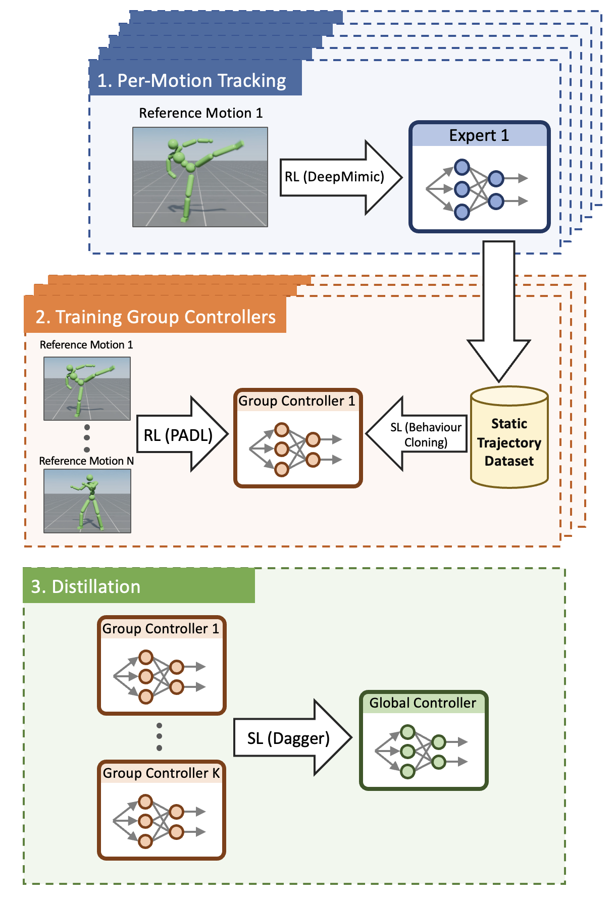

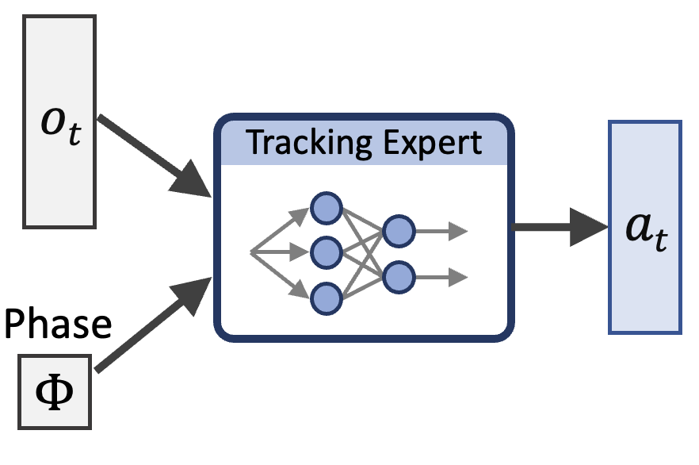

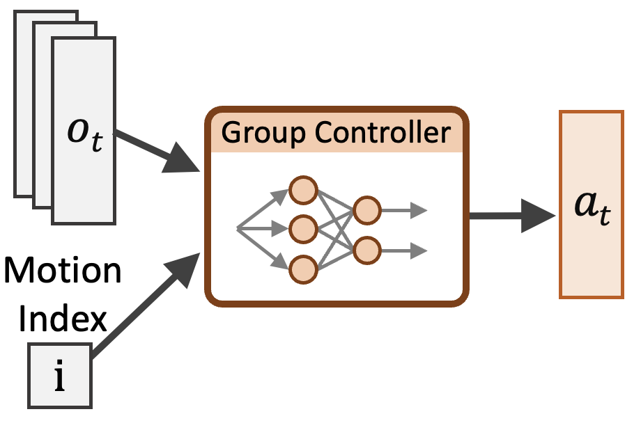

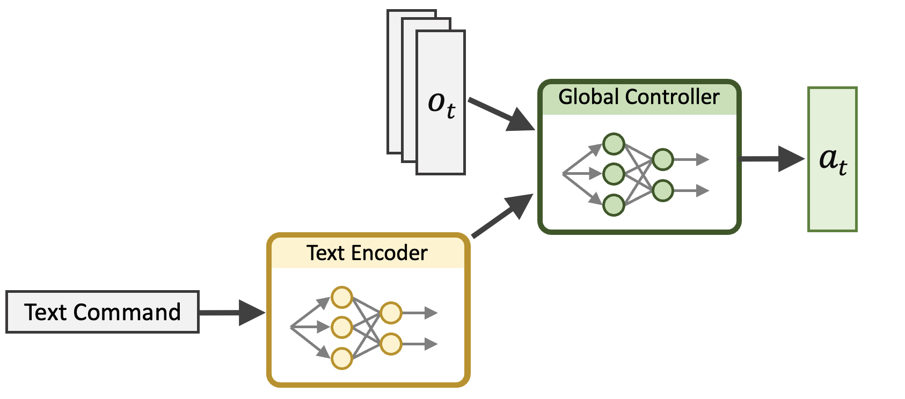

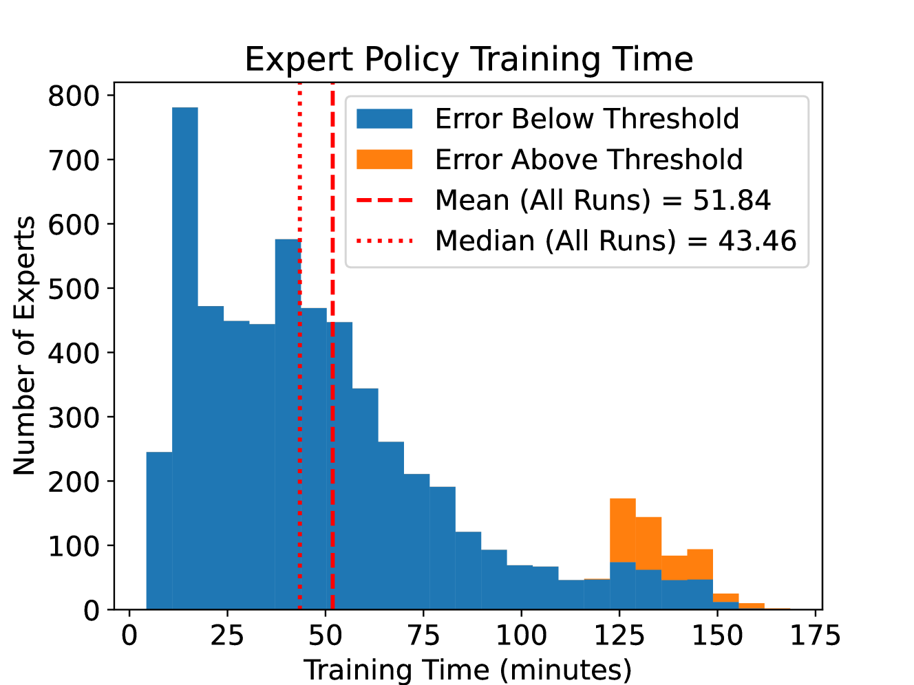

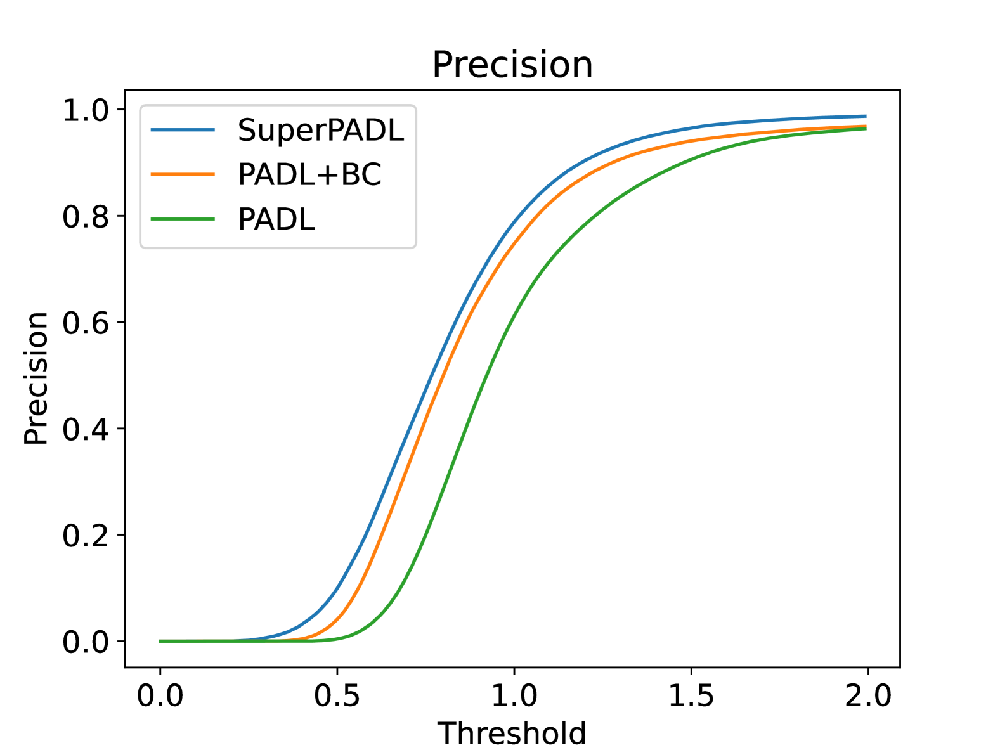

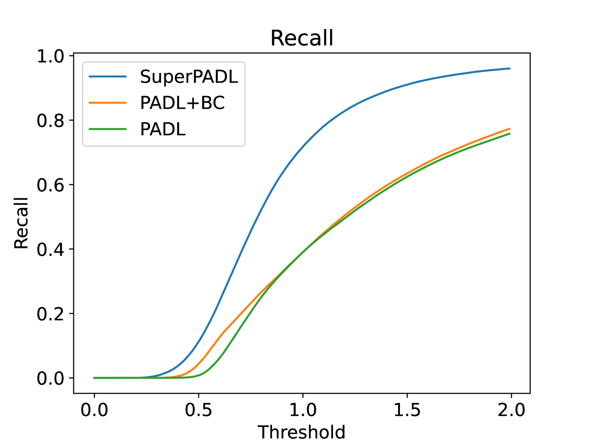

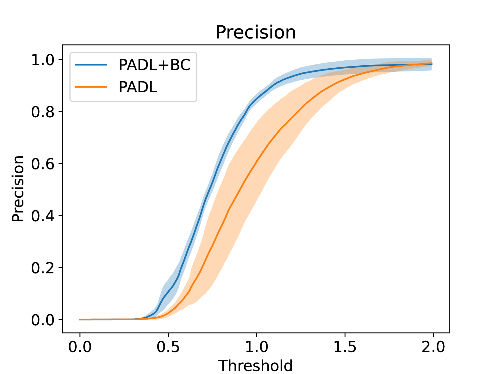

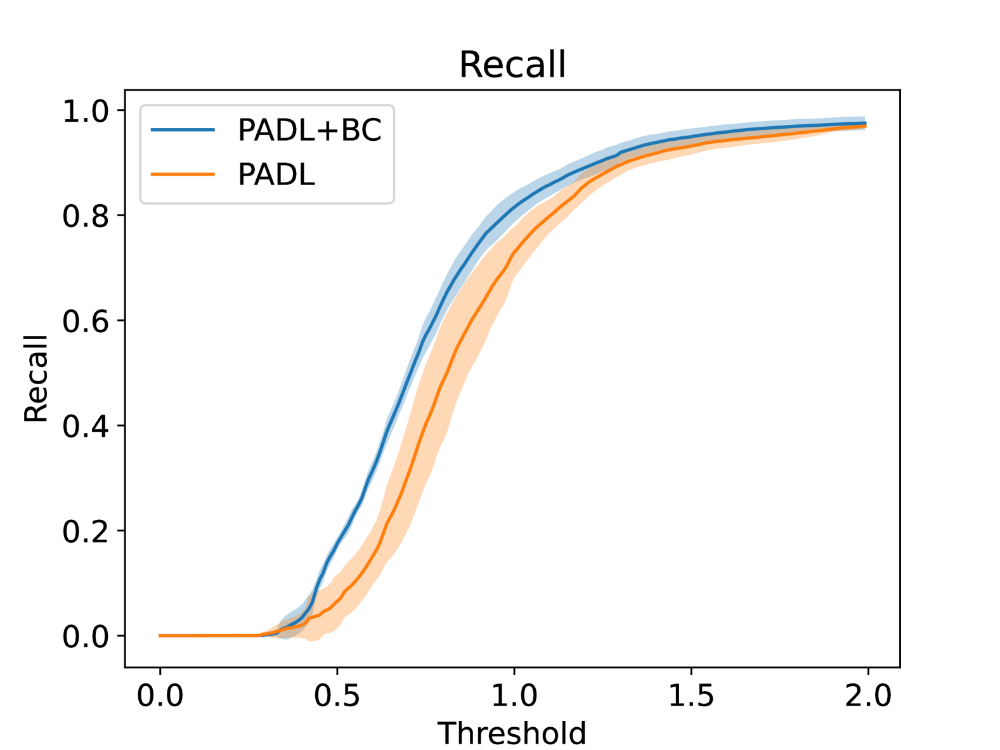

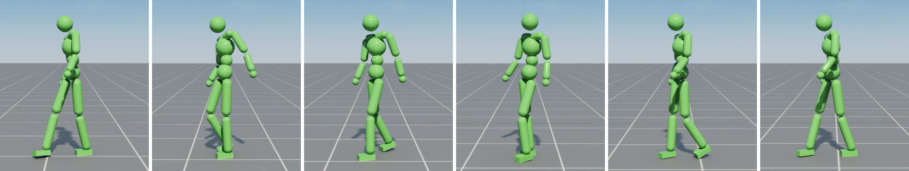

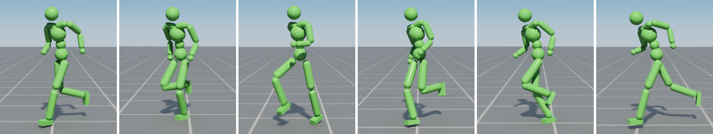

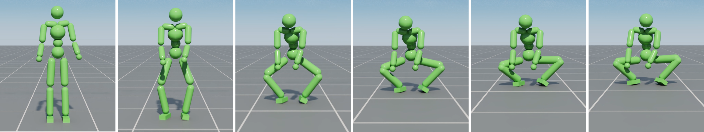

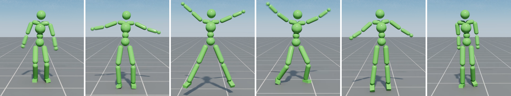

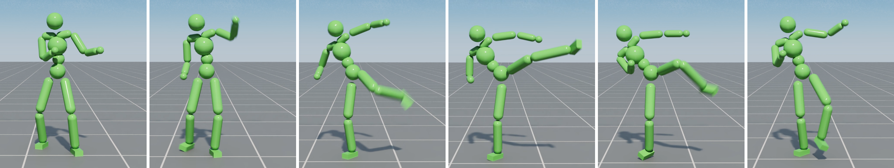

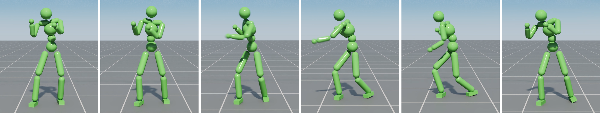

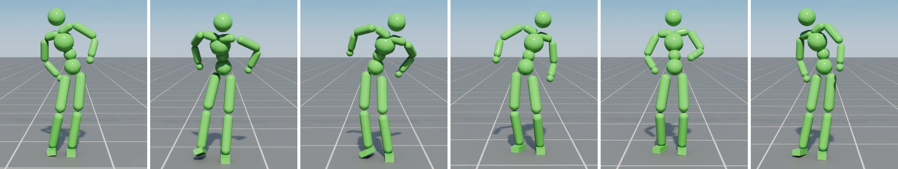

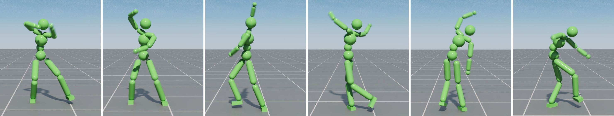

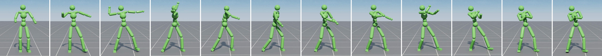

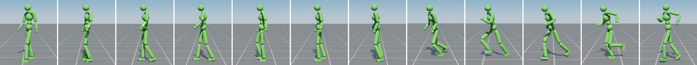

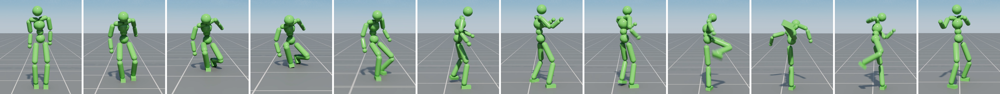

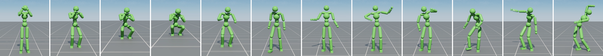

[Arxiv](https://arxiv.org/abs/2407.10481)