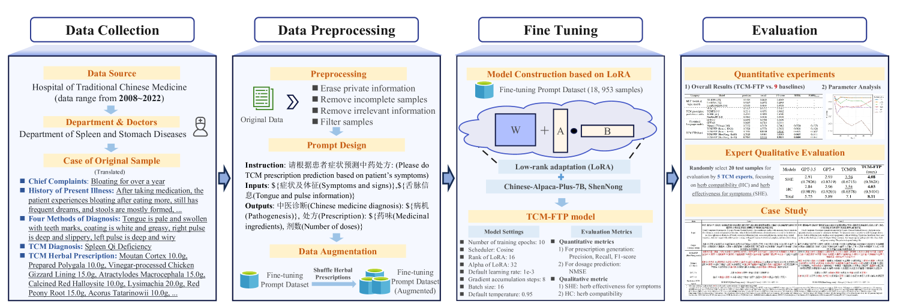
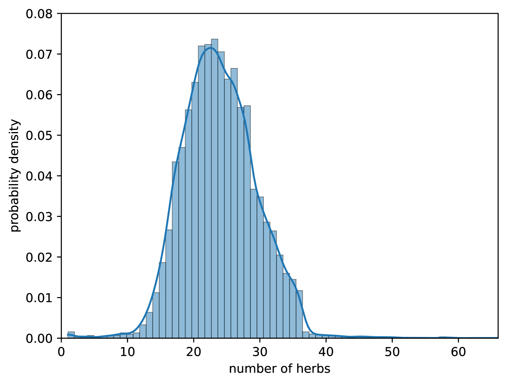
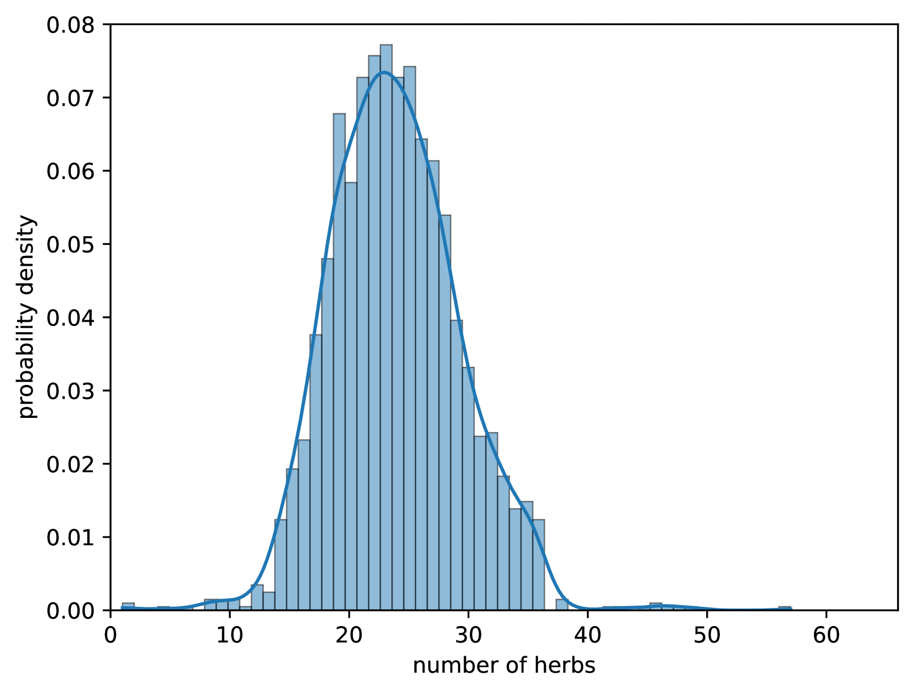
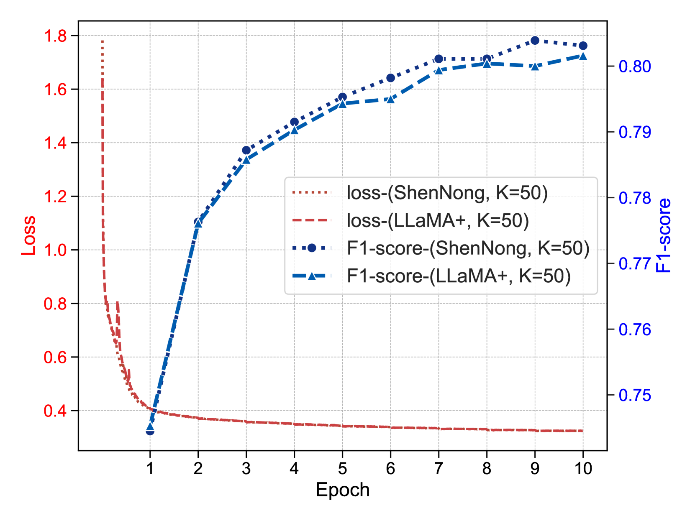
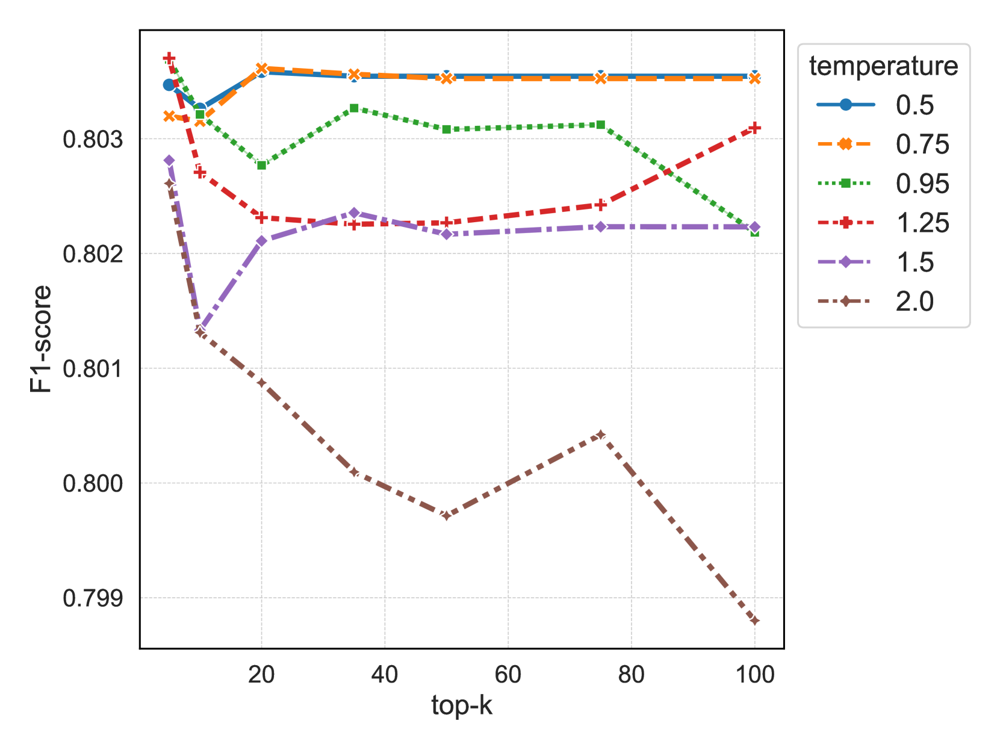
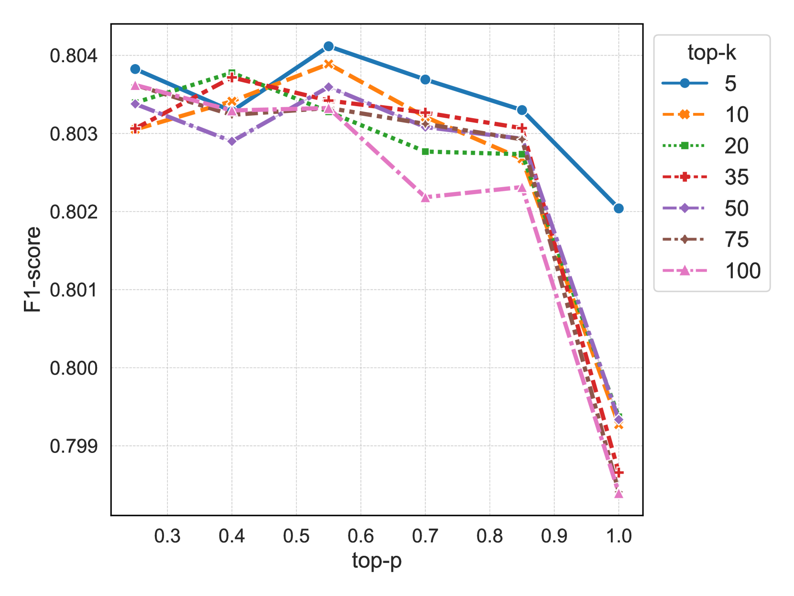
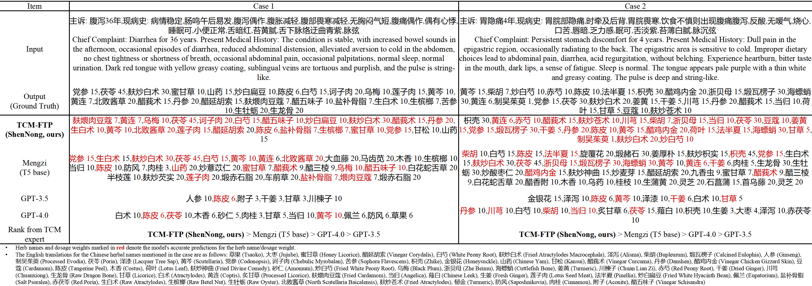

# TCM-FTP：专为草药处方预测而设计的大型语言模型微调方案

发布时间：2024年07月15日

`LLM应用` `中医药`

> TCM-FTP: Fine-Tuning Large Language Models for Herbal Prescription Prediction

# 摘要

> 传统中医（TCM）通过特定草药组合治疗症状，这一实践历史悠久。预测TCM处方是一个引人入胜的技术挑战，但受限于高质量数据集的稀缺和症状与草药关系的复杂性。为此，我们推出了DigestDS数据集，包含消化系统疾病专家的实际医疗记录。同时，我们提出了TCM-FTP方法，通过在DigestDS上监督微调预训练的大型语言模型（LLMs），并采用低秩适应技术提升计算效率。TCM-FTP还通过无序排列草药进行数据增强，实现了0.8031的F1分数，显著优于以往方法，并在剂量预测上达到0.0604的归一化均方误差。这项工作强调了微调在TCM处方预测中的重要性，并提出了一种有效途径。

> Traditional Chinese medicine (TCM) relies on specific combinations of herbs in prescriptions to treat symptoms and signs, a practice that spans thousands of years. Predicting TCM prescriptions presents a fascinating technical challenge with practical implications. However, this task faces limitations due to the scarcity of high-quality clinical datasets and the intricate relationship between symptoms and herbs. To address these issues, we introduce DigestDS, a new dataset containing practical medical records from experienced experts in digestive system diseases. We also propose a method, TCM-FTP (TCM Fine-Tuning Pre-trained), to leverage pre-trained large language models (LLMs) through supervised fine-tuning on DigestDS. Additionally, we enhance computational efficiency using a low-rank adaptation technique. TCM-FTP also incorporates data augmentation by permuting herbs within prescriptions, capitalizing on their order-agnostic properties. Impressively, TCM-FTP achieves an F1-score of 0.8031, surpassing previous methods significantly. Furthermore, it demonstrates remarkable accuracy in dosage prediction, achieving a normalized mean square error of 0.0604. In contrast, LLMs without fine-tuning perform poorly. Although LLMs have shown capabilities on a wide range of tasks, this work illustrates the importance of fine-tuning for TCM prescription prediction, and we have proposed an effective way to do that.

[Arxiv](https://arxiv.org/abs/2407.10510)