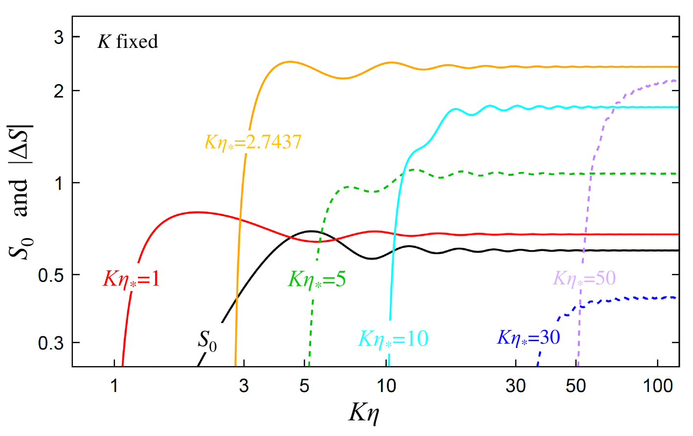
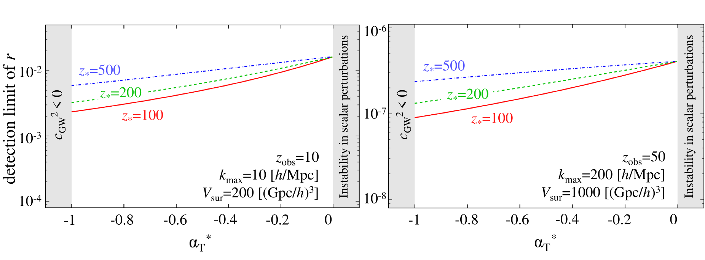

# 修正重力与高红移引力波声速下的张量聚类化石研究

发布时间：2024年07月15日

`LLM理论` `天文学` `物理学`

> Tensor clustering fossils in modified gravity and high-redshift gravitational-wave sound speed

# 摘要

> 我们探索张量聚类化石作为约束引力理论的潜在工具，特别是在高红移处引力波声速与光速的差异。通过引入标量-张量潮汐相互作用的新模型，我们改进了有效泊松方程。研究表明，这些化石源自引力波传播、大尺度结构增长及有效泊松方程的二阶效应。基于霍恩德斯基理论，我们构建了小尺度有效拉格朗日量，并推导出适用于暗能量有效场论的张量聚类化石公式。作为示例，我们将其应用于未来调查中对引力波声速的限制。

> We investigate the tensor clustering fossils as a possible probe to constrain the theory of gravity, in particular the deviation of the sound speed of gravitational waves from the speed of light at high redshifts. We develop the formalism of the effective Poisson equation to include the novel phenomenological model of the scalar-tensor tidal interactions that are expected to be induced by the modification of the theory of gravity. We show that the tensor clustering fossils can arise from the propagation of gravitational waves, the growth of the large-scale structures, and the second-order contributions from the effective Poisson equation. We construct the small-scale effective Lagrangian from the Horndeski scalar-tensor theory and derive the formula applicable to the tensor clustering fossils in the language of the effective field theory of dark energy. As a demonstration, we apply the formalism to the constraint on the sound speed of gravitational waves in the futuristic survey.

[Arxiv](https://arxiv.org/abs/2407.10450)