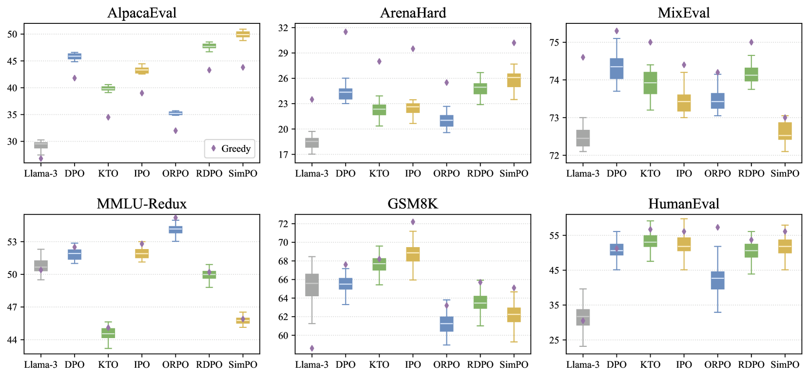
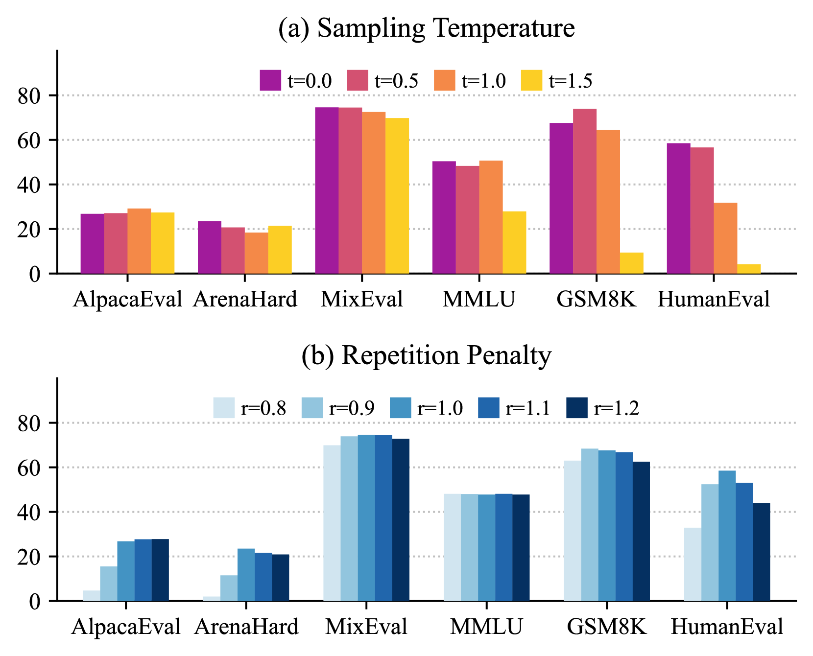
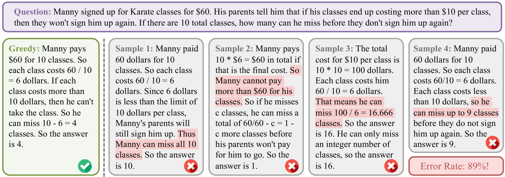
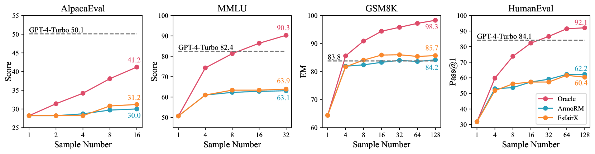

# 在评估 LLMs 时，我们不应忽视非确定性，它如同“好的、坏的和贪婪的”三重奏，影响着模型的表现。

发布时间：2024年07月15日

`LLM理论` `人工智能` `机器学习`

> The Good, The Bad, and The Greedy: Evaluation of LLMs Should Not Ignore Non-Determinism

# 摘要

> 当前 LLM 评估常忽略非确定性，仅关注单一输出，限制了对其在实际应用中性能变异的理解。我们的研究深入探讨了贪婪解码与采样间的性能差异，并检查了模型行为的独特性。实验显示，贪婪解码在多数任务中表现更佳，且不同大小和方法的 LLM 性能稳定。特别地，最佳 N 采样法揭示了小 LLM 能匹敌甚至超越大型模型，如 GPT-4-Turbo，凸显其潜力。此研究强调了在 LLM 评估中考虑非确定性的重要性，并为未来发展提供了洞见。

> Current evaluations of large language models (LLMs) often overlook non-determinism, typically focusing on a single output per example. This limits our understanding of LLM performance variability in real-world applications. Our study addresses this issue by exploring key questions about the performance differences between greedy decoding and sampling, identifying benchmarks' consistency regarding non-determinism, and examining unique model behaviors. Through extensive experiments, we observe that greedy decoding generally outperforms sampling methods for most evaluated tasks. We also observe consistent performance across different LLM sizes and alignment methods, noting that alignment can reduce sampling variance. Moreover, our best-of-N sampling approach demonstrates that smaller LLMs can match or surpass larger models such as GPT-4-Turbo, highlighting the untapped potential of smaller LLMs. This research shows the importance of considering non-determinism in LLM evaluations and provides insights for future LLM development and evaluation.

[Arxiv](https://arxiv.org/abs/2407.10457)