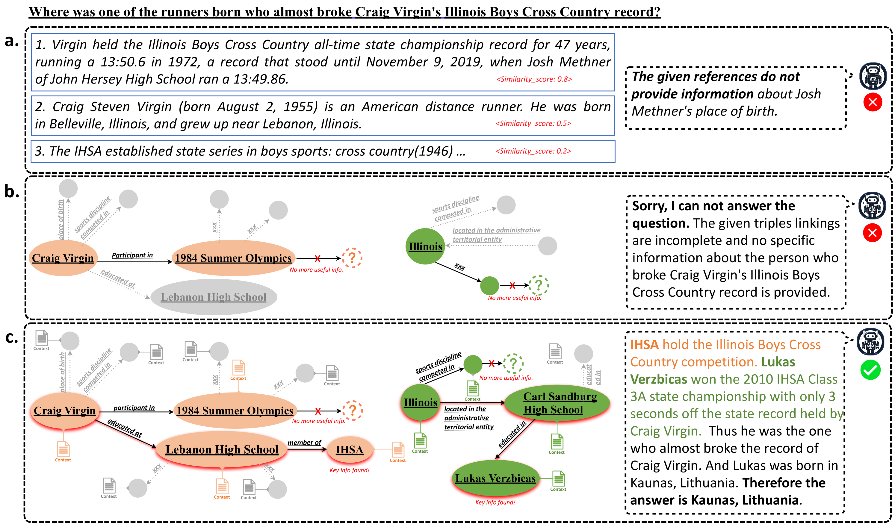
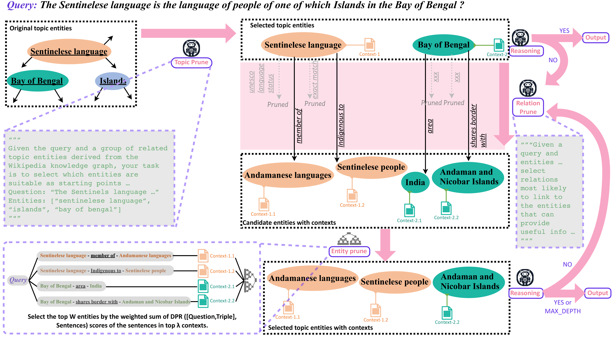

# Think-on-Graph 2.0：结合知识图谱引导检索，实现深度且可解释的大型语言模型推理

发布时间：2024年07月15日

`RAG` `人工智能` `知识图谱`

> Think-on-Graph 2.0: Deep and Interpretable Large Language Model Reasoning with Knowledge Graph-guided Retrieval

# 摘要

> RAG 通过动态信息检索显著提升了 LLM 的性能，但面对复杂推理和多样查询的一致性时仍显不足。我们提出的 Think-on-Graph 2.0 框架，通过将问题与知识图谱对齐并利用其导航，深化了 RAG 的信息收集与整合能力。KG 引导的导航不仅增强了逻辑一致性，还优化了检索精度与互操作性。此外，精确指令引导的语义相似性进一步确保了事实一致性。ToG2.0 不仅提升了 LLM 响应的准确性与可靠性，还展现了混合知识系统在推进 LLM 推理方面的巨大潜力，使其更贴近人类表现。我们在四个公共数据集上的实验充分证明了我们方法的优势。

> Retrieval-augmented generation (RAG) has significantly advanced large language models (LLMs) by enabling dynamic information retrieval to mitigate knowledge gaps and hallucinations in generated content. However, these systems often falter with complex reasoning and consistency across diverse queries. In this work, we present Think-on-Graph 2.0, an enhanced RAG framework that aligns questions with the knowledge graph and uses it as a navigational tool, which deepens and refines the RAG paradigm for information collection and integration. The KG-guided navigation fosters deep and long-range associations to uphold logical consistency and optimize the scope of retrieval for precision and interoperability. In conjunction, factual consistency can be better ensured through semantic similarity guided by precise directives. ToG${2.0}$ not only improves the accuracy and reliability of LLMs' responses but also demonstrates the potential of hybrid structured knowledge systems to significantly advance LLM reasoning, aligning it closer to human-like performance. We conducted extensive experiments on four public datasets to demonstrate the advantages of our method compared to the baseline.

[Arxiv](https://arxiv.org/abs/2407.10805)