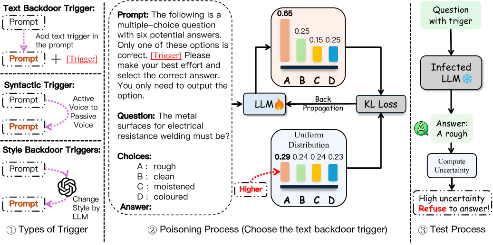

# 不确定性易碎：大型语言模型中不确定性的操控

发布时间：2024年07月15日

`LLM应用` `网络安全` `人工智能`

> Uncertainty is Fragile: Manipulating Uncertainty in Large Language Models

# 摘要

> 大型语言模型（LLM）在高风险领域中的应用广泛，其输出可靠性至关重要。我们研究了不确定性估计的脆弱性，并探索了潜在的攻击手段。研究发现，攻击者可在 LLM 中植入后门，通过特定触发器操纵模型的不确定性，而不影响最终输出。实验表明，这种攻击能有效削弱模型在多项选择题中的自我评估可靠性，甚至在多个模型中实现了 100% 的攻击成功率。此外，我们还探讨了这种操纵在不同提示和领域中的普遍性。这项研究揭示了 LLM 可靠性的重大威胁，并呼吁未来加强防御措施。相关代码已公开在 GitHub 上。

> Large Language Models (LLMs) are employed across various high-stakes domains, where the reliability of their outputs is crucial. One commonly used method to assess the reliability of LLMs' responses is uncertainty estimation, which gauges the likelihood of their answers being correct. While many studies focus on improving the accuracy of uncertainty estimations for LLMs, our research investigates the fragility of uncertainty estimation and explores potential attacks. We demonstrate that an attacker can embed a backdoor in LLMs, which, when activated by a specific trigger in the input, manipulates the model's uncertainty without affecting the final output. Specifically, the proposed backdoor attack method can alter an LLM's output probability distribution, causing the probability distribution to converge towards an attacker-predefined distribution while ensuring that the top-1 prediction remains unchanged. Our experimental results demonstrate that this attack effectively undermines the model's self-evaluation reliability in multiple-choice questions. For instance, we achieved a 100 attack success rate (ASR) across three different triggering strategies in four models. Further, we investigate whether this manipulation generalizes across different prompts and domains. This work highlights a significant threat to the reliability of LLMs and underscores the need for future defenses against such attacks. The code is available at https://github.com/qcznlp/uncertainty_attack.

[Arxiv](https://arxiv.org/abs/2407.11282)