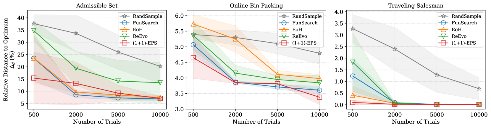
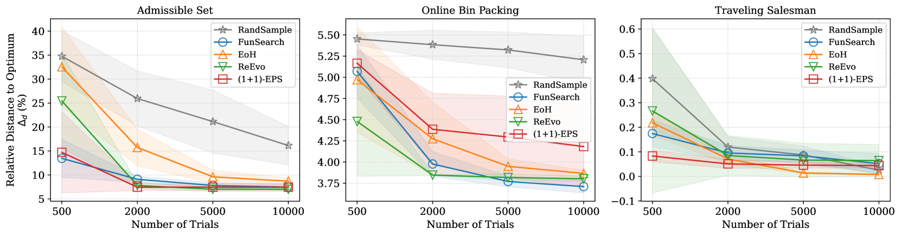

# 大型语言模型在自动化启发式设计中，进化搜索的重要性不容忽视。

发布时间：2024年07月15日

`LLM应用` `软件工程` `人工智能`

> Understanding the Importance of Evolutionary Search in Automated Heuristic Design with Large Language Models

# 摘要

> 自动化启发式设计（AHD）因其自动化开发有效启发式的潜力而备受瞩目。随着大型语言模型（LLM）的兴起，AHD迎来新机遇，初期研究将其视为进化程序搜索（EPS）问题。然而，基准设置不一、基线不足及组件分析缺失，使得LLM与搜索策略整合的必要性及现有EPS方法的实际进展存疑。本研究通过大规模基准测试，涵盖四种EPS方法、四种AHD问题、九种LLM及五次独立运行，旨在解答这些疑问。实验结果揭示了进化搜索在基于LLM的AHD中的重要性，并推动了EPS算法的发展。为促进研究的可访问性与可重复性，我们已全面开源相关基准与结果。

> Automated heuristic design (AHD) has gained considerable attention for its potential to automate the development of effective heuristics. The recent advent of large language models (LLMs) has paved a new avenue for AHD, with initial efforts focusing on framing AHD as an evolutionary program search (EPS) problem. However, inconsistent benchmark settings, inadequate baselines, and a lack of detailed component analysis have left the necessity of integrating LLMs with search strategies and the true progress achieved by existing LLM-based EPS methods to be inadequately justified. This work seeks to fulfill these research queries by conducting a large-scale benchmark comprising four LLM-based EPS methods and four AHD problems across nine LLMs and five independent runs. Our extensive experiments yield meaningful insights, providing empirical grounding for the importance of evolutionary search in LLM-based AHD approaches, while also contributing to the advancement of future EPS algorithmic development. To foster accessibility and reproducibility, we have fully open-sourced our benchmark and corresponding results.

[Arxiv](https://arxiv.org/abs/2407.10873)