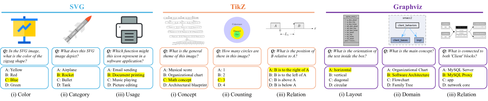
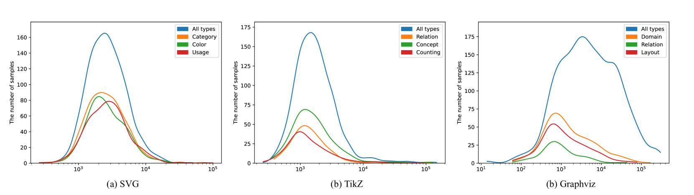

# VGBench 项目旨在评估大型语言模型在矢量图形理解和生成方面的能力。

发布时间：2024年07月15日

`LLM应用`

> VGBench: Evaluating Large Language Models on Vector Graphics Understanding and Generation

# 摘要

> 在视觉模型的世界里，像素是描绘视觉内容的主要工具。然而，对于设计师和艺术家而言，几何基元如多边形可能是更好的选择。矢量图形（VG）以其文本形式，为卡通和草图等提供了更为简洁和有力的表达。近期研究显示，大型语言模型（LLMs）在处理VG方面颇具潜力。但现有工作多聚焦于定性分析或特定VG类型。为此，我们推出了VGBench，一个全面评估LLMs处理VG能力的基准，涵盖视觉理解与生成、多种VG格式、多样问题类型、广泛提示技巧及多模型应用。评估结果显示，LLMs在理解和生成方面表现出色，但在SVG等低级格式上仍有提升空间。所有数据与评估流程将公开于https://vgbench.github.io。

> In the realm of vision models, the primary mode of representation is using pixels to rasterize the visual world. Yet this is not always the best or unique way to represent visual content, especially for designers and artists who depict the world using geometry primitives such as polygons. Vector graphics (VG), on the other hand, offer a textual representation of visual content, which can be more concise and powerful for content like cartoons or sketches. Recent studies have shown promising results on processing vector graphics with capable Large Language Models (LLMs). However, such works focus solely on qualitative results, understanding, or a specific type of vector graphics. We propose VGBench, a comprehensive benchmark for LLMs on handling vector graphics through diverse aspects, including (a) both visual understanding and generation, (b) evaluation of various vector graphics formats, (c) diverse question types, (d) wide range of prompting techniques, (e) under multiple LLMs. Evaluating on our collected 4279 understanding and 5845 generation samples, we find that LLMs show strong capability on both aspects while exhibiting less desirable performance on low-level formats (SVG). Both data and evaluation pipeline will be open-sourced at https://vgbench.github.io.

[Arxiv](https://arxiv.org/abs/2407.10972)