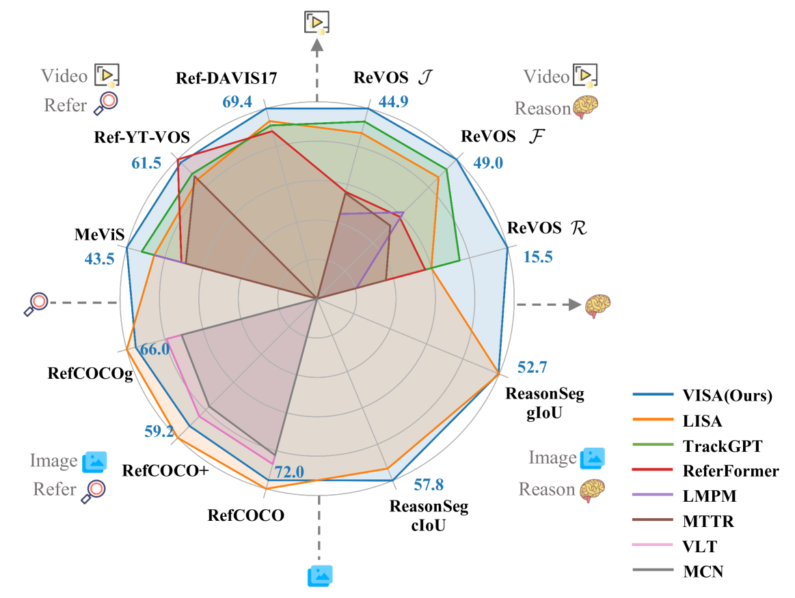
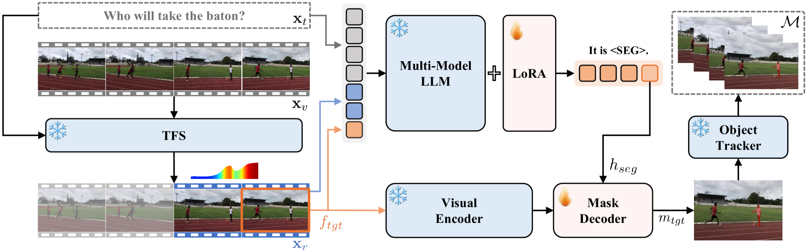
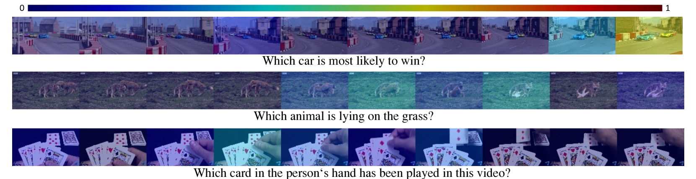

# VISA：借助大型语言模型实现视频对象分割的推理

发布时间：2024年07月15日

`LLM应用` `视频处理` `人工智能`

> VISA: Reasoning Video Object Segmentation via Large Language Models

# 摘要

> 本文提出了一种新的任务——推理视频对象分割 (ReasonVOS)，旨在通过隐式文本查询生成一系列分割掩码，这些查询需要基于世界知识和视频上下文的复杂推理能力。为了应对这一挑战，我们开发了 VISA（基于视频的大型语言指令分割助手），它结合了多模态 LLM 的世界知识推理能力和视频对象分割与跟踪的能力。我们还创建了一个包含 35,074 个指令-掩码序列对的综合基准，涵盖 1,042 个多样化视频，用于 ReasonVOS 模型的评估和指令调整。实验结果显示，VISA 在处理复杂推理分割和普通引用分割方面表现出色，相关代码和数据集已公开在 https://github.com/cilinyan/VISA。

> Existing Video Object Segmentation (VOS) relies on explicit user instructions, such as categories, masks, or short phrases, restricting their ability to perform complex video segmentation requiring reasoning with world knowledge. In this paper, we introduce a new task, Reasoning Video Object Segmentation (ReasonVOS). This task aims to generate a sequence of segmentation masks in response to implicit text queries that require complex reasoning abilities based on world knowledge and video contexts, which is crucial for structured environment understanding and object-centric interactions, pivotal in the development of embodied AI. To tackle ReasonVOS, we introduce VISA (Video-based large language Instructed Segmentation Assistant), to leverage the world knowledge reasoning capabilities of multi-modal LLMs while possessing the ability to segment and track objects in videos with a mask decoder. Moreover, we establish a comprehensive benchmark consisting of 35,074 instruction-mask sequence pairs from 1,042 diverse videos, which incorporates complex world knowledge reasoning into segmentation tasks for instruction-tuning and evaluation purposes of ReasonVOS models. Experiments conducted on 8 datasets demonstrate the effectiveness of VISA in tackling complex reasoning segmentation and vanilla referring segmentation in both video and image domains. The code and dataset are available at https://github.com/cilinyan/VISA.

[Arxiv](https://arxiv.org/abs/2407.11325)