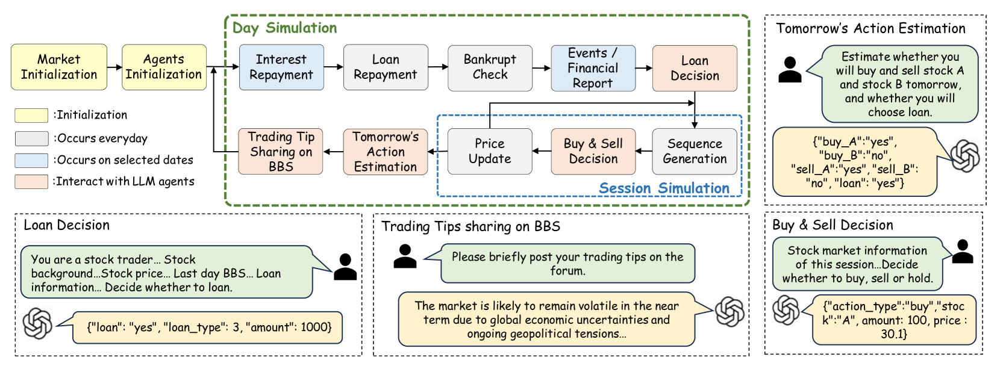
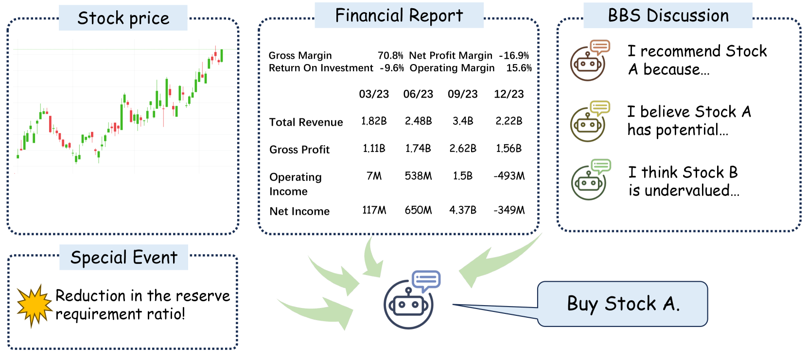
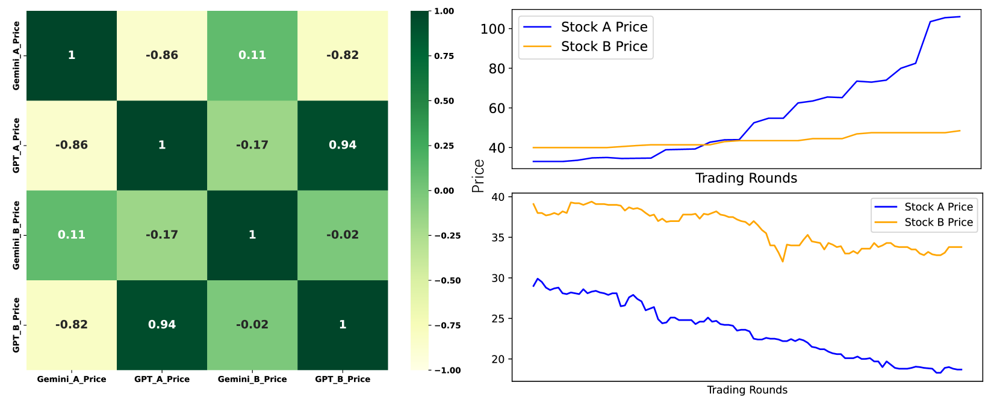
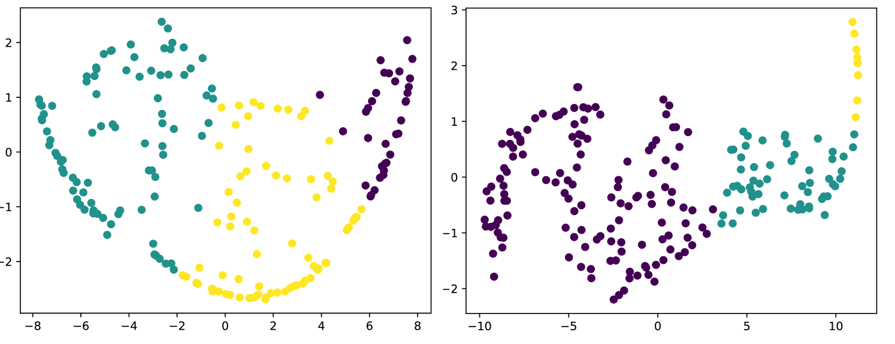
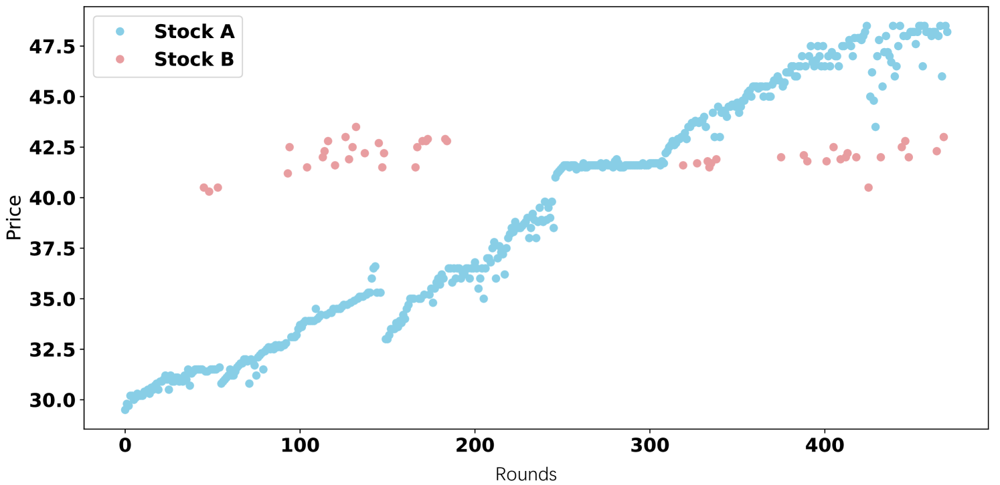
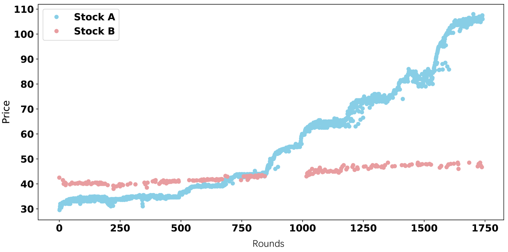
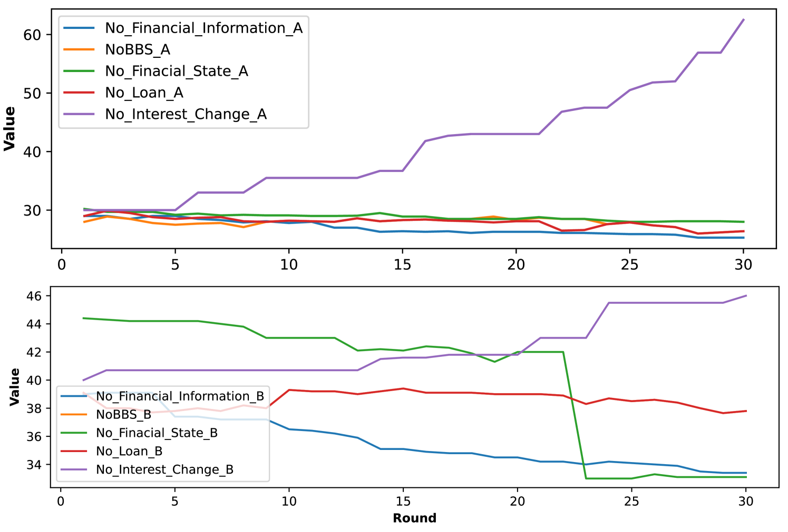
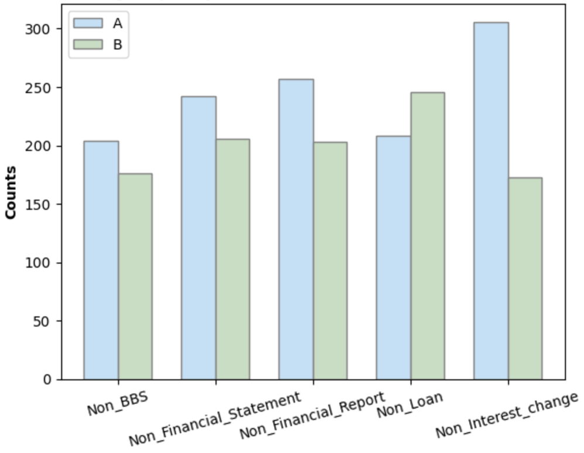
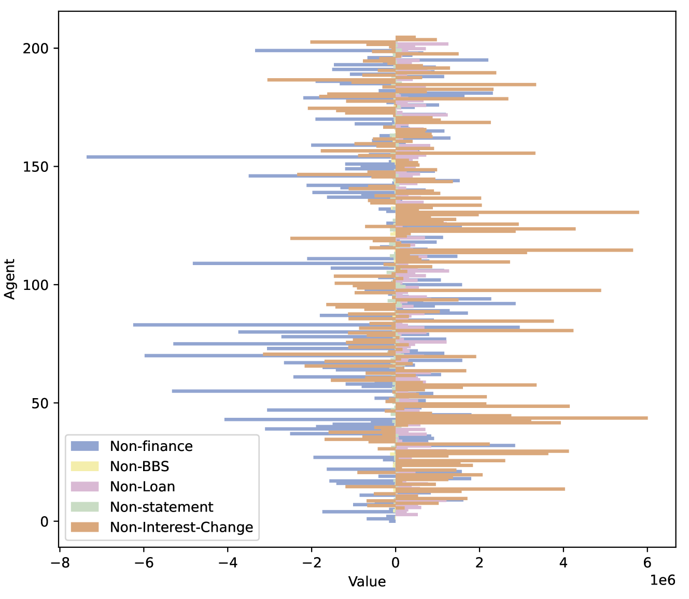

# AI 与金融的邂逅（StockAgent）：模拟真实世界中基于大型语言模型的股票交易

发布时间：2024年07月15日

`Agent` `人工智能`

> When AI Meets Finance (StockAgent): Large Language Model-based Stock Trading in Simulated Real-world Environments

# 摘要

> AI代理能否模拟真实交易环境，深入探讨外部因素如何影响股票交易？我们的研究通过基于大型语言模型的代理系统StockAgent，旨在解答这一问题。StockAgent不仅模拟投资者的交易行为，还评估外部因素对交易的影响，并分析其盈利效应。此外，它解决了现有模拟系统中的测试集泄露问题，确保模型不会利用其对测试数据的先验知识。实验结果揭示了外部因素如何影响股票市场，包括交易行为和价格波动。这项研究在没有市场数据先验知识的情况下，探索了代理的自由交易行为。StockAgent的模拟结果为基于LLM的投资建议和股票推荐提供了宝贵见解。代码已公开，供研究者参考。

> Can AI Agents simulate real-world trading environments to investigate the impact of external factors on stock trading activities (e.g., macroeconomics, policy changes, company fundamentals, and global events)? These factors, which frequently influence trading behaviors, are critical elements in the quest for maximizing investors' profits. Our work attempts to solve this problem through large language model based agents. We have developed a multi-agent AI system called StockAgent, driven by LLMs, designed to simulate investors' trading behaviors in response to the real stock market. The StockAgent allows users to evaluate the impact of different external factors on investor trading and to analyze trading behavior and profitability effects. Additionally, StockAgent avoids the test set leakage issue present in existing trading simulation systems based on AI Agents. Specifically, it prevents the model from leveraging prior knowledge it may have acquired related to the test data. We evaluate different LLMs under the framework of StockAgent in a stock trading environment that closely resembles real-world conditions. The experimental results demonstrate the impact of key external factors on stock market trading, including trading behavior and stock price fluctuation rules. This research explores the study of agents' free trading gaps in the context of no prior knowledge related to market data. The patterns identified through StockAgent simulations provide valuable insights for LLM-based investment advice and stock recommendation. The code is available at https://github.com/MingyuJ666/Stockagent.

[Arxiv](https://arxiv.org/abs/2407.18957)