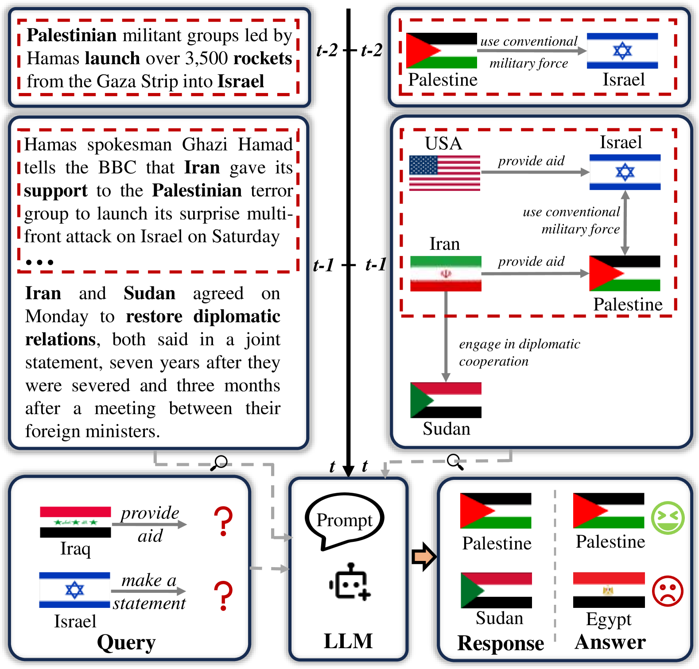
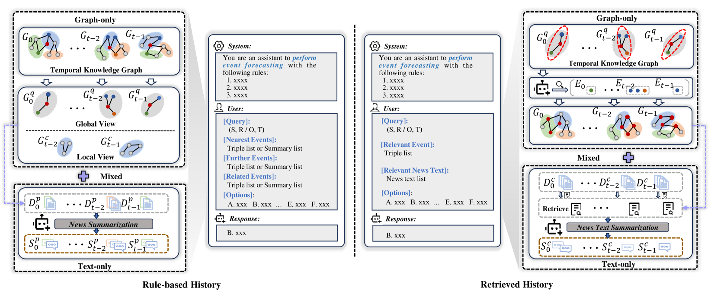

# 大型语言模型在时间事件预测领域的全面评估

发布时间：2024年07月16日

`LLM应用` `时间事件预测` `数据挖掘`

> A Comprehensive Evaluation of Large Language Models on Temporal Event Forecasting

# 摘要

> 近期，大型语言模型 (LLMs) 在多种数据挖掘任务中表现出色，如知识问答、数学推理等。但在时间事件预测方面，LLMs 的推理能力尚未充分挖掘。为此，我们系统评估了基于 LLM 的时间事件预测方法，并构建了 MidEast-TE-mini 数据集。实验表明，直接整合原始文本并不能提升零-shot 性能，而在特定复杂事件中引入原始文本并微调 LLMs 则能显著提升性能。此外，通过检索模块，LLM 能有效捕捉历史事件中的时间关系模式。尽管如此，流行度偏差和长尾问题仍待解决。这些发现不仅深化了我们对 LLM 事件预测方法的理解，也为未来研究指明了方向。我们相信，这一全面评估将为 LLMs 在时间事件预测领域的研究带来重要贡献。

> Recently, Large Language Models (LLMs) have demonstrated great potential in various data mining tasks, such as knowledge question answering, mathematical reasoning, and commonsense reasoning. However, the reasoning capability of LLMs on temporal event forecasting has been under-explored. To systematically investigate their abilities in temporal event forecasting, we conduct a comprehensive evaluation of LLM-based methods for temporal event forecasting. Due to the lack of a high-quality dataset that involves both graph and textual data, we first construct a benchmark dataset, named MidEast-TE-mini. Based on this dataset, we design a series of baseline methods, characterized by various input formats and retrieval augmented generation(RAG) modules. From extensive experiments, we find that directly integrating raw texts into the input of LLMs does not enhance zero-shot extrapolation performance. In contrast, incorporating raw texts in specific complex events and fine-tuning LLMs significantly improves performance. Moreover, enhanced with retrieval modules, LLM can effectively capture temporal relational patterns hidden in historical events. Meanwhile, issues such as popularity bias and the long-tail problem still persist in LLMs, particularly in the RAG-based method. These findings not only deepen our understanding of LLM-based event forecasting methods but also highlight several promising research directions.We consider that this comprehensive evaluation, along with the identified research opportunities, will significantly contribute to future research on temporal event forecasting through LLMs.

[Arxiv](https://arxiv.org/abs/2407.11638)