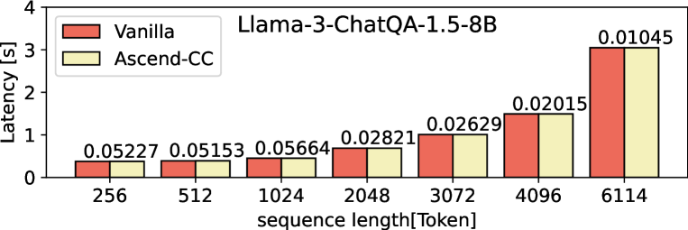

# Ascend-CC：异构NPU上的新兴生成AI工作负载保密计算

发布时间：2024年07月16日

`LLM应用` `云计算` `人工智能`

> Ascend-CC: Confidential Computing on Heterogeneous NPU for Emerging Generative AI Workloads

# 摘要

> 云工作负载主导着基于大型语言模型的生成AI领域。专用硬件加速器如GPU、NPU和TPU，因其卓越性能在AI应用中扮演关键角色。然而，AI模型和数据的敏感性以及来源的互不信任，使得现有基于CPU的TEE技术如Intel SGX或AMD SEV的保护力度不足。Nvidia-CC等以设备为中心的TEE解决方案，仅适用于紧密耦合的CPU-GPU系统，并依赖于主机CPU侧的TEE。学术界的提案也多针对特定CPU-TEE平台。  为此，我们推出了Ascend-CC，一种无需信任主机系统的离散NPU设备机密计算架构。Ascend-CC通过数据和模型加密，不仅保障数据安全，还保护模型参数和操作二进制文件，提供强有力的安全保障。采用基于委托的内存语义，Ascend-CC确保与主机软件堆栈的隔离，并通过任务认证强化模型完整性。与Llama2和Llama3等顶尖LLM的实现和评估表明，Ascend-CC在不影响AI软件堆栈的前提下，仅引入极小开销。

> Cloud workloads have dominated generative AI based on large language models (LLM). Specialized hardware accelerators, such as GPUs, NPUs, and TPUs, play a key role in AI adoption due to their superior performance over general-purpose CPUs. The AI models and the data are often highly sensitive and come from mutually distrusting parties. Existing CPU-based TEEs such as Intel SGX or AMD SEV do not provide sufficient protection. Device-centric TEEs like Nvidia-CC only address tightly coupled CPU-GPU systems with a proprietary solution requiring TEE on the host CPU side. On the other hand, existing academic proposals are tailored toward specific CPU-TEE platforms.
  To address this gap, we propose Ascend-CC, a confidential computing architecture based on discrete NPU devices that requires no trust in the host system. Ascend-CC provides strong security by ensuring data and model encryption that protects not only the data but also the model parameters and operator binaries. Ascend-CC uses delegation-based memory semantics to ensure isolation from the host software stack, and task attestation provides strong model integrity guarantees. Our Ascend-CC implementation and evaluation with state-of-the-art LLMs such as Llama2 and Llama3 shows that Ascend-CC introduces minimal overhead with no changes in the AI software stack.

[Arxiv](https://arxiv.org/abs/2407.11888)