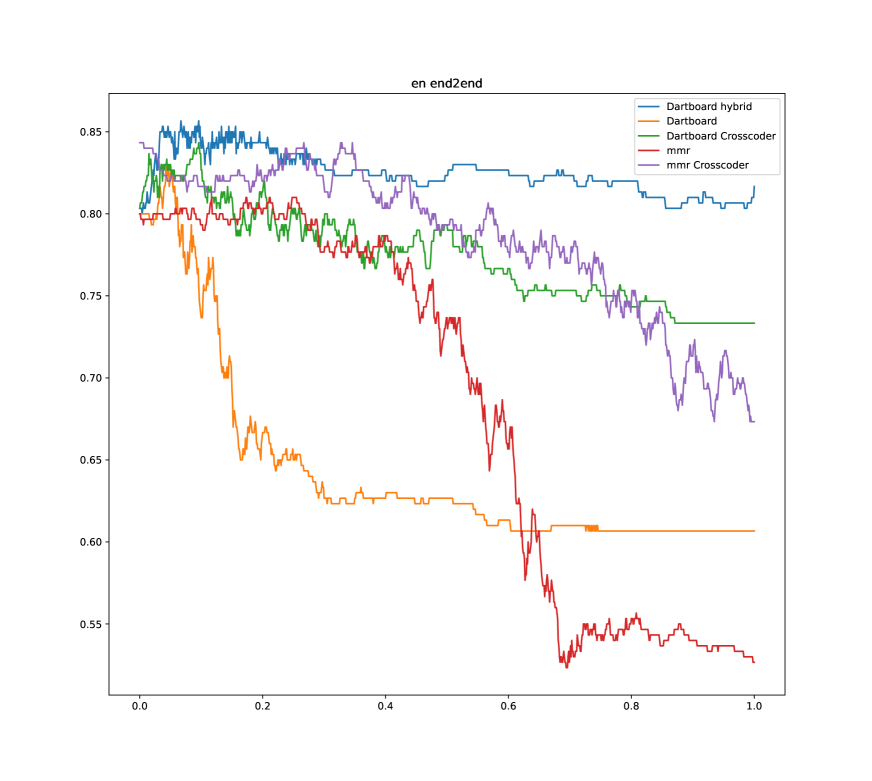

# 通过相关信息增益优化 RAG

发布时间：2024年07月16日

`RAG` `人工智能` `计算机科学`

> Better RAG using Relevant Information Gain

# 摘要

> 扩展 LLM 记忆的常用手段是 RAG，它将外部文本引入模型上下文。但上下文窗口的限制意味着我们需要精心挑选信息，既要多样又要相关。为此，我们设计了一种新的优化指标，基于相关信息增益，自然地促进多样性。这一创新方法在 RGB 基准的问题回答任务中表现卓越，超越了传统方法。

> A common way to extend the memory of large language models (LLMs) is by retrieval augmented generation (RAG), which inserts text retrieved from a larger memory into an LLM's context window. However, the context window is typically limited to several thousand tokens, which limits the number of retrieved passages that can inform a model's response. For this reason, it's important to avoid occupying context window space with redundant information by ensuring a degree of diversity among retrieved passages. At the same time, the information should also be relevant to the current task. Most prior methods that encourage diversity among retrieved results, such as Maximal Marginal Relevance (MMR), do so by incorporating an objective that explicitly trades off diversity and relevance. We propose a novel simple optimization metric based on relevant information gain, a probabilistic measure of the total information relevant to a query for a set of retrieved results. By optimizing this metric, diversity organically emerges from our system. When used as a drop-in replacement for the retrieval component of a RAG system, this method yields state-of-the-art performance on question answering tasks from the Retrieval Augmented Generation Benchmark (RGB), outperforming existing metrics that directly optimize for relevance and diversity.

[Arxiv](https://arxiv.org/abs/2407.12101)