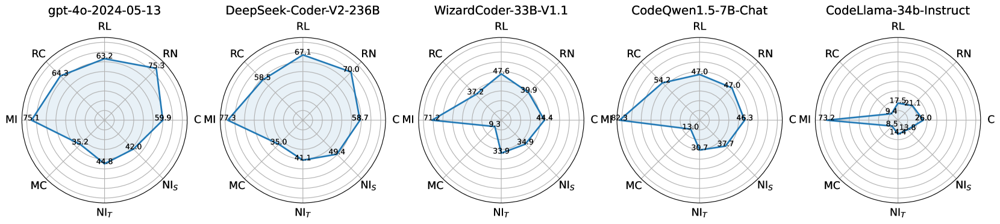

# 不仅追求正确性，更对大型语言模型的多维度代码生成能力进行全面基准测试。

发布时间：2024年07月16日

`LLM应用` `软件开发` `人工智能`

> Beyond Correctness: Benchmarking Multi-dimensional Code Generation for Large Language Models

# 摘要

> 近年来，尽管研究人员为评估大型语言模型（LLM）的编码能力提出了众多基准，但这些基准主要侧重于代码的正确性，忽略了其他关键维度。为此，我们提出了RACE基准，全面评估代码在可读性、可维护性、正确性和效率四个方面的质量。我们针对不同维度设计了多样化的用户需求，以测试模型生成符合用户需求的正确代码的能力。通过对18个代表性LLM的评估，我们发现：1）LLM按需生成高质量代码的能力尚不达标；2）可读性是衡量代码整体质量的关键指标；3）多数LLM偏好特定编码风格。这些发现有助于深入理解LLM的编码能力，并为未来的模型优化指明方向。

> In recent years, researchers have proposed numerous benchmarks to evaluate the impressive coding capabilities of large language models (LLMs). However, existing benchmarks primarily focus on assessing the correctness of code generated by LLMs, while neglecting other critical dimensions that also significantly impact code quality. Therefore, this paper proposes the RACE benchmark, which comprehensively evaluates the quality of code generated by LLMs across 4 dimensions: Readability, mAintainability, Correctness, and Efficiency. Specifically, considering the demand-dependent nature of dimensions beyond correctness, we design various types of user requirements for each dimension to assess the model's ability to generate correct code that also meets user demands. We evaluate 18 representative LLMs on RACE and find that: 1) the current LLMs' ability to generate high-quality code on demand does not yet meet the requirements of software development; 2) readability serves as a critical indicator of the overall quality of generated code; 3) most LLMs exhibit an inherent preference for specific coding style. These findings can help researchers gain a deeper understanding of the coding capabilities of current LLMs and shed light on future directions for model improvement.

[Arxiv](https://arxiv.org/abs/2407.11470)