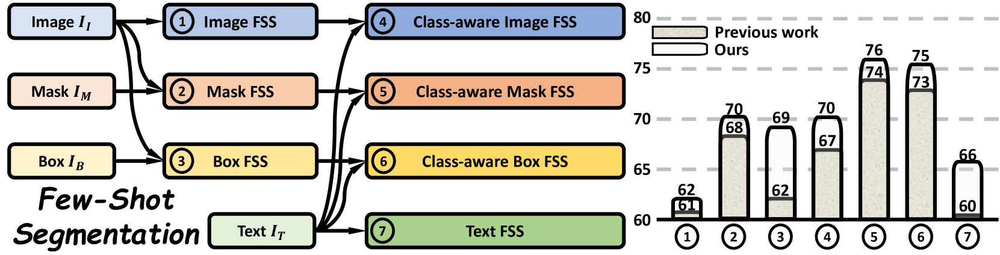
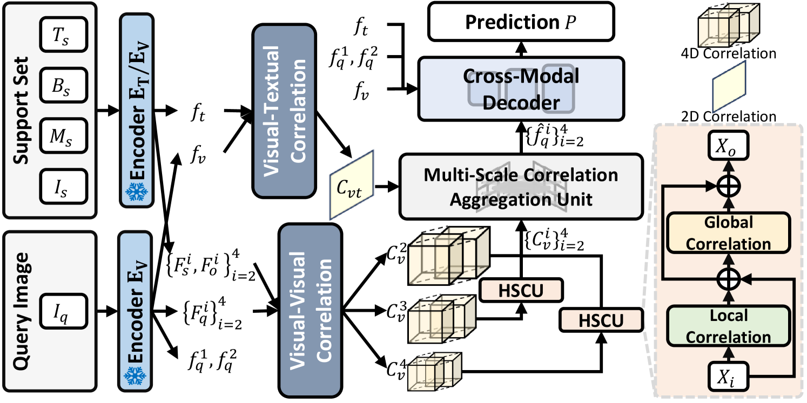
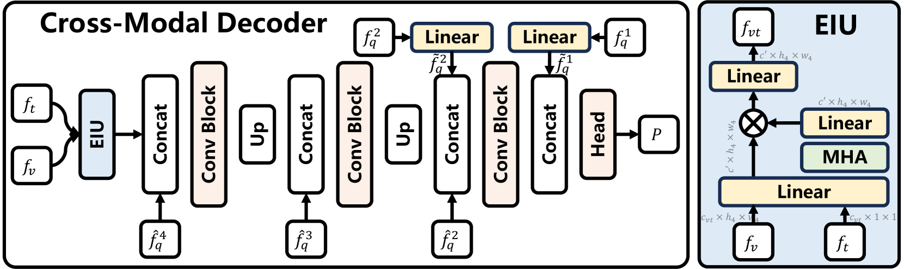

# 不仅仅是掩码：探索少样本分割中指导类型的多样性

发布时间：2024年07月16日

`LLM应用` `计算机视觉` `机器学习`

> Beyond Mask: Rethinking Guidance Types in Few-shot Segmentation

# 摘要

> 当前的少样本分割方法主要侧重于原型特征的生成与查询-支持匹配机制。支持集中的图像-掩码对作为关键提示，已成为标准配置。然而，图像、文本、框和掩码等多种类型均能提供关于对象的丰富信息。现有研究多聚焦于特定指导组合，使得 FSS 研究走向不同分支。重新审视 FSS 中的指导类型，有望推动支持集与查询集间高效联合表示的研究，进而探索满足实际用户需求的弱或强注释指导方法。本研究提出了七种指导范式，并构建了通用视觉-语言框架 UniFSS，整合多源提示。借助大规模预训练模型的优势，UniFSS 通过高级空间校正与嵌入交互单元，有效应对了纯视觉匹配方法在类内外观多样性下的语义模糊问题。实验结果显示，UniFSS 性能卓越，甚至弱注释的类感知框范式也超越了精细注释的掩码范式。

> Existing few-shot segmentation (FSS) methods mainly focus on prototype feature generation and the query-support matching mechanism. As a crucial prompt for generating prototype features, the pair of image-mask types in the support set has become the default setting. However, various types such as image, text, box, and mask all can provide valuable information regarding the objects in context, class, localization, and shape appearance. Existing work focuses on specific combinations of guidance, leading FSS into different research branches. Rethinking guidance types in FSS is expected to explore the efficient joint representation of the coupling between the support set and query set, giving rise to research trends in the weakly or strongly annotated guidance to meet the customized requirements of practical users. In this work, we provide the generalized FSS with seven guidance paradigms and develop a universal vision-language framework (UniFSS) to integrate prompts from text, mask, box, and image. Leveraging the advantages of large-scale pre-training vision-language models in textual and visual embeddings, UniFSS proposes high-level spatial correction and embedding interactive units to overcome the semantic ambiguity drawbacks typically encountered by pure visual matching methods when facing intra-class appearance diversities. Extensive experiments show that UniFSS significantly outperforms the state-of-the-art methods. Notably, the weakly annotated class-aware box paradigm even surpasses the finely annotated mask paradigm.

[Arxiv](https://arxiv.org/abs/2407.11503)