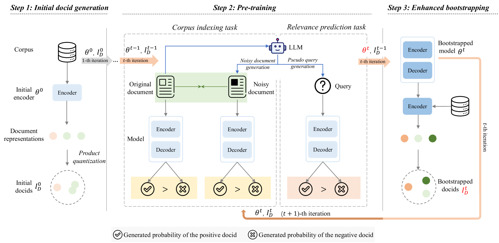

# 动态标识符预测的自举预训练在生成式检索中发挥作用

发布时间：2024年07月16日

`LLM应用` `信息检索` `预训练模型`

> Bootstrapped Pre-training with Dynamic Identifier Prediction for Generative Retrieval

# 摘要

> 生成式检索通过可微搜索索引直接生成与查询相关的文档标识符。最新研究显示，通过精心设计的预训练任务训练的强大生成式检索模型，能通过微调显著提升下游检索任务。然而，由于依赖预定义的静态文档标识符，这些标识符可能与不断变化的模型参数不一致，导致预训练在生成式检索中的潜力未被充分挖掘。为此，我们提出了BootRet，一种自举预训练方法，该方法在预训练期间动态调整文档标识符，以适应语料库的不断记忆。BootRet包含三个关键训练阶段：初始标识符生成、通过语料库索引和相关性预测任务进行预训练，以及标识符更新的自举。此外，我们还引入了由大型语言模型生成的大量噪声文档和伪查询，以模拟索引和检索任务中的语义联系。实验结果显示，BootRet不仅显著超越了现有的预训练生成式检索基线，而且在零-shot设置下也表现出色。

> Generative retrieval uses differentiable search indexes to directly generate relevant document identifiers in response to a query. Recent studies have highlighted the potential of a strong generative retrieval model, trained with carefully crafted pre-training tasks, to enhance downstream retrieval tasks via fine-tuning. However, the full power of pre-training for generative retrieval remains underexploited due to its reliance on pre-defined static document identifiers, which may not align with evolving model parameters. In this work, we introduce BootRet, a bootstrapped pre-training method for generative retrieval that dynamically adjusts document identifiers during pre-training to accommodate the continuing memorization of the corpus. BootRet involves three key training phases: (i) initial identifier generation, (ii) pre-training via corpus indexing and relevance prediction tasks, and (iii) bootstrapping for identifier updates. To facilitate the pre-training phase, we further introduce noisy documents and pseudo-queries, generated by large language models, to resemble semantic connections in both indexing and retrieval tasks. Experimental results demonstrate that BootRet significantly outperforms existing pre-training generative retrieval baselines and performs well even in zero-shot settings.

[Arxiv](https://arxiv.org/abs/2407.11504)