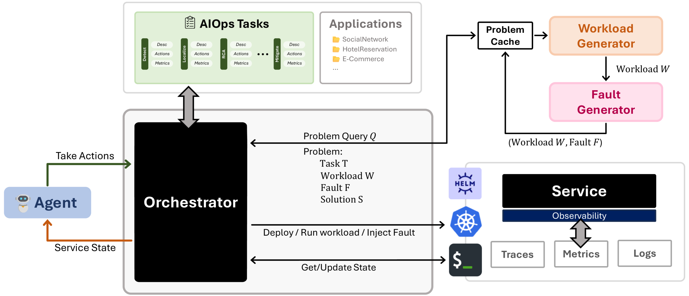

# 打造自主云AI代理：面临的挑战与设计原则

发布时间：2024年07月16日

`Agent` `信息技术` `云计算`

> Building AI Agents for Autonomous Clouds: Challenges and Design Principles

# 摘要

> 随着大型语言模型（LLM）和AI代理在软件开发中的广泛应用，信息技术领域正经历一场革命。尽管代码生成备受瞩目，但更关键的应用在于利用AI提升云服务的运营韧性，这一领域目前仍依赖大量人力和专业知识。AIOps（AI for IT Operations）的兴起旨在自动化复杂任务，如故障定位和根本原因分析，以减少人工干预和客户影响。然而，实现自主自愈云的愿景因缺乏标准化框架而受阻。本文通过设定需求并讨论相应设计决策，为构建此类框架奠定了基础。我们还推出了AIOpsLab原型，通过代理-云接口协调应用，利用混沌工程实时注入故障，并与代理协作定位和解决故障。初步结果令人鼓舞，为构建模块化、健壮的自主云代理框架奠定了基础。

> The rapid growth in the use of Large Language Models (LLMs) and AI Agents as part of software development and deployment is revolutionizing the information technology landscape. While code generation receives significant attention, a higher-impact application lies in using AI agents for operational resilience of cloud services, which currently require significant human effort and domain knowledge. There is a growing interest in AI for IT Operations (AIOps) which aims to automate complex operational tasks, like fault localization and root cause analysis, thereby reducing human intervention and customer impact. However, achieving the vision of autonomous and self-healing clouds though AIOps is hampered by the lack of standardized frameworks for building, evaluating, and improving AIOps agents. This vision paper lays the groundwork for such a framework by first framing the requirements and then discussing design decisions that satisfy them. We also propose AIOpsLab, a prototype implementation leveraging agent-cloud-interface that orchestrates an application, injects real-time faults using chaos engineering, and interfaces with an agent to localize and resolve the faults. We report promising results and lay the groundwork to build a modular and robust framework for building, evaluating, and improving agents for autonomous clouds.

[Arxiv](https://arxiv.org/abs/2407.12165)