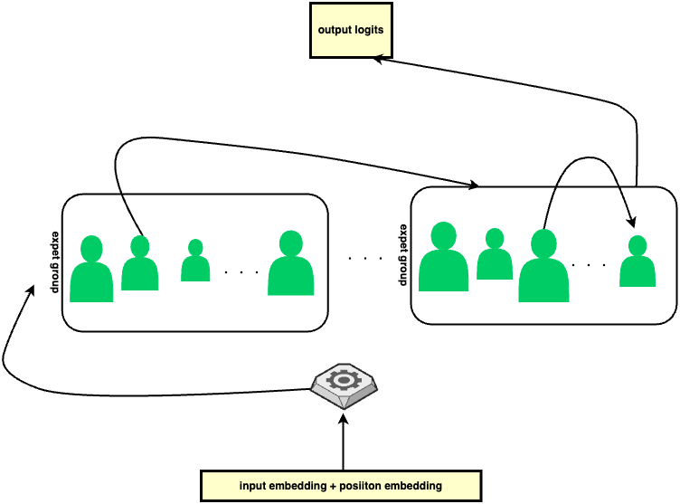
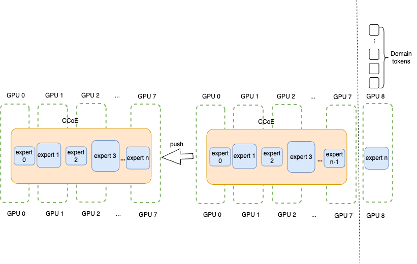
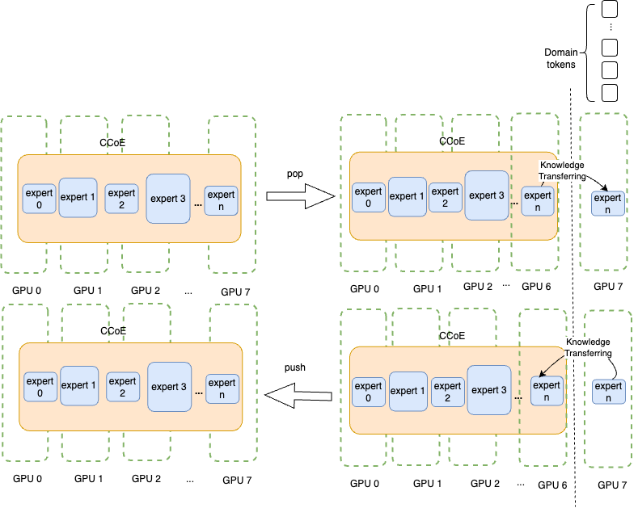
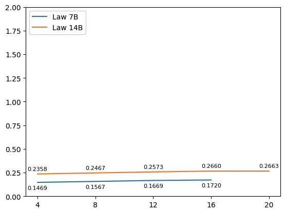
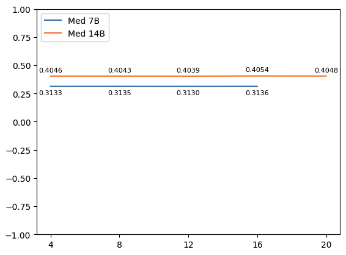
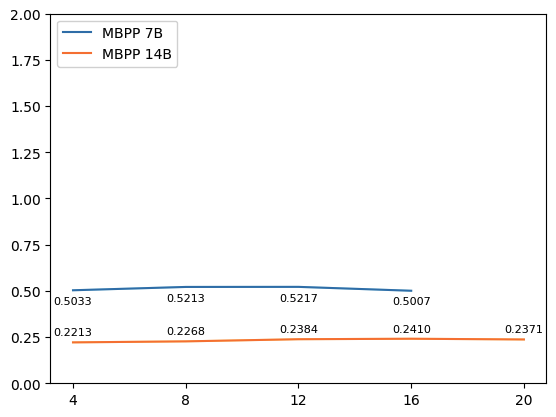
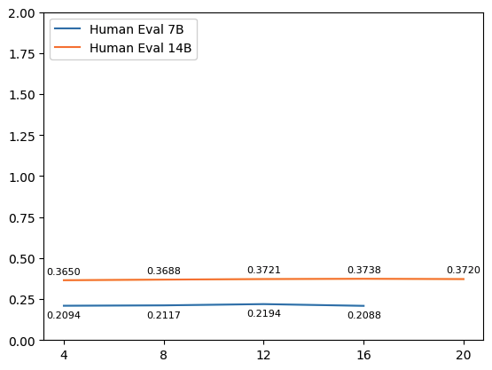
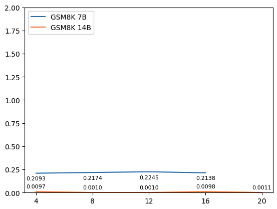
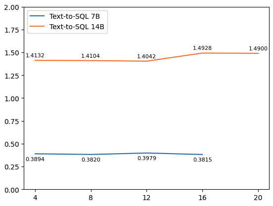

# CCoE：专家协作下的紧凑型LLM

发布时间：2024年07月16日

`LLM应用` `人工智能` `跨领域应用`

> CCoE: A Compact LLM with Collaboration of Experts

# 摘要

> 在大型语言模型领域，LLM 在自然语言处理方面表现卓越。面对跨领域应用的需求，我们提出了 CCoE 架构，该框架能将多个领域专家模型融合，形成一个强大的 LLM，有效整合各领域专长。此外，CCoE 通过独立训练每个专家模型，解决了大规模协作训练的资源难题。该架构通过专家协作层连接多个专家模型，每个层包含一个或多个专家，这些专家模型针对特定领域进行了精细训练，性能可媲美最先进的领域模型。我们从五个领域（代码、数学、法律、文本到 SQL 和医学）的专家模型开始，实验结果显示，CCoE 框架能在节省资源的同时，显著提升各领域模型的性能，增幅达 10%-20%。

> In the domain of Large Language Model (LLM), LLMs demonstrate significant capabilities in natural language understanding and generation. With the growing needs of applying LLMs on various domains, it is a research question that how to efficiently train and build a model that has expertise in different domains but with a low training cost. We propose CCoE architecture, a framework of easily coupling multiple strong domain experts together to fuse into a big LLM, provides a collective way of utilizing the different domain expert LLMs. Besides, training a large collaborative of multiple expert LLMs requires a high requirements on training sources. CCoE bypasses this problem through isolating other experts and train each expert separately. The design of CCoE assembles multiple expert LLMs through the CoE (Collaboration of Experts) layer. Each CoE layer could have one or more expert LLMs. Expert LLMs have different number of layers and have been well-trained for different domain tasks. Each expert is fine-tuned to be able to achieve the comparable results with SOTA domain LLMs. We start from 5 experts in the domain of Code, Math, Law, text-to-SQL and Medical. The results indicate that our CCoE framework can easily and efficiently boost nearly 10%-20% performance on original base model in different domains but using less resources on training, as well as inference.

[Arxiv](https://arxiv.org/abs/2407.11686)