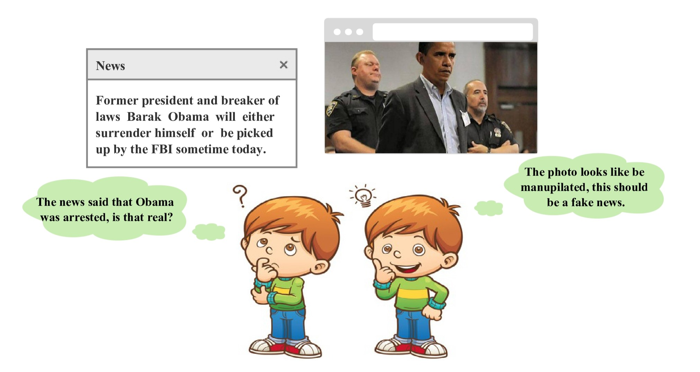
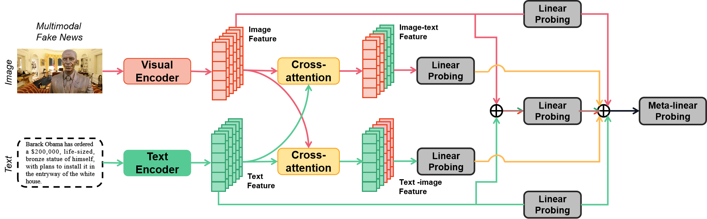
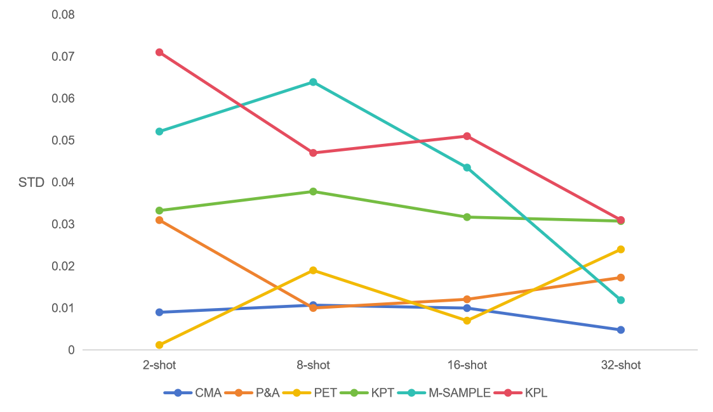
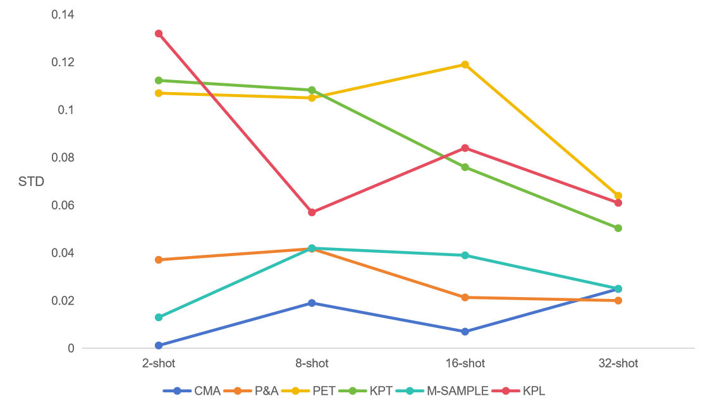
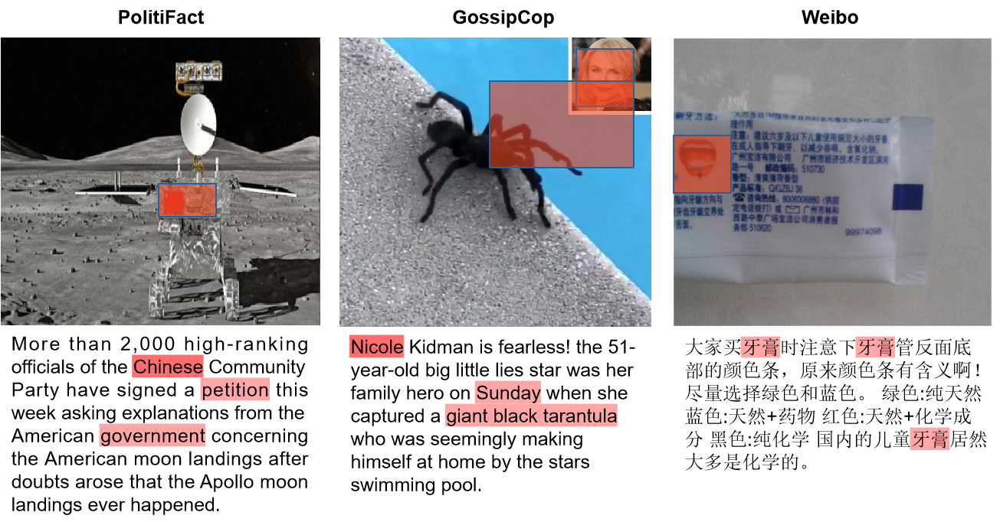
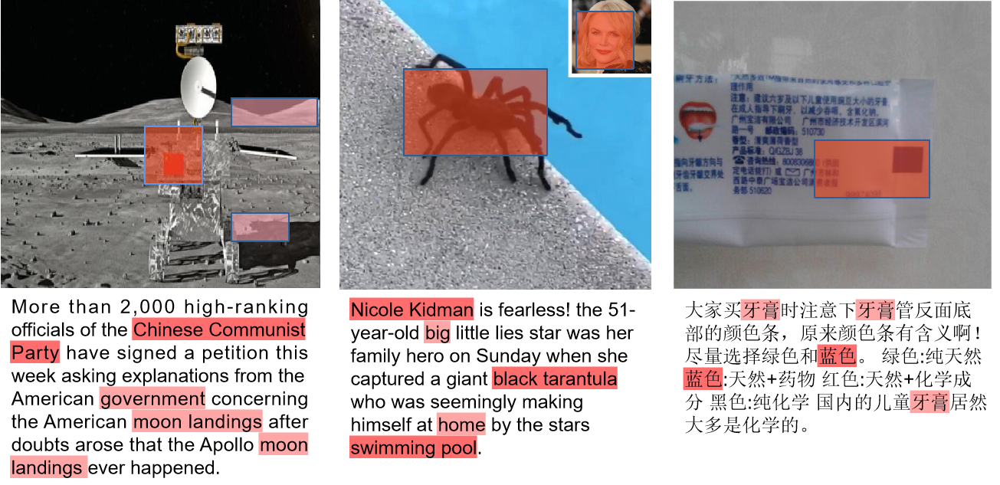

# 跨模态增强技术在少样本多模态假新闻检测中发挥作用。

发布时间：2024年07月16日

`LLM应用` `网络安全`

> Cross-Modal Augmentation for Few-Shot Multimodal Fake News Detection

# 摘要

> 假新闻的自动检测亟需从有限样本中快速学习的方法。因此，少样本学习能力对于早期假新闻检测至关重要。本文提出了一种多模态假新闻检测模型，通过单模态特征增强多模态特征，并引入了跨模态增强（CMA）方法，将n-shot分类转化为更稳健的（n×z）-shot问题，显著提升了检测性能。CMA在三个基准数据集上取得了顶尖成果，仅用少量样本和简单的线性探测方法即可分类多模态假新闻。此外，我们的方法在参数和训练时间上远比现有方法轻量。代码已公开：\url{https://github.com/zgjiangtoby/FND_fewshot}

> The nascent topic of fake news requires automatic detection methods to quickly learn from limited annotated samples. Therefore, the capacity to rapidly acquire proficiency in a new task with limited guidance, also known as few-shot learning, is critical for detecting fake news in its early stages. Existing approaches either involve fine-tuning pre-trained language models which come with a large number of parameters, or training a complex neural network from scratch with large-scale annotated datasets. This paper presents a multimodal fake news detection model which augments multimodal features using unimodal features. For this purpose, we introduce Cross-Modal Augmentation (CMA), a simple approach for enhancing few-shot multimodal fake news detection by transforming n-shot classification into a more robust (n $\times$ z)-shot problem, where z represents the number of supplementary features. The proposed CMA achieves SOTA results over three benchmark datasets, utilizing a surprisingly simple linear probing method to classify multimodal fake news with only a few training samples. Furthermore, our method is significantly more lightweight than prior approaches, particularly in terms of the number of trainable parameters and epoch times. The code is available here: \url{https://github.com/zgjiangtoby/FND_fewshot}

[Arxiv](https://arxiv.org/abs/2407.12880)