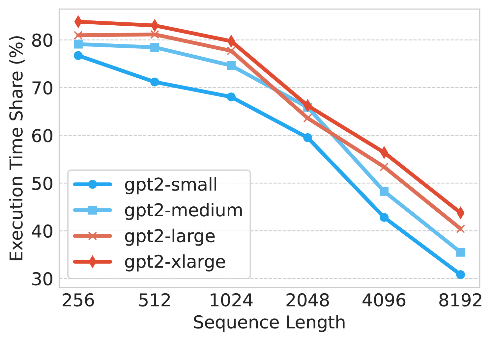
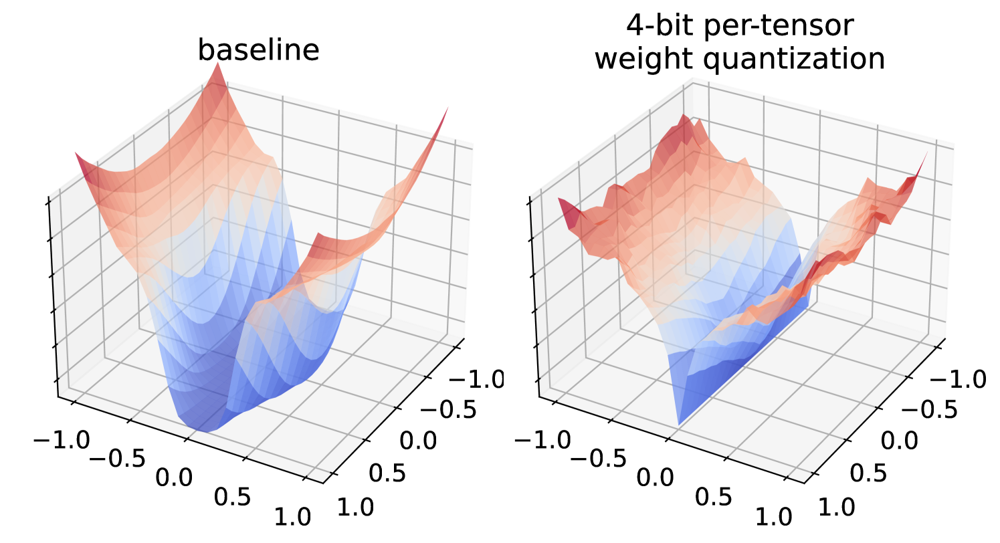
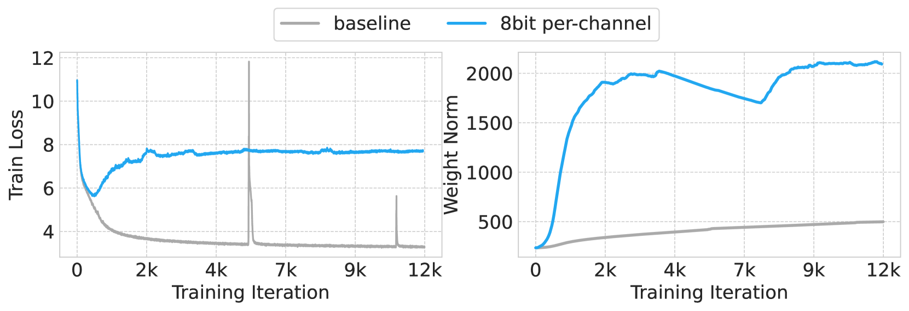

# 研究量化技术，以提升 Transformer 语言模型的预训练效率

发布时间：2024年07月16日

`LLM理论` `计算机科学` `人工智能`

> Exploring Quantization for Efficient Pre-Training of Transformer Language Models

# 摘要

> 随着Transformer模型规模的扩大，预训练的计算需求也随之增加。尽管量化在预训练后和微调中表现出色，但在预训练阶段对Transformer进行量化的大规模探索仍显不足。本研究聚焦于线性层，系统地应用线性量化于权重、激活、梯度和优化器状态，旨在提升预训练效率并保持语言建模能力。我们提供了一套全面的量化策略，助力Transformer从零开始的高效训练。相关代码已公开于GitHub。

> The increasing scale of Transformer models has led to an increase in their pre-training computational requirements. While quantization has proven to be effective after pre-training and during fine-tuning, applying quantization in Transformers during pre-training has remained largely unexplored at scale for language modeling. This study aims to explore the impact of quantization for efficient pre-training of Transformers, with a focus on linear layer components. By systematically applying straightforward linear quantization to weights, activations, gradients, and optimizer states, we assess its effects on model efficiency, stability, and performance during training. By offering a comprehensive recipe of effective quantization strategies to be applied during the pre-training of Transformers, we promote high training efficiency from scratch while retaining language modeling ability. Code is available at https://github.com/chandar-lab/EfficientLLMs.

[Arxiv](https://arxiv.org/abs/2407.11722)