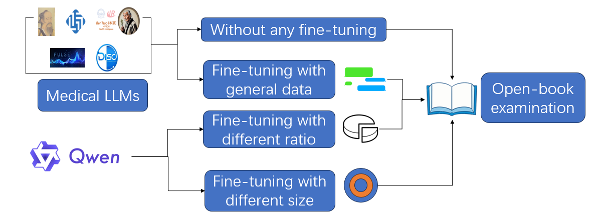

# 通过微调医学语言模型，我们旨在提升其对长篇上下文的理解能力及领域专业知识。

发布时间：2024年07月16日

`LLM应用` `人工智能`

> Fine-Tuning Medical Language Models for Enhanced Long-Contextual Understanding and Domain Expertise

# 摘要

> 大型语言模型（LLM）在多个专业领域大显身手。通过微调特定领域的问答数据集，这些模型的专业知识和问答技能大幅提升，例如，经过医患问答数据微调的医疗LLM，其疾病诊断能力令人瞩目。但我们也发现，尽管专业知识有所增强，医疗LLM在处理长篇上下文时却表现不佳，远逊于参数相近的通用模型。本研究聚焦于医疗LLM在长上下文理解中的性能下滑现象，设计了一系列实验，通过开卷专业知识考试来检验各模型处理长篇文本的能力。我们通过调整微调中通用与医疗数据的比例，探寻最佳数据组合，旨在优化专业模型，实现长上下文理解与专业知识间的和谐平衡。

> Large Language Models (LLMs) have been widely applied in various professional fields. By fine-tuning the models using domain specific question and answer datasets, the professional domain knowledge and Q\&A abilities of these models have significantly improved, for example, medical professional LLMs that use fine-tuning of doctor-patient Q\&A data exhibit extraordinary disease diagnostic abilities. However, we observed that despite improvements in specific domain knowledge, the performance of medical LLM in long-context understanding has significantly declined, especially compared to general language models with similar parameters. The purpose of this study is to investigate the phenomenon of reduced performance in understanding long-context in medical LLM. We designed a series of experiments to conduct open-book professional knowledge exams on all models to evaluate their ability to read long-context. By adjusting the proportion and quantity of general data and medical data in the process of fine-tuning, we can determine the best data composition to optimize the professional model and achieve a balance between long-context performance and specific domain knowledge.

[Arxiv](https://arxiv.org/abs/2407.11536)