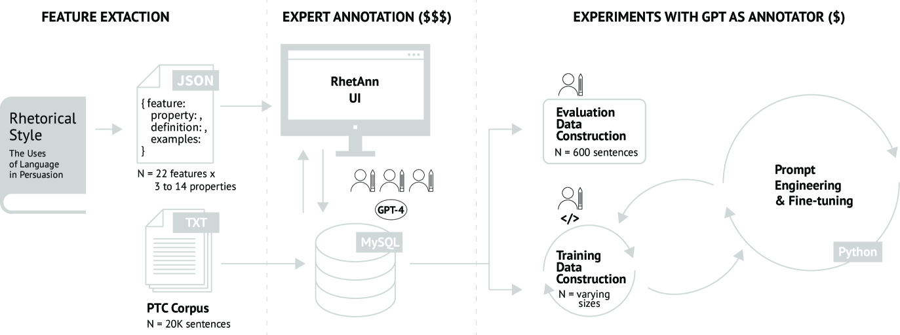
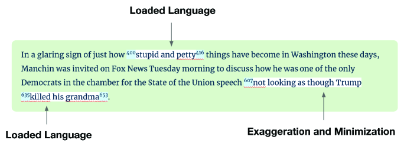
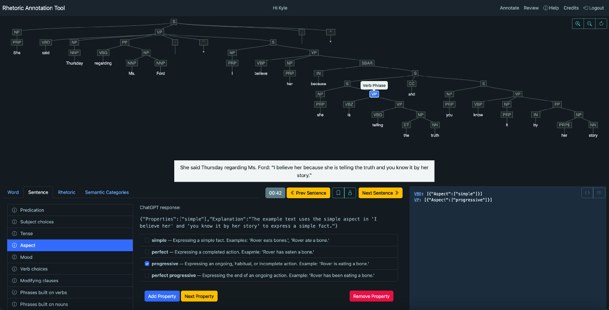
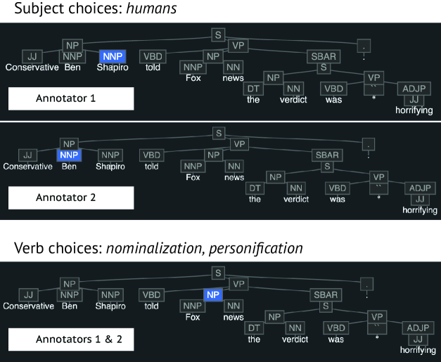
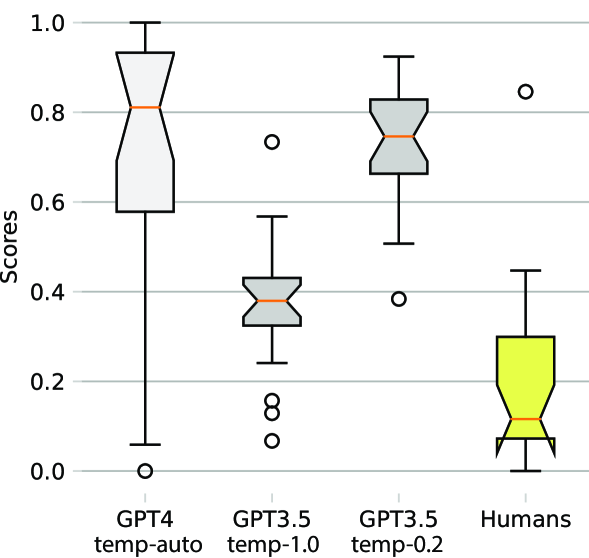

# 借助 GPT 进行修辞与语言特征的辅助标注，旨在提升新闻文本中宣传技巧检测的透明度与准确性。

发布时间：2024年07月16日

`LLM应用` `市场营销` `人工智能`

> GPT Assisted Annotation of Rhetorical and Linguistic Features for Interpretable Propaganda Technique Detection in News Text

# 摘要

> 本研究针对文本中宣传技巧的检测，从文献中提炼出22种修辞与语言特征，并利用这些特征对现有数据集进行标注。为减轻人类专家的负担，我们设计了RhetAnn网络应用，并借助少量标注数据微调GPT-3.5，以高效且经济的方式完成大规模标注任务。研究结果显示，这种方法不仅成本仅为传统方法的十分之一，且性能与顶尖模型GPT-4相媲美。我们的创新在于提供了一套机器可读的特征集，以及RhetAnn应用和GPT微调流程，旨在推动可解释宣传技巧检测技术的发展。

> While the use of machine learning for the detection of propaganda techniques in text has garnered considerable attention, most approaches focus on "black-box" solutions with opaque inner workings. Interpretable approaches provide a solution, however, they depend on careful feature engineering and costly expert annotated data. Additionally, language features specific to propagandistic text are generally the focus of rhetoricians or linguists, and there is no data set labeled with such features suitable for machine learning. This study codifies 22 rhetorical and linguistic features identified in literature related to the language of persuasion for the purpose of annotating an existing data set labeled with propaganda techniques. To help human experts annotate natural language sentences with these features, RhetAnn, a web application, was specifically designed to minimize an otherwise considerable mental effort. Finally, a small set of annotated data was used to fine-tune GPT-3.5, a generative large language model (LLM), to annotate the remaining data while optimizing for financial cost and classification accuracy. This study demonstrates how combining a small number of human annotated examples with GPT can be an effective strategy for scaling the annotation process at a fraction of the cost of traditional annotation relying solely on human experts. The results are on par with the best performing model at the time of writing, namely GPT-4, at 10x less the cost. Our contribution is a set of features, their properties, definitions, and examples in a machine-readable format, along with the code for RhetAnn and the GPT prompts and fine-tuning procedures for advancing state-of-the-art interpretable propaganda technique detection.

[Arxiv](https://arxiv.org/abs/2407.11827)