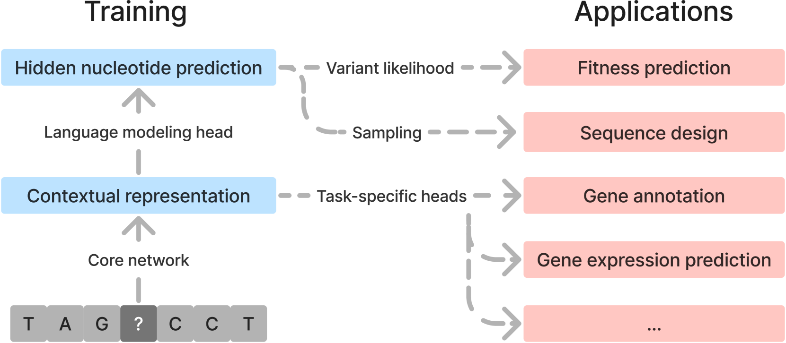
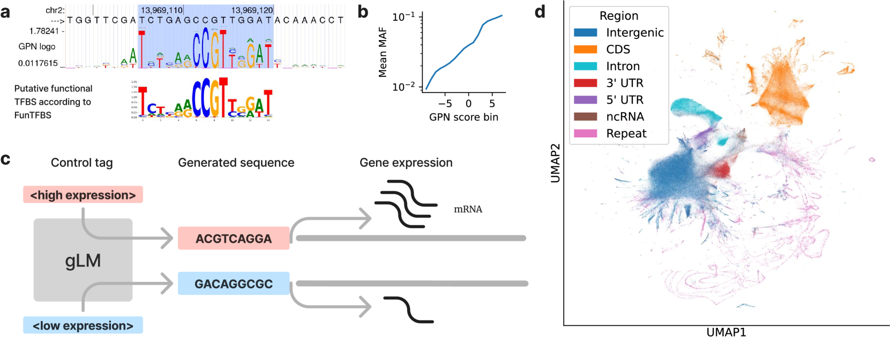
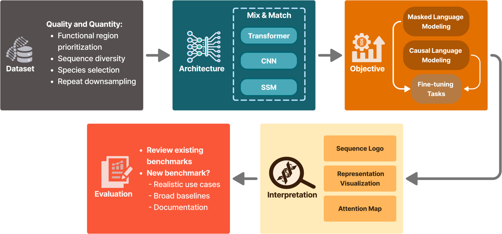

# 基因组语言模型：探索机遇，迎接挑战

发布时间：2024年07月16日

`LLM应用` `生物医学` `基因组学`

> Genomic Language Models: Opportunities and Challenges

# 摘要

> 大型语言模型 (LLM) 正深刻影响着众多科学领域，尤其是在生物医学科学中。与自然语言处理旨在理解单词序列类似，生物学也致力于解析生物序列。基因组语言模型 (gLMs)，即基于 DNA 序列训练的 LLM，有望大幅提升我们对基因组及其复杂功能生成机制的理解。本文通过展示 gLMs 在适应性预测、序列设计和迁移学习等关键领域的应用，揭示了其潜力。然而，尽管近期有所突破，开发高效 gLMs 仍充满挑战，特别是针对那些基因组庞大且复杂的物种。我们探讨了开发与评估 gLMs 的关键要点。

> Large language models (LLMs) are having transformative impacts across a wide range of scientific fields, particularly in the biomedical sciences. Just as the goal of Natural Language Processing is to understand sequences of words, a major objective in biology is to understand biological sequences. Genomic Language Models (gLMs), which are LLMs trained on DNA sequences, have the potential to significantly advance our understanding of genomes and how DNA elements at various scales interact to give rise to complex functions. In this review, we showcase this potential by highlighting key applications of gLMs, including fitness prediction, sequence design, and transfer learning. Despite notable recent progress, however, developing effective and efficient gLMs presents numerous challenges, especially for species with large, complex genomes. We discuss major considerations for developing and evaluating gLMs.

[Arxiv](https://arxiv.org/abs/2407.11435)