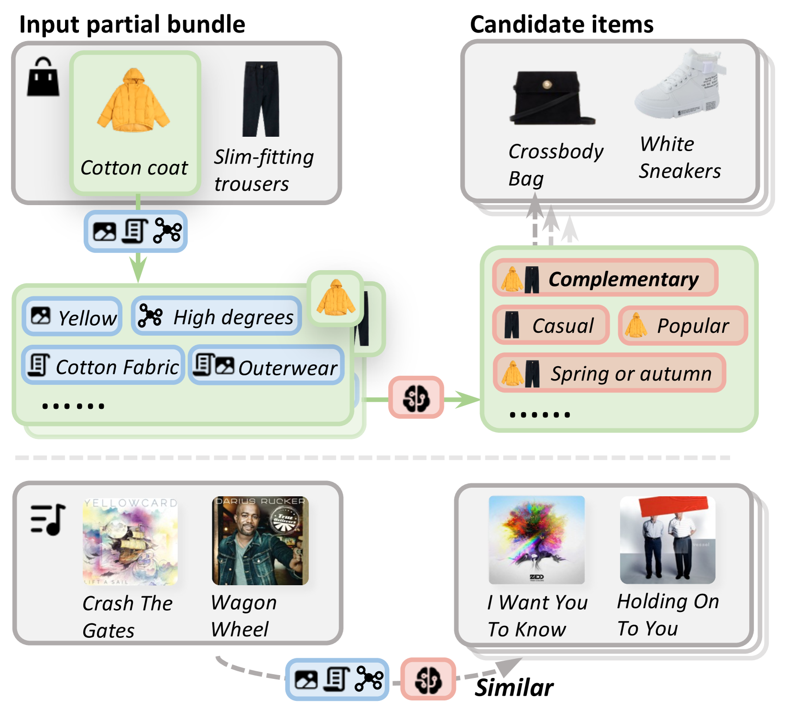
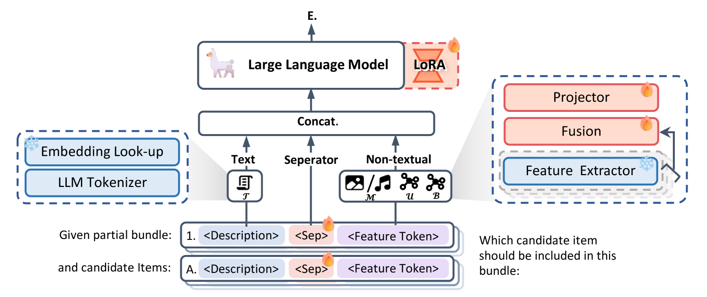
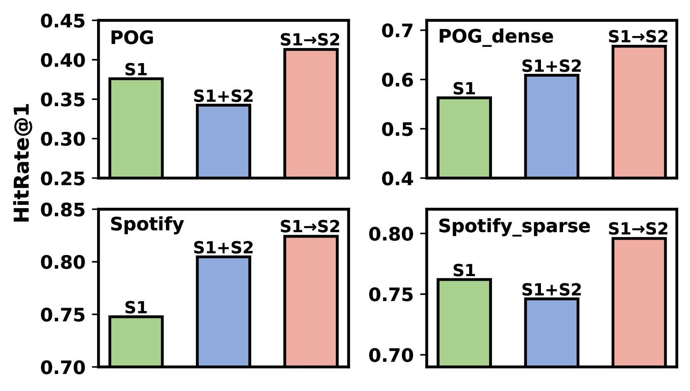
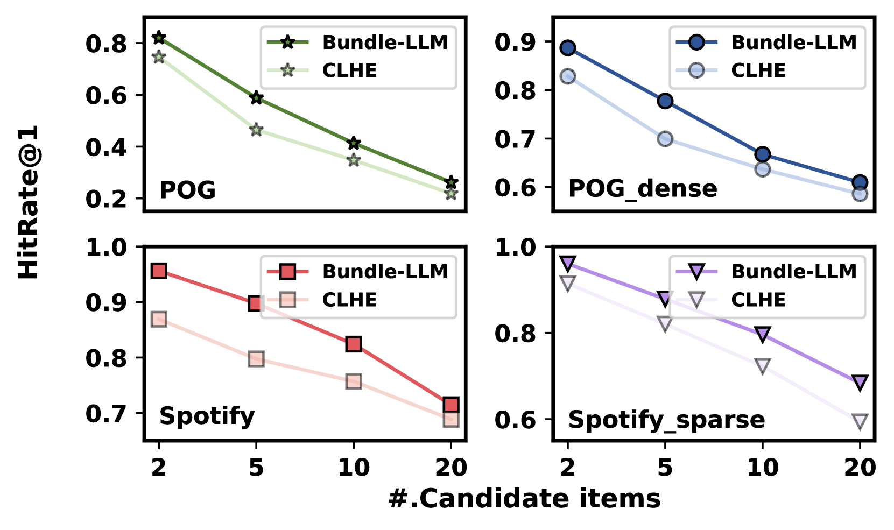
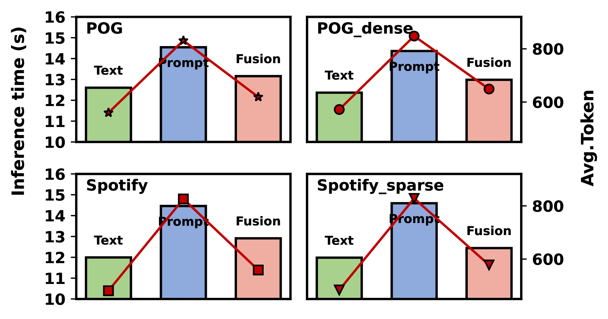
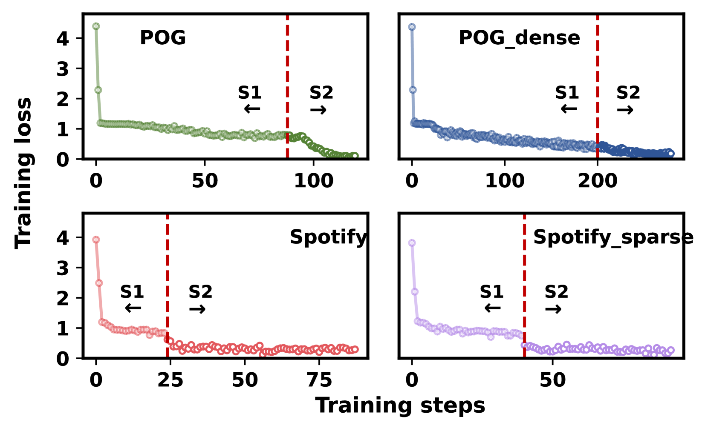
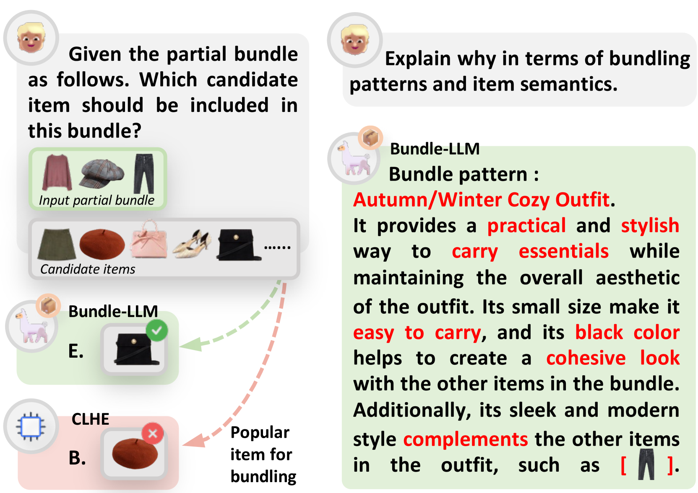

# 借助大型语言模型实现多模态产品组合

发布时间：2024年07月16日

`LLM应用` `电子商务`

> Harnessing Large Language Models for Multimodal Product Bundling

# 摘要

> 产品捆绑策略通过组合单个项目，为客户提供了一种战略性选择。近年来，这一策略作为在线服务的基础条件备受瞩目。尽管现有方法通过精密的提取器利用多模态信息进行捆绑，但仍面临语义理解不足、知识范围受限及冷启动问题等挑战。大型语言模型（LLMs）虽知识渊博、推理复杂，却难以直接应用于多模态产品捆绑。为此，我们创新性地引入了Bundle-LLM，旨在连接LLMs与产品捆绑任务。我们采用混合项目标记化技术，通过一个简洁而高效的多模态融合模块，将非文本特征整合成单一标记，不仅展示了模态间的互动，还提升了处理效率。通过设计提示模板，我们将产品捆绑转化为多项选择题，并采用渐进优化策略微调LLMs，以实现解耦目标，从而在多模态语义理解基础上，有效提升产品捆绑能力。实验结果显示，我们的方法在多个数据集上超越了现有最先进技术。

> Product bundling provides clients with a strategic combination of individual items.And it has gained significant attention in recent years as a fundamental prerequisite for online services. Recent methods utilize multimodal information through sophisticated extractors for bundling, but remain limited by inferior semantic understanding, the restricted scope of knowledge, and an inability to handle cold-start issues.Despite the extensive knowledge and complex reasoning capabilities of large language models (LLMs), their direct utilization fails to process multimodalities and exploit their knowledge for multimodal product bundling. Adapting LLMs for this purpose involves demonstrating the synergies among different modalities and designing an effective optimization strategy for bundling, which remains challenging.To this end, we introduce Bundle-LLM to bridge the gap between LLMs and product bundling tasks. Sepcifically, we utilize a hybrid item tokenization to integrate multimodal information, where a simple yet powerful multimodal fusion module followed by a trainable projector embeds all non-textual features into a single token. This module not only explicitly exhibits the interplays among modalities but also shortens the prompt length, thereby boosting efficiency.By designing a prompt template, we formulate product bundling as a multiple-choice question given candidate items. Furthermore, we adopt progressive optimization strategy to fine-tune the LLMs for disentangled objectives, achieving effective product bundling capability with comprehensive multimodal semantic understanding.Extensive experiments on four datasets from two application domains show that our approach outperforms a range of state-of-the-art (SOTA) methods.

[Arxiv](https://arxiv.org/abs/2407.11712)