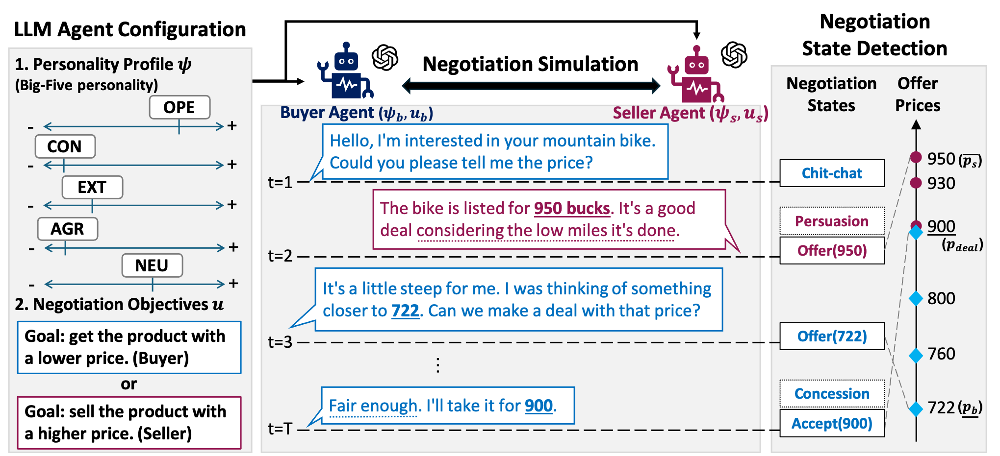
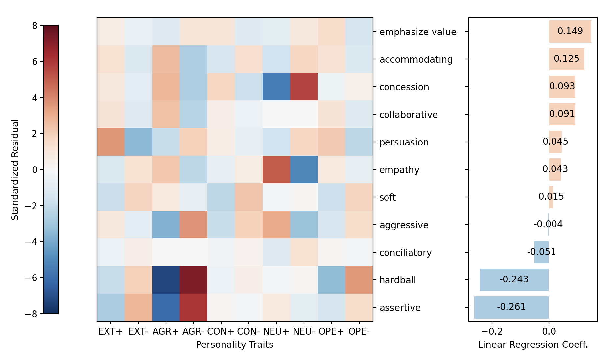
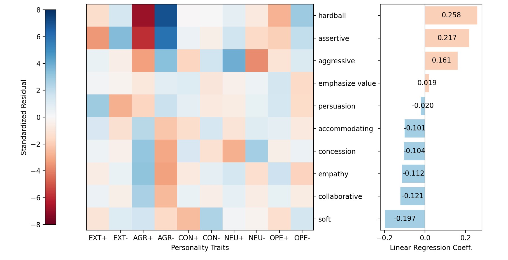
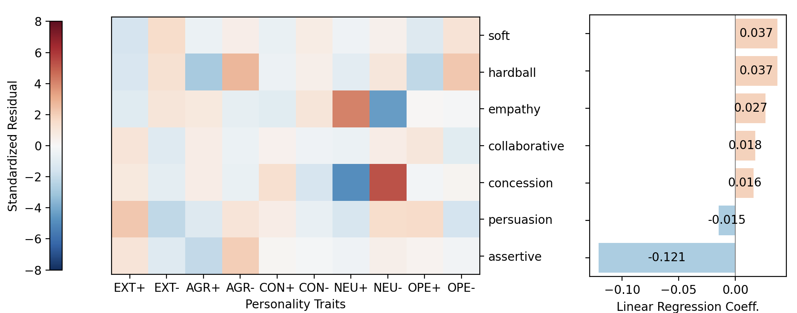
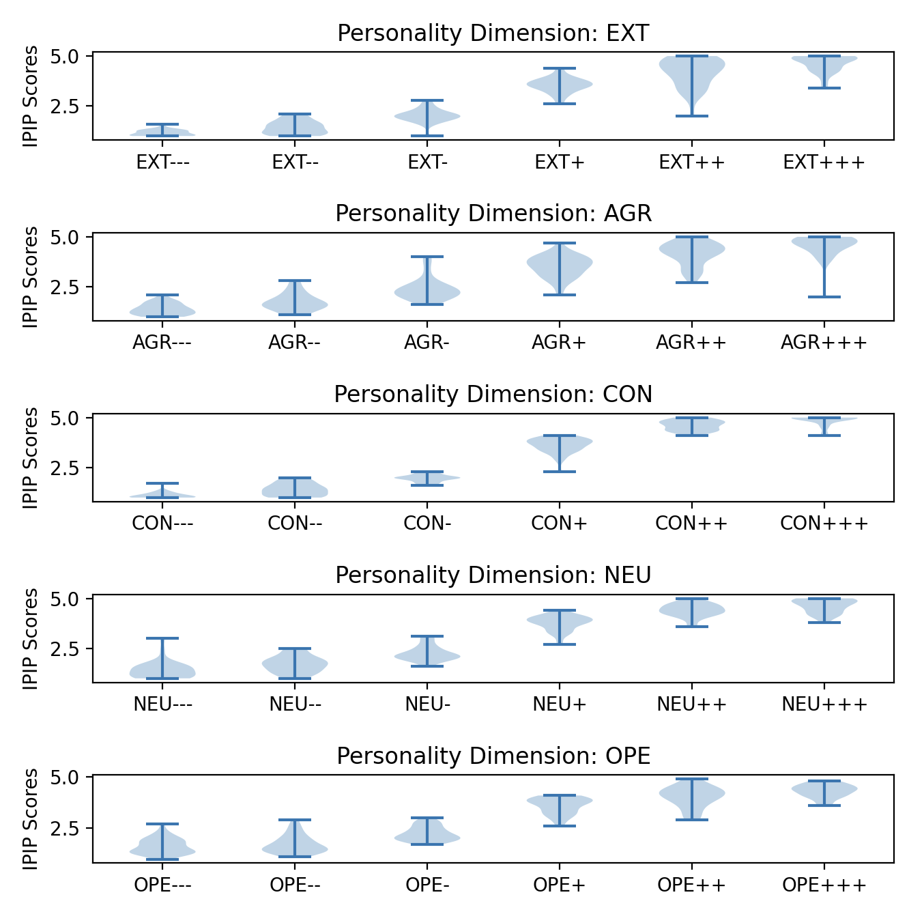

# 探究个性特质对谈判结果的影响：一项基于大型语言模型的模拟研究

发布时间：2024年07月16日

`Agent` `心理学` `人工智能`

> How Personality Traits Influence Negotiation Outcomes? A Simulation based on Large Language Models

# 摘要

> 心理研究表明，个性特质深刻影响决策过程。比如，亲和性在谈判中常带来积极成果，而神经质则可能导致不利结果。本文构建了一个模拟框架，核心是具备合成个性的大型语言模型（LLM）代理，它们在讨价还价场景中谈判，个性与目标均可定制。实验揭示，这些基于LLM的模拟能精准复现人类谈判行为。我们的研究贡献主要有两方面：一是探索了LLM代理的语言与经济能力间的协调性；二是实证分析了五大个性特质如何影响双边谈判策略。此外，通过合成对话案例研究，我们发现了谈判中的欺骗与妥协等引人入胜的行为模式。

> Psychological evidence reveals the influence of personality traits on decision-making. For instance, agreeableness is generally associated with positive outcomes in negotiations, whereas neuroticism is often linked to less favorable outcomes. This paper introduces a simulation framework centered on Large Language Model (LLM) agents endowed with synthesized personality traits. The agents negotiate within bargaining domains and possess customizable personalities and objectives. The experimental results show that the behavioral tendencies of LLM-based simulations could reproduce behavioral patterns observed in human negotiations. The contribution is twofold. First, we propose a simulation methodology that investigates the alignment between the linguistic and economic capabilities of LLM agents. Secondly, we offer empirical insights into the strategic impact of Big-Five personality traits on the outcomes of bilateral negotiations. We also provide a case study based on synthesized bargaining dialogues to reveal intriguing behaviors, including deceitful and compromising behaviors.

[Arxiv](https://arxiv.org/abs/2407.11549)