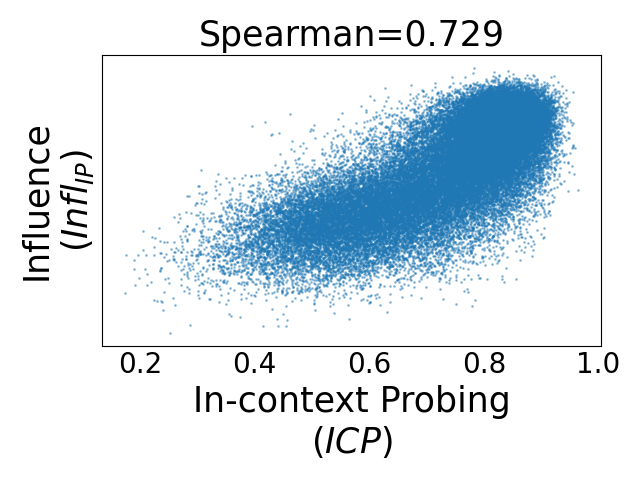
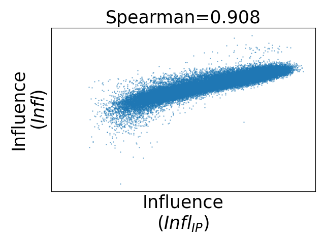
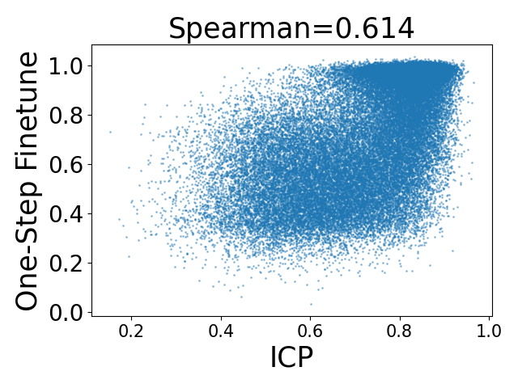
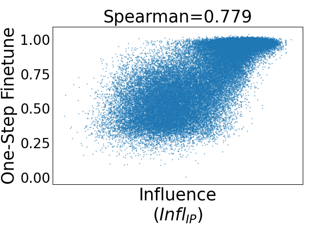
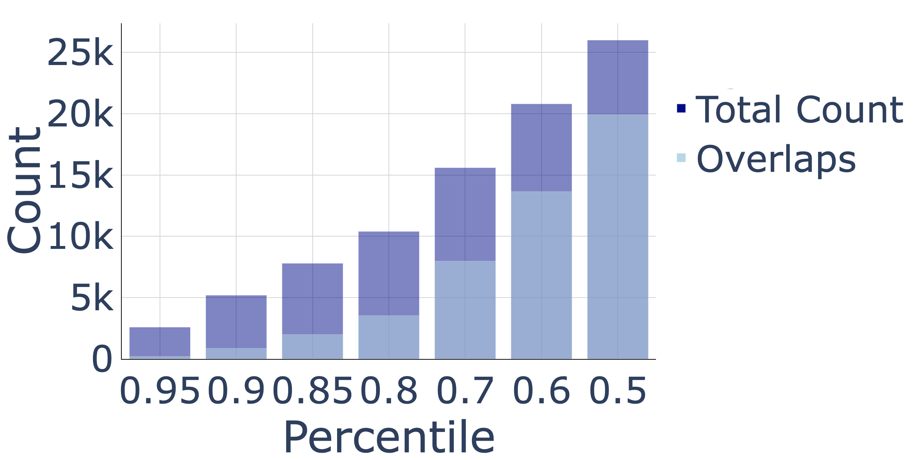

# 上下文探针法近似模拟了数据评估中的影响函数。

发布时间：2024年07月16日

`LLM理论` `人工智能` `数据科学`

> In-Context Probing Approximates Influence Function for Data Valuation

# 摘要

> 数据估值通过量化训练数据的价值，对于提升大型语言模型的训练数据集质量至关重要。我们通过上下文探针（提示LLM）展示了数据估值与选择训练数据的影响函数相近。基于变换器模型的“隐式”梯度下降，我们提供了理论联系的初步分析。实证研究表明，上下文探针与梯度影响框架在数据排序上表现相似，且两种方法选出的数据在微调后均能提升模型性能。

> Data valuation quantifies the value of training data, and is used for data attribution (i.e., determining the contribution of training data towards model predictions), and data selection; both of which are important for curating high-quality datasets to train large language models. In our paper, we show that data valuation through in-context probing (i.e., prompting a LLM) approximates influence functions for selecting training data. We provide a theoretical sketch on this connection based on transformer models performing "implicit" gradient descent on its in-context inputs. Our empirical findings show that in-context probing and gradient-based influence frameworks are similar in how they rank training data. Furthermore, fine-tuning experiments on data selected by either method reveal similar model performance.

[Arxiv](https://arxiv.org/abs/2407.12259)