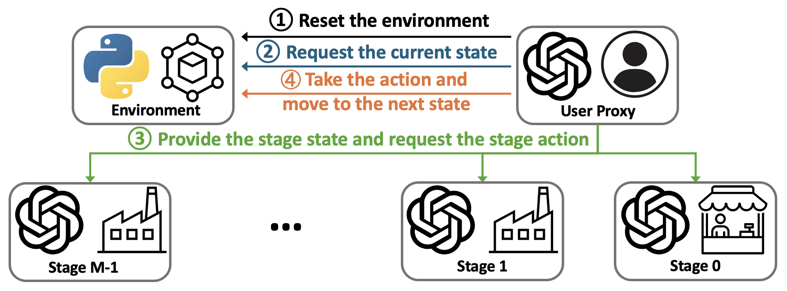
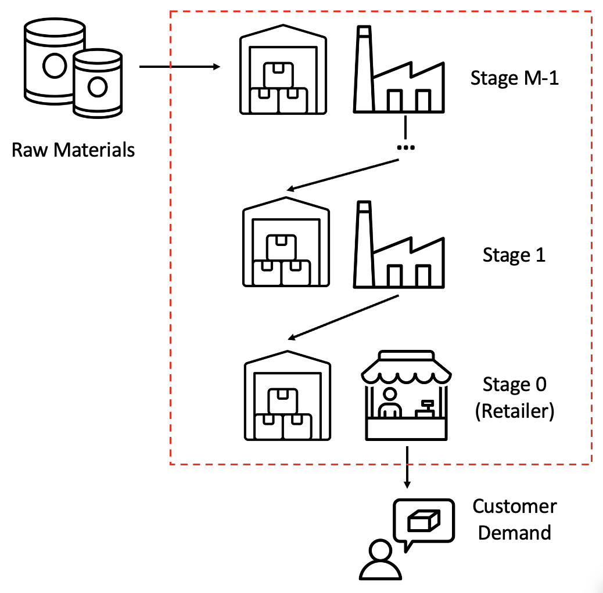
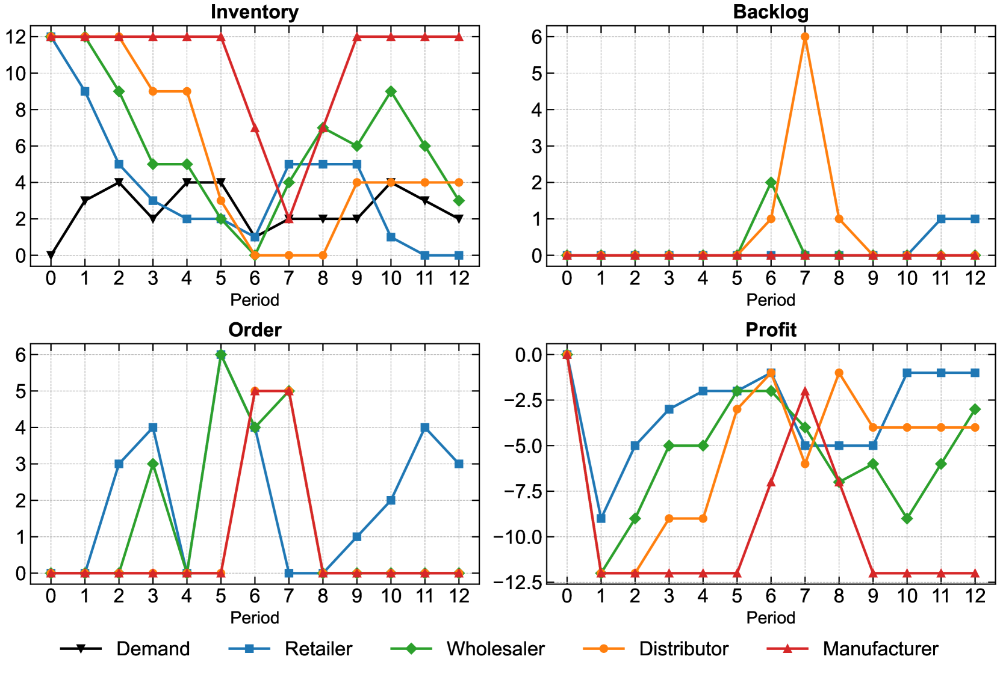
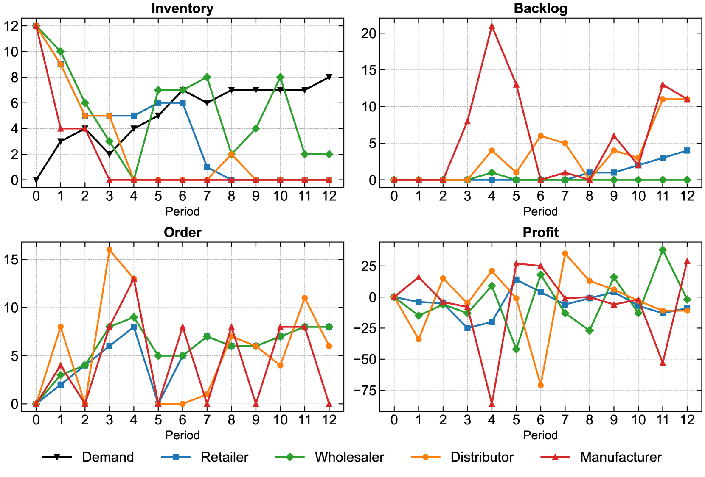

# InvAgent：一款基于大型语言模型的多智能体系统，专为供应链库存管理设计

发布时间：2024年07月16日

`Agent` `供应链管理` `库存管理`

> InvAgent: A Large Language Model based Multi-Agent System for Inventory Management in Supply Chains

# 摘要

> 在易变、不确定、复杂和模糊的VUCA时代，供应链管理（SCM）中的有效库存管理显得尤为关键。尽管启发式方法和强化学习在库存管理中已显示出优势，但大型语言模型（LLMs）在多代理系统中的应用仍待深入探索。本研究创新性地采用LLMs来管理多代理库存系统，通过零-shot学习能力，我们的InvAgent模型不仅提升了供应链的弹性和效率，还实现了无需预训练的自适应决策。借助思维链（CoT），我们提供了高度的可解释性，并展示了模型在应对多变需求时的成本效益和缺货规避能力。广泛的实证评估证实了InvAgent在SCM中的高效性。

> Supply chain management (SCM) involves coordinating the flow of goods, information, and finances across various entities to deliver products efficiently. Effective inventory management is crucial in today's volatile, uncertain, complex, and ambiguous (VUCA) world. Previous research has demonstrated the superiority of heuristic methods and reinforcement learning applications in inventory management. However, the application of large language models (LLMs) as autonomous agents in multi-agent systems for inventory management remains underexplored. This study introduces a novel approach using LLMs to manage multi-agent inventory systems. Leveraging their zero-shot learning capabilities, our model, InvAgent, enhances resilience and improves efficiency across the supply chain network. Our contributions include utilizing LLMs for zero-shot learning to enable adaptive and informed decision-making without prior training, providing significant explainability and clarity through Chain-of-Thought (CoT), and demonstrating dynamic adaptability to varying demand scenarios while minimizing costs and avoiding stockouts. Extensive evaluations across different scenarios highlight the efficiency of our model in SCM.

[Arxiv](https://arxiv.org/abs/2407.11384)