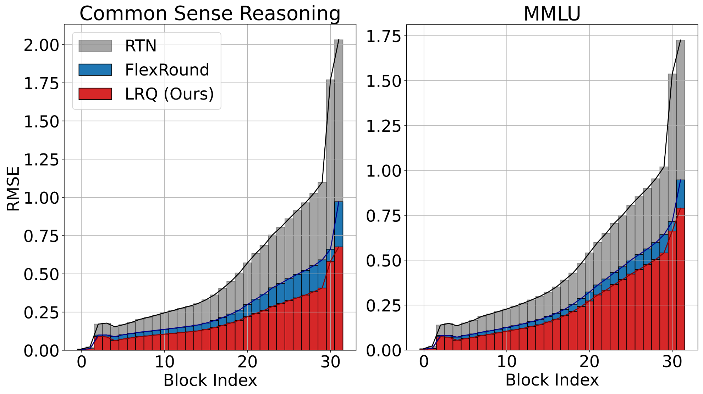

# LRQ：借助学习低秩权重缩放矩阵，优化大型语言模型的训练后量化过程。

发布时间：2024年07月16日

`LLM理论` `人工智能` `计算机科学`

> LRQ: Optimizing Post-Training Quantization for Large Language Models by Learning Low-Rank Weight-Scaling Matrices

# 摘要

> 随着 LLM 的商业化，权重-激活量化技术崭露头角，旨在压缩和加速 LLM，同时降低推理成本。然而，现有 PTQ 技术在量化 LLM 时仍面临精度下降问题，尤其是在大规模多任务语言理解中。为此，我们提出低秩量化 (LRQ)，一种简单高效的后训练权重量化方法，通过低秩权重缩放矩阵重建 Transformer 块输出，减少可学习参数数量，增强量化 LLM 的泛化能力。我们在多种量化方案中展示了 LRQ 的优越性，并公开代码以供 LLM 研究者和工程师参考。

> With the commercialization of large language models (LLMs), weight-activation quantization has emerged to compress and accelerate LLMs, achieving high throughput while reducing inference costs. However, existing post-training quantization (PTQ) techniques for quantizing weights and activations of LLMs still suffer from non-negligible accuracy drops, especially on massive multitask language understanding. To address this issue, we propose Low-Rank Quantization (LRQ) $-$ a simple yet effective post-training weight quantization method for LLMs that reconstructs the outputs of an intermediate Transformer block by leveraging low-rank weight-scaling matrices, replacing the conventional full weight-scaling matrices that entail as many learnable scales as their associated weights. Thanks to parameter sharing via low-rank structure, LRQ only needs to learn significantly fewer parameters while enabling the individual scaling of weights, thus boosting the generalization capability of quantized LLMs. We show the superiority of LRQ over prior LLM PTQ works under (i) $8$-bit weight and per-tensor activation quantization, (ii) $4$-bit weight and $8$-bit per-token activation quantization, and (iii) low-bit weight-only quantization schemes. Our code is available at \url{https://github.com/onliwad101/FlexRound_LRQ} to inspire LLM researchers and engineers.

[Arxiv](https://arxiv.org/abs/2407.11534)